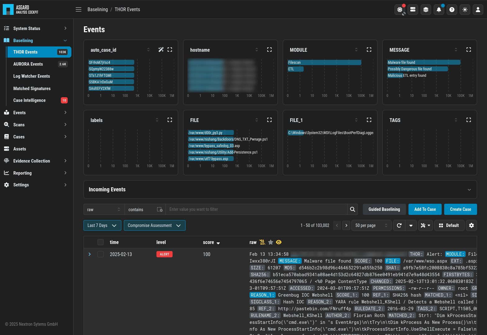
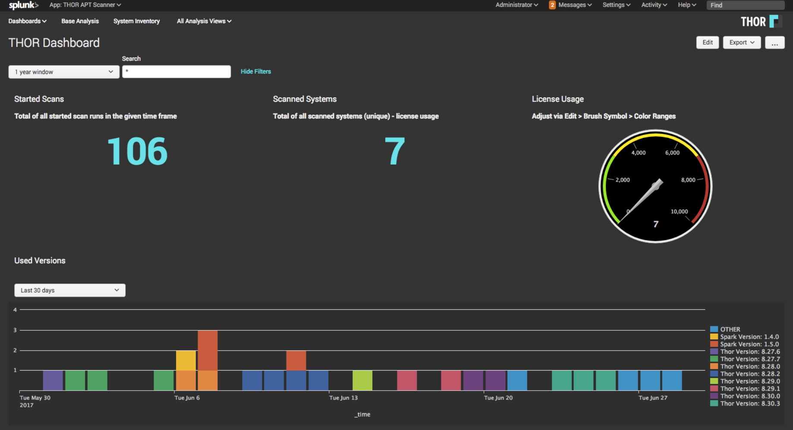
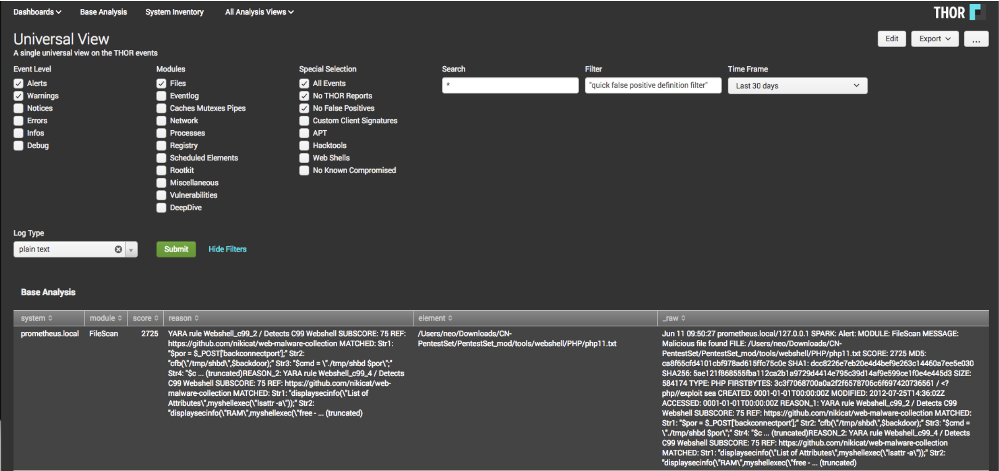
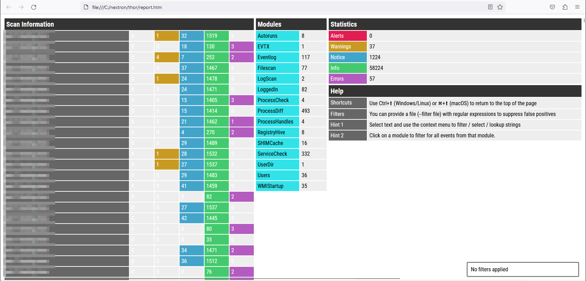

.. Index:: THOR Logs

THOR Logs
=========

This chapter explains the possibilities for collecting and analyzing
THOR logs.

ASGARD Analysis Cockpit
-----------------------

The **ASGARD Analysis Cockpit** is the central platform for analyzing
THOR logs. It can be used in environments where scans are controlled by
the ASGARD Management Center, but it also works when THOR is executed
manually or controlled by third-party solutions. It is available both
as a virtual appliance for VMware and as a dedicated hardware
appliance.

THOR can also be used as a hunting solution. It is optimized to avoid
false negatives, which means it is designed not to miss indicators of
compromise. As a trade-off, this usually results in more anomalies and
false positives being reported.

If you scan your infrastructure frequently, you either see the same
anomalies again and again or need to create many rules to filter them
out and save analysis time.

The ASGARD Analysis Cockpit is designed to support this process. It can
help generate these rules automatically so that you can define baseline
filters after the first scan. Once that baseline is in place, it
becomes much easier to focus on relevant alerts and warnings because
only the differences between scans are highlighted.

The ASGARD Analysis Cockpit also includes a highly configurable
ticketing system to help organize analysis workflows, as well as
rule-based alert forwarding and SIEM integration for faster reaction to
new incidents.

   ASGARD Analysis Cockpit View

Splunk
------

We offer a THOR Splunk App and Add-on through the official Splunk App
Store. The app extracts event fields and provides dashboards that give
you a better overview of distributed runs across multiple systems.

   THOR Splunk App (free)

   Splunk THOR App Universal View

[THOR APT Scanner App](https://splunkbase.splunk.com/app/3717/)

[THOR Add-On](https://splunkbase.splunk.com/app/3718/)

THOR Util Report Feature
------------------------

THOR Util provides a ``report`` feature that creates HTML reports from
the text logs of one or more scanned systems.

   THOR Util's Report Output

More information about this feature is available on our website and in
the separate THOR Util manual:

[THOR Util with HTML report generation](https://www.nextron-systems.com/2018/06/20/thor-util-with-html-report-generation/)

Log Analysis Manual
-------------------

We also provide a detailed Log Analysis Manual that:

* Explains how to analyze THOR logs
* Contains example logs
* Lists potential false positives you might encounter
* Explains how different attributes should be evaluated

[Log Analysis Manual](https://log-analysis-manual.nextron-systems.com/)
