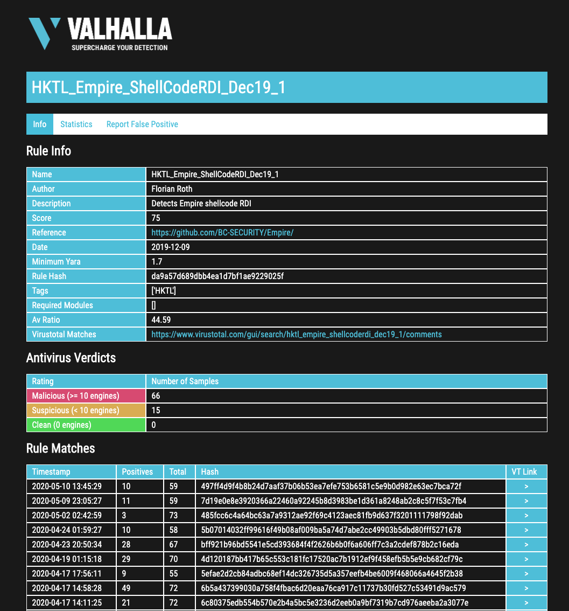

.. Index:: Valhalla

Valhalla
========

The rule info pages allow you to retrieve more information about a
specific rule. They show metadata, past rule matches, and previous
antivirus verdicts. A second tab contains statistics. You can also
report false positives for that rule using the button in the tab bar.

Please note that rule info lookups in the web GUI are rate limited. If
you query rule information too frequently, access may be temporarily
blocked.

Rule info pages can be accessed using the following URL scheme:

:samp:`https://valhalla.nextron-systems.com/info/rule/RULE\_NAME`

[Example rule info page](https://valhalla.nextron-systems.com/info/rule/HKTL_Empire_ShellCodeRDI_Dec19_1)

   
   Rule Info Page
