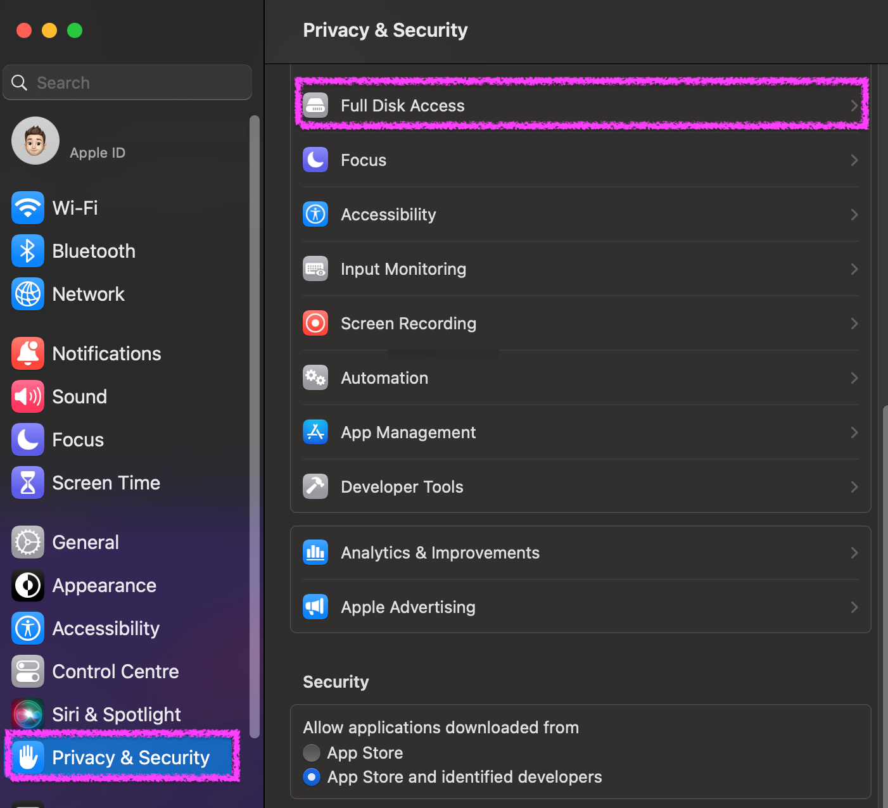
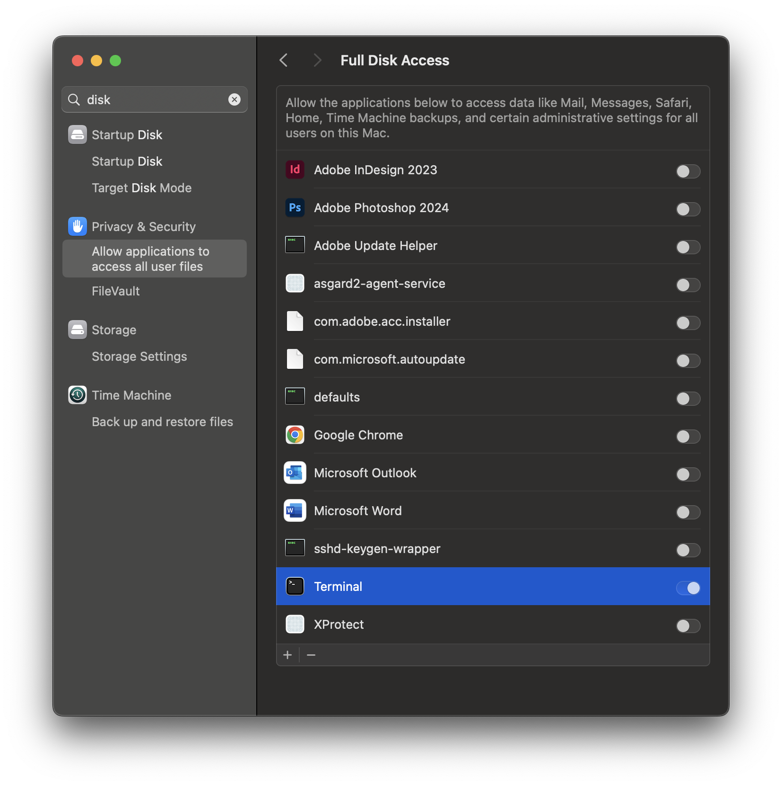

.. Index:: Maintenance

Maintenance
===========

This chapter focuses on the maintenance aspect of THOR.
We will explain updating THOR or its signatures, using
different signature versions, or including signatures
from the `YARA Forge <https://yarahq.github.io/>`_ project.

Upgrade THOR
------------

Run the following command to update THOR and its Signatures:

Windows:

.. code-block:: doscon

   C:\nextron\thor>thor-util.exe upgrade

Linux:

.. code-block:: console

   nextron@unix:~/Documents/thor$ ./thor-util upgrade

It is **important** that you update THOR before running it for the first time,
since the downloaded version, or the contained signatures, could contain an
older version.

.. note::
   The upgrade requires a valid license for the host that performs the update.
   If you don't want to use a license for that host, ask us for a ``silent license``,
   which can be used for all kinds of testing purposes and also allows to update THOR
   and its signatures.

Update Signatures
-----------------

Run the following command to update **only** the signatures.

Windows:

.. code-block:: doscon

   C:\nextron\thor>thor-util.exe update

Linux:

.. code-block:: console

   nextron@unix:~/Documents/thor$ ./thor-util update

Use Preview Signatures
----------------------

We offer a "preview" of our newest signatures, which contains the newest rules.
Those signatures have been processed by our automated pipeline and passed the
quality check, however the manual testing of those new rules did not take place yet.

We have those signatures to offer the newest rules to our customers in time critical
engagements. You have to carefully consider if the potential higher rate of false positive
warrants the usage of those rules. We generally recommend to only use those rules if
the currently available signatures are a few days old.

Run the following command to get the newest "preview" signatures:

Windows:

.. code-block:: doscon

    C:\nextron\thor>thor-util.exe update --sigdev

Linux:

.. code-block:: console

   nextron@unix:~/Documents/thor$ ./thor-util update --sigdev

Use YARA Forge Signatures
-------------------------

You can include additional YARA Signatures from the
`YARA Forge <https://yarahq.github.io/>`_ project.

The following rulesets are available:

* core
* extended
* full

To do so, run the following command:

Windows:

.. code-block:: doscon

    C:\nextron\thor>thor-util.exe yara-forge download --ruleset core

Linux:

.. code-block:: console

   nextron@unix:~/Documents/thor$ ./thor-util yara-forge download --ruleset core

You can only have one ruleset active. Downloading a different ruleset
will override the old one. The ruleset will be updated when running a normal
update or upgrade of THOR. You can remove a ruleset with the following command:

Windows:

.. code-block:: doscon

    C:\nextron\thor>thor-util.exe yara-forge remove

Linux:

.. code-block:: console

   nextron@unix:~/Documents/thor$ ./thor-util yara-forge remove

.. important::
   Please read carefully what the rulesets are designed for and when to use
   them. In any case, usage of those rulesets could result in longer runtime
   of your THOR scans.

Grant Full Disk Access on macOS
-------------------------------

THOR requires Full Disk Access (FDA) for some data like Mail, Messages and certain
administrative settings for all users, while scanning macOS, although THOR itself
must be executed with administrative privileges.

You can grant FDA to ``Terminal`` (as executing application) on demand while scanning,
by allowing access when prompted. Alternatively, you can grant access before, to perform
the scan unattended. Please keep in mind that also administrative privileges on the
machine are needed to perform this change.

To do this, navigate on your Mac to ``System Settings`` > ``Privacy & Security`` > ``Full Disk Access``:

   System Settings View

You need to add ``Terminal`` to the listed application.

   Full Disk Access View

After your scan has finished, you can disable FDA for Terminal and reenable when scanning again.

Add Command Line Completions (optional)
---------------------------------------

Since version 10.7.15, THOR offers shell completions for browsing the flags. These completions can be generated by using:

   ``thor-linux-64 --completions <bash/zsh/fish/powershell>``

This generates a snippet for the specified shell that can be loaded for the current terminal using the following command, depending on your shell:

- bash:

   ``source <(thor-linux-64 --completions bash)``

- zsh:

   ``source <(thor-linux-64 --completions zsh)``

- fish:

   ``thor-linux-64 --completions fish | source``

- PowerShell:

   ``thor64.exe --completions powershell | Out-String | Invoke-Expression``

Verify Public Key Signatures (optional)
---------------------------------------

You can verify the executable files in the THOR package with

* their digital signature (PE signature) issued by "Nextron Systems GmbH"
* thor-util's "verify" feature
* openssl verifying the integrity of executables manually

Find more information on THOR Util in its dedicated `online manual <https://thor-util-manual.nextron-systems.com>`__.

.. hint::
   THOR Util automatically verifies the signatures of the contained
   binaries in an update package and exits if one or more signatures cannot
   be verified. You don't have to check them manually unless you distrust
   the THOR Util itself. In this case, you can use the public key published
   on `our web page <https://www.nextron-systems.com/pki/>`__.

After downloading the public key the signatures can be manually verified with the following command:

.. code-block:: doscon

   C:\Users\nextron>openssl dgst -sha256 -verify <Path to public key .pem> -signature <Path to signature .sig> <Path to the executable>

Example Windows:

.. code-block:: doscon

   C:\Users\nextron>openssl dgst -sha256 -verify codesign.pem -signature thor64.exe.sig thor64.exe
   Verified OK

Example Linux:

.. code-block:: console

   user@unix:~/thor$ openssl sha256 -verify codesign.pem -signature thor-linux.sig thor-linux
   Verified OK
