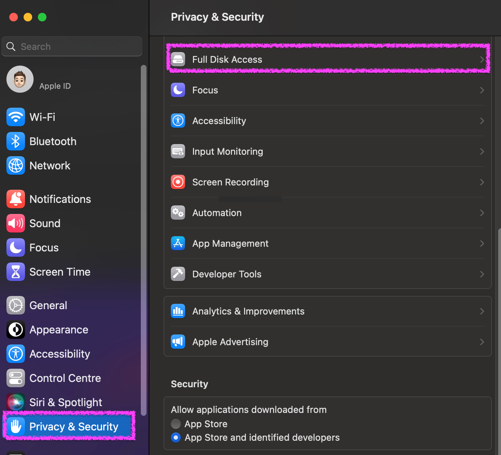
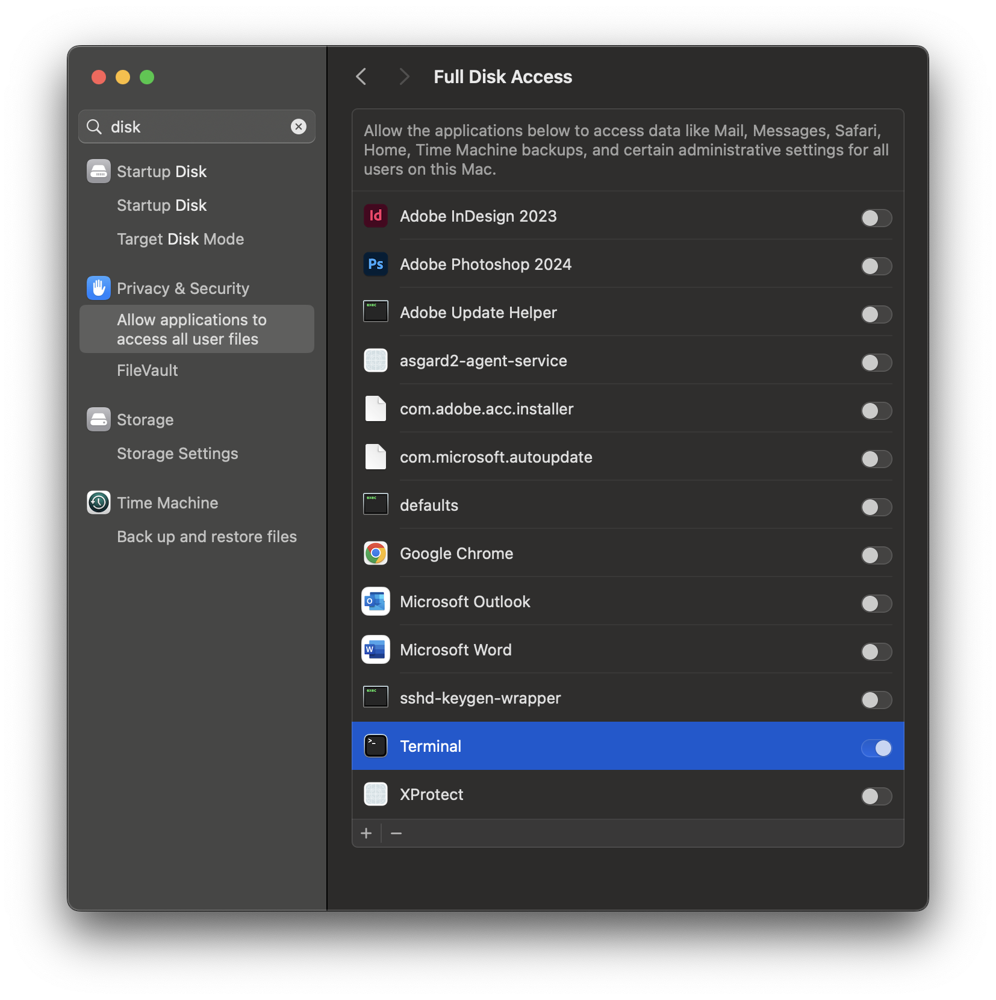

.. Index:: Maintenance

Maintenance
===========

This chapter covers routine THOR maintenance. It explains how to update
THOR and its signatures, how to use different signature variants, and
how to include signatures from the
`YARA Forge <https://yarahq.github.io/>`_ project.

Upgrade THOR
------------

Run the following command to update THOR and its signatures:

Windows:

.. code-block:: doscon

   C:\thor>thor-util.exe upgrade

Linux:

.. code-block:: console

   nextron@unix:~/Documents/thor$ ./thor-util upgrade

We strongly recommend updating THOR before running it for the first
time, because the downloaded package or the included signatures may
already be out of date.

.. note::
   The upgrade requires a valid license for the host that performs the
   update. If you do not want to use a regular license on that host,
   ask us for a ``silent license``. It can be used for testing purposes
   and also allows THOR and signature updates.

Update Signatures
-----------------

Run the following command to update **only** the signatures.

Windows:

.. code-block:: doscon

   C:\thor>thor-util.exe update

Linux:

.. code-block:: console

   nextron@unix:~/Documents/thor$ ./thor-util update

Use Preview Signatures
----------------------

We provide preview signatures that contain the newest rules. These
signatures have passed our automated pipeline and quality checks, but
new rules may not yet have completed manual testing.

Preview signatures are intended for time-critical engagements where the
latest detections are more important than minimizing false positives.
Use them carefully, as they may produce a higher false positive rate. In
general, we recommend using them only if the regular signature set is a
few days old.

Run the following command to download the latest preview signatures:

Windows:

.. code-block:: doscon

    C:\thor>thor-util.exe update --sigdev

Linux:

.. code-block:: console

   nextron@unix:~/Documents/thor$ ./thor-util update --sigdev

Use YARA Forge Signatures
-------------------------

You can include additional YARA signatures from the
`YARA Forge <https://yarahq.github.io/>`_ project.

The following rulesets are available:

* core
* extended
* full

To do so, run the following command:

Windows:

.. code-block:: doscon

    C:\thor>thor-util.exe yara-forge download --ruleset core

Linux:

.. code-block:: console

   nextron@unix:~/Documents/thor$ ./thor-util yara-forge download --ruleset core

Only one ruleset can be active at a time. Downloading a different
ruleset replaces the current one. The selected ruleset is updated during
a regular THOR update or upgrade. You can remove a ruleset with the
following command:

Windows:

.. code-block:: doscon

    C:\thor>thor-util.exe yara-forge remove

Linux:

.. code-block:: console

   nextron@unix:~/Documents/thor$ ./thor-util yara-forge remove

.. important::
   Review what each ruleset is designed for before enabling it. These
   rulesets may increase THOR scan runtime.

Grant Full Disk Access on macOS
-------------------------------

THOR requires Full Disk Access (FDA) on macOS to access certain data,
such as Mail, Messages, and some administrative settings for all users.
THOR itself must still be executed with administrative privileges.

You can grant FDA to ``Terminal`` (the executing application) when
prompted during a scan. Alternatively, you can grant access in advance
if you want to run the scan unattended. Administrative privileges on the
Mac are required to make this change.

To do this, navigate on your Mac to ``System Settings`` > ``Privacy & Security`` > ``Full Disk Access``:

   System Settings View

Add ``Terminal`` to the list of applications.

   Full Disk Access View

After the scan finishes, you can disable FDA for Terminal and enable it
again before future scans.

Add Command Line Completions (optional)
---------------------------------------

Since version 10.7.15, THOR can generate shell completions for browsing
available flags:

.. code-block:: console

   thor-linux-64 --completions <bash/zsh/fish/powershell>

Load the generated snippet into the current shell with one of the
following commands:

* bash: ``source <(thor-linux-64 --completions bash)``
* zsh: ``source <(thor-linux-64 --completions zsh)``
* fish: ``thor-linux-64 --completions fish | source``
* PowerShell:
  ``thor64.exe --completions powershell | Out-String | Invoke-Expression``

Verify Public Key Signatures (optional)
---------------------------------------

You can verify the executable files in the THOR package using one of
the following methods:

* their digital signature (PE signature) issued by "Nextron Systems GmbH"
* thor-util's "verify" feature
* openssl verifying the integrity of executables manually

Find more information on THOR Util in its dedicated
`online manual <https://thor-util-manual.nextron-systems.com>`__.

.. hint::
   THOR Util automatically verifies the signatures of the contained
   binaries in an update package and exits if one or more signatures
   cannot be verified. You do not need to check them manually unless you
   do not trust THOR Util itself. In that case, you can use the public
   key published on `our web page <https://www.nextron-systems.com/pki/>`__.

After downloading the public key, you can manually verify the signatures
with the following command:

.. code-block:: doscon

   C:\Users\nextron>openssl dgst -sha256 -verify <Path to public key .pem> -signature <Path to signature .sig> <Path to the executable>

Example Windows:

.. code-block:: doscon

   C:\Users\nextron>openssl dgst -sha256 -verify codesign.pem -signature thor64.exe.sig thor64.exe
   Verified OK

Example Linux:

.. code-block:: console

   user@unix:~/thor$ openssl sha256 -verify codesign.pem -signature thor-linux.sig thor-linux
   Verified OK
