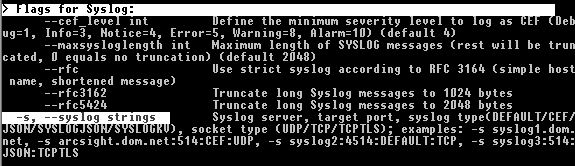

.. Index:: Scan Templates

Scan Templates
==============

THOR supports YAML-based configuration files, referred to as
"templates". They map to THOR's command-line options and provide a
flexible way to define scan settings.

This means that every parameter that can be set on the command line can
also be provided in a configuration file. You can also combine multiple
template files in a single scan run.

Default Template
^^^^^^^^^^^^^^^^

By default, THOR applies only the file named ``thor.yml`` in the
``./config`` subfolder. Additional config files can be applied with the
``-t`` command-line parameter.

Apply Custom Scan Templates
^^^^^^^^^^^^^^^^^^^^^^^^^^^

The following command applies a custom scan template named
``mythor.yml`` from the ``config`` directory.

.. code-block:: doscon

   C:\thor>thor.exe -t config\mythor.yml

Example Templates
^^^^^^^^^^^^^^^^^

The default config file ``thor.yml`` in the ``./config`` folder has the
following content:

.. literalinclude:: ../examples/thor.yml
   :language: yaml
   :linenos:

Example content of a custom config file ``mythor.yml``:

.. literalinclude:: ../examples/mythor.yml
   :language: yaml
   :linenos:

The default scan template is always applied first. Custom templates can
then override settings from the default template. In the example above,
the ``cpu-limit`` and ``file-size-limit`` parameters are overridden by
the custom template.

As shown in the example file, template files must use the long form of
command-line parameters (for example ``remote-log``), not the short form
(for example ``-s``). You can look up the long forms in the command-line
help with ``--help full``.

   Lookup command line parameter long forms using ``--help full``
