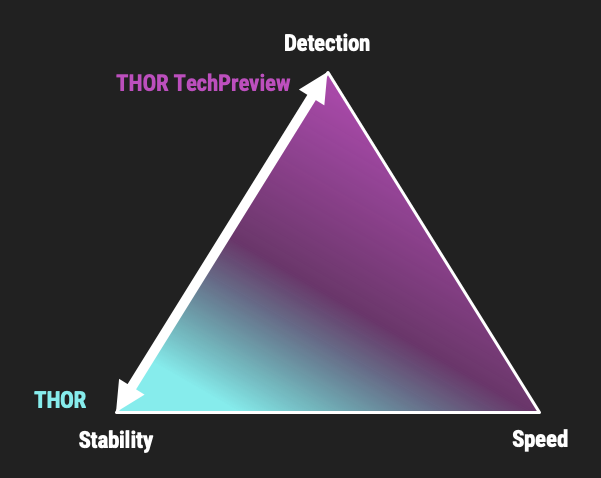

.. Index:: Which version to use

Which version to use?
=====================

The available THOR versions can be confusing at first. This section
explains which variant to use in which situation.

Which THOR Variant?
-------------------

THOR is available in different variants.

* :ref:`core/version:thor`
* :ref:`core/version:thor techpreview`
* :ref:`core/version:thor legacy` (limited support and compatibility)

   THOR Default and TechPreview Focus

THOR
^^^^

The default version of THOR is the most stable and most extensively
tested version. It is recommended for production use when stability is
the priority.

The default version should be used for:

* Scan sweeps on hundreds or thousands of systems
* Continuous compromise assessments on hundreds or thousands of systems
* Systems with high stability requirements

THOR TechPreview
^^^^^^^^^^^^^^^^

The TechPreview version is focused on detection coverage and speed. This
`blog post <https://www.nextron-systems.com/2020/08/31/introduction-thor-techpreview/>`__
contains more information on the differences.

The TechPreview version should be used for:

* Digital forensic lab scanning
* Dropzone mode scanning
* Image scanning
* THOR Thunderstorm setups
* Single-system live forensics on systems where maximum stability is not
  the highest priority

You can find the information on how to get the TechPreview version in
the `THOR Util manual <https://thor-util-manual.nextron-systems.com/en/latest/usage/download-packages.html#thor-techpreview-version>`__.

THOR Legacy
^^^^^^^^^^^

THOR Legacy is a reduced version intended for outdated operating
systems. It includes the modules that can be supported on those
platforms. This
`blog post <https://www.nextron-systems.com/2020/12/17/thor-10-legacy-for-windows-xp-and-windows-2003/>`__
contains more information on the legacy version.

The legacy version lacks:

* Diagnostic features of THOR Util
* UPX unpacking
* ADS scanning
* Module: Process scanning
* Module: Eventlog scanning
* Module: THOR Thunderstorm
* Module: ETW Watcher
* Module: Task scheduler
* HTML report generation

.. note::
   We offer only limited support for this version and cannot guarantee
   stable operation on every deprecated platform.

To use THOR Legacy, you need a special license. Contact sales for more
information about Legacy licenses.

To download THOR Legacy, either download it directly from our portal
(recommended; continue with step 5) or use THOR Util as follows:

1. Download a normal THOR package (non-legacy)
2. Use thor-util to download THOR Legacy:

   ``thor-util.exe download --legacy -t thor10-win``

3. You will receive a ZIP file with a name similar to:

   ``thor-win-10.6.20_<date>-<time>.zip``

4. The ZIP file contains the following files:

   .. figure:: ../images/thor_legacy_content.png
      :alt: THOR Legacy content

5. Transfer the package to your legacy system. Before using it, run:

   ``thor-legacy-util.exe upgrade``

   ``thor-legacy-util.exe update``

6. Place your Legacy license in this folder and start using THOR Legacy.

Which Architecture?
-------------------

THOR packages include both 32-bit and 64-bit executables. Never run the
32-bit THOR binary named ``thor.exe`` on a 64-bit system. Compared with
the 64-bit version, the 32-bit binary has limitations such as lower
available memory and different views of the file system and registry.

Make sure to run the correct binary for your target architecture.

What Command Line Flags?
------------------------

THOR is designed for production use. In most cases, you do not need to
specify additional command-line flags. Our recommended way to use THOR
is **without any additional command-line flags**.

However, special circumstances can require different settings and
therefore a different set of command-line flags. See chapter
:ref:`scanning/using-thor:using thor` for often used flags.
