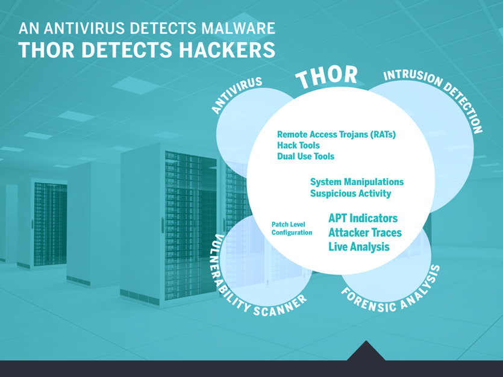

.. Index:: What is THOR?

What is THOR?
=============

THOR is a portable scanner designed to detect attacker tools and traces
of malicious activity on suspicious or compromised systems.

It combines a broad set of basic checks with in-depth analysis of the
local event log, registry, and file system. THOR is designed to identify
files and behavioral traces that a traditional antivirus solution may
miss. Its integrated scoring system helps assess suspicious elements
based on multiple characteristics and can provide indicators of
previously unknown malware.

THOR can also be extended to detect customer-specific attack patterns,
for example specific malware files or log entries identified during a
forensic investigation.

THOR is a portable, agentless "APT scanner".

   THOR Coverage and Comparison to Antivirus and Intrusion Detection

The key features are:

* Scans for hack tools and attacker activity using multiple detection
  mechanisms
* Portable – no installation required
* Runs on supported Windows, Linux, macOS, and AIX systems without
  additional runtime prerequisites
* Can be adapted to detect tools and activity specific to new APT cases
* Integrated scoring system to help identify suspicious or previously
  unknown malware
* Supports multiple export formats: Syslog (JSON/Key-Value/CEF), HTML,
  TXT, JSON, and CSV
* Can throttle scan activity to reduce system load

THOR Contents
-------------

The THOR package contains the following files and directories:

.. list-table::
   :widths: 30, 70
   :header-rows: 1

   * - Component
     - Files/Directories
   * - THOR Binaries
     - Windows: **thor.exe** and **thor64.exe**

       Linux: **thor-linux** and **thor-linux-64**

       macOS: **thor-macosx**

       AIX: **thor-aix**
   * - THOR Utility
     - Helper utility for updates, encryption, report generation, signature
       verification, and other tasks. See `THOR Util Manual <https://thor-util-manual.nextron-systems.com/>`_

       Windows: **thor-util.exe**

       Unix: **thor-util**
   * - Configuration Files (see :ref:`core/templates:scan templates`)
     - Located in ``./config`` (**thor.yml**, **thor-util.yml**,
       **sigma.yml**, **false\_positive\_filters.cfg**)
   * - Main Signature Database
     - Located in ``./signatures``
   * - Custom Signatures and IOCs (see :ref:`signatures/index:custom signatures`)
     - Located in ``./custom-signatures``
   * - THOR Changelog
     - **changes.log**
   * - Additional Tools
     - Located in ``./tools``; helpers for unpacking files
   * - THOR Manuals
     - Located in ``./docs``
   * - Plugins (see :ref:`scanning/using-thor:plugins`)
     - Located in ``./plugins``
