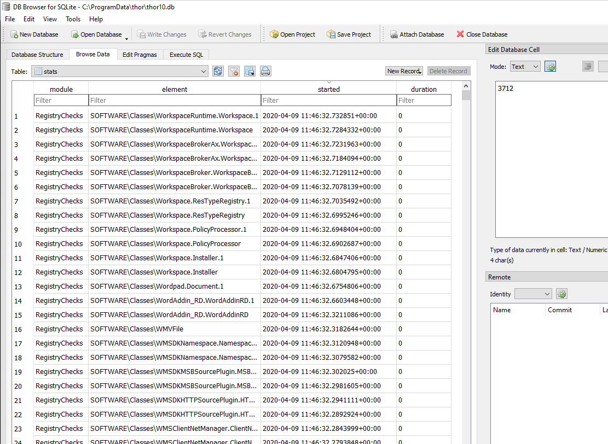

.. Index:: Finding Bottlenecks

Finding Bottlenecks
-------------------

You may encounter the message ``MESSAGE: Maximum runtime has exceeded,
killing THOR`` or notice that a scan is very slow or does not seem to
finish.

This message includes the elements that THOR was scanning when it
terminated, along with the time spent on each one. This can help you
determine why the scan took so long and whether a specific element
caused the delay.

You can also review the statistics table in ``thor10.db`` on the
affected endpoint after the scan. This helps identify the last element
or elements that took a long time to process.

We recommend using `DB Browser for SQLite <https://sqlitebrowser.org/>`_.

On Windows, the THOR DB is located at ``C:\ProgramData\thor\thor10.db``.

