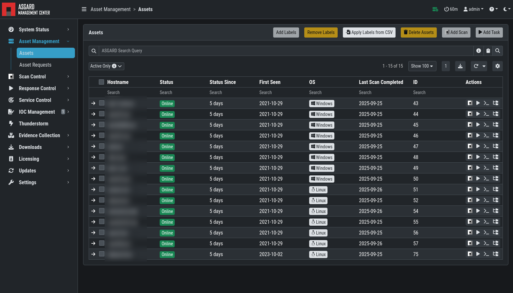
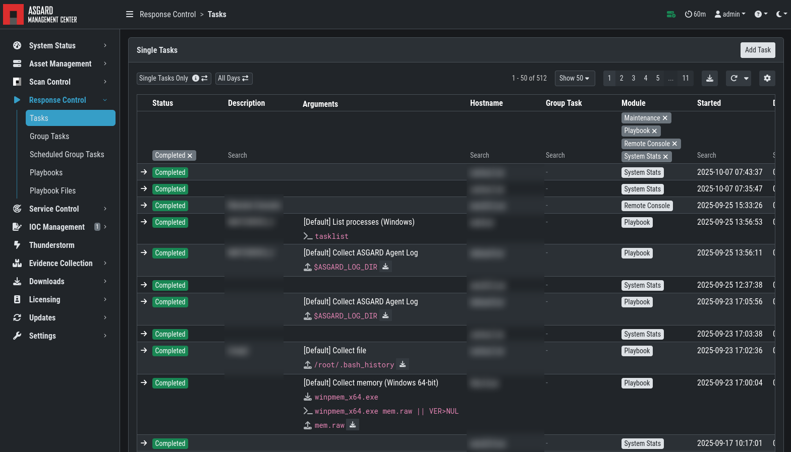

.. Index:: ASGARD Management Center

ASGARD Management Center
------------------------

ASGARD is the central management platform for THOR scans. It manages
distributed THOR scans on thousands of systems, collects, forwards and
analyses logs. Furthermore, ASGARD can control and execute complex
response tasks if needed.

ASGARD comes in two variations: While ASGARD Management Center features
scan control and response functions, ASGARD Analysis Cockpit can be used
to analyze large amounts of scan logs through an integrated base-lining
and case management.

The hardened, Linux-based ASGARD appliance is a powerful, solid and
scalable response platform with agents for Windows, Linux and macOS. It
provides essential response features like the collection of files,
directories and main memory, remote file system browsing and other
counteractive measures.

It features templates for scan runs and lets you plan and schedule
distributed sweeps with the lowest impact on system resources. Other
services are:

* **Update Service** - automatic updates for THOR scanners
* **License Service** - central registration and sub license generation
* **Asset Management Service** - central inventory and status dashboard
* **IOC Management** – manage and scan with custom IOC and YARA rule sets
* **Evidence Collection** – collect evidences (files and memory) from asset

   ASGARD Management Center

   ASGARD Response
