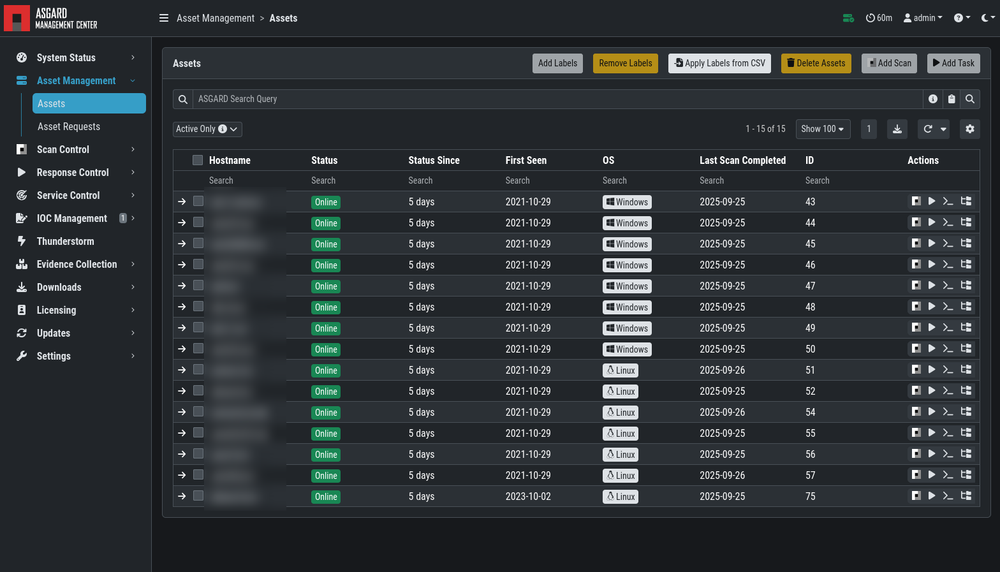
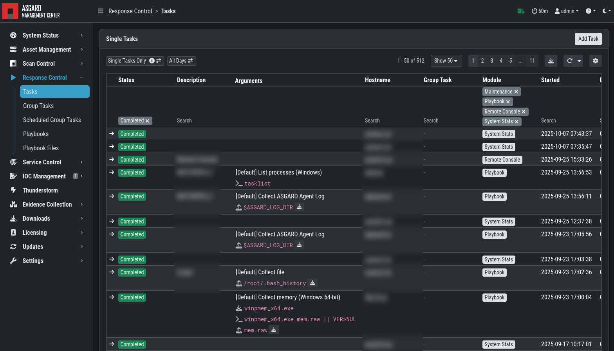

.. Index:: ASGARD Management Center

ASGARD Management Center
========================

ASGARD is the central management platform for THOR scans. It manages
distributed THOR scans across thousands of systems, collects and
forwards logs, and supports log analysis. It can also control and
execute complex response tasks when needed.

ASGARD is available in two variants. ASGARD Management Center focuses on
scan control and response functions, while ASGARD Analysis Cockpit is
used to analyze large volumes of scan logs through integrated
baselining and case management.

The hardened, Linux-based ASGARD appliance is a scalable response
platform with agents for Windows, Linux, and macOS. It provides
essential response features such as collecting files, directories, and
main memory, browsing remote file systems, and executing additional
response measures.

It provides templates for scan runs and lets you plan and schedule
distributed sweeps with minimal impact on system resources. Additional
services include:

* **Update Service** - automatic updates for THOR scanners
* **License Service** - central registration and sublicense generation
* **Asset Management Service** - central inventory and status dashboard
* **IOC Management** - manage and scan with custom IOC and YARA rule sets
* **Evidence Collection** - collect evidence (files and memory) from assets

   ASGARD Management Center

   ASGARD Response
