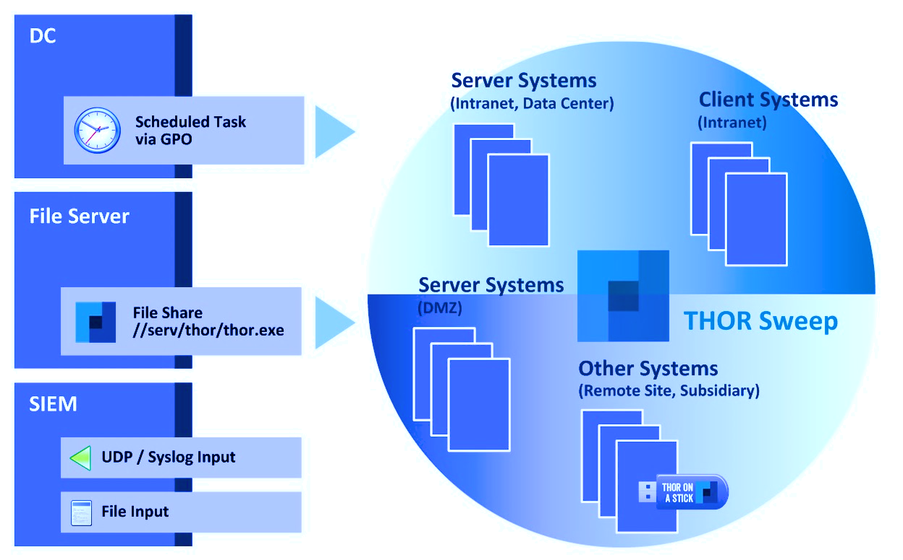

.. Index:: Network Share

Network Share (Windows)
=======================

THOR is a lightweight tool that can be deployed in many different ways.
It does not require installation and leaves only a few temporary files
on the target system.

A simple deployment option is to provide the THOR program folder on a
read-only network share and make it accessible to all systems in the
network. Systems in DMZ networks can still be scanned manually by
transferring a THOR package to the system and running it from the
command line. Locally written log files use the same format as syslog
messages sent to remote SIEM systems, so both can be processed together.

We often recommend triggering the scan through a Scheduled Task
distributed via GPO or PsExec. At the configured time, the target
systems access the file share and start the scan. You can either mount
the network share and run THOR from there or access it directly through
its UNC path, for example ``\\server\share\thor.exe`` or
``\\server\share\thor64.exe``.

   Deployment via Network Share

Place THOR on a Network Share
^^^^^^^^^^^^^^^^^^^^^^^^^^^^^

A practical way to run THOR on multiple systems is to define a
Scheduled Task through your Windows domain's group policy features.

The preferred way to run THOR on a remote system is to provide a network
share containing the extracted THOR package. You can use this directory
as the output directory, but we recommend creating a separate writable
share for HTML and TXT result files. The share containing the THOR
program folder should be read-only. Output files should either be
disabled or written to different locations to avoid write-access errors.

The necessary steps are:

1. Create a network share and extract the THOR package into the root of
   the share, i.e. ``\\fileserver\thor\``
2. Find the ``thor_remote.bat`` batch file in the ``tools`` subfolder,
   place it directly in the root of the program folder, and adjust it to
   your needs:

   -  set the network share UNC path

   -  set the parameters for the THOR run (see :ref:`scanning/using-thor:using thor`)

You should then test the setup as follows:

1. Connect to a remote system (Remote Desktop), which you would like to
   scan
2. Start a command prompt as Administrator (right-click > Run as
   Administrator)
3. Run the following command, which is going to mount a network drive,
   run THOR and disconnect the previously mounted drive:
   ``\\fileserver\thor\thor_remote.bat``

After a successful test run, decide how you want to invoke the script on
the network share. The following sections describe different options.

Create a Scheduled Task via GPO
^^^^^^^^^^^^^^^^^^^^^^^^^^^^^^^

In a Windows domain environment, you can create a Scheduled Task and
distribute it through GPO. The Scheduled Task invokes the batch file on
the network share and runs THOR. Make sure the respective user account
has the rights required to mount the configured network share.

| You can find more information here:
| https://technet.microsoft.com/en-us/library/cc725745.aspx

Create a Scheduled Task via PsExec
^^^^^^^^^^^^^^^^^^^^^^^^^^^^^^^^^^

This method uses Sysinternals PsExec and a list of target systems to
connect to each system and create a Scheduled Task from the command
line. For example:

.. code-block:: doscon

   C:\thor>psexec \\server1 -u domain/admin -p pass schtasks /create /tn "THOR Run" /tr "\\server\share\thor_remote.bat" /sc ONCE /st 08:00:00 /ru DOMAIN/FUadmin /rp password

Start THOR on the Remote System via WMIC
^^^^^^^^^^^^^^^^^^^^^^^^^^^^^^^^^^^^^^^^

THOR can also be started on a remote system via ``wmic`` using a file
share that contains the THOR package and is readable by the user who
executes the scan.

.. code-block:: doscon

   C:\thor>wmic /node:10.0.2.10 /user:MYDOM\scanadmin process call create "cmd.exe /c \\server\thor10\thor.exe"
