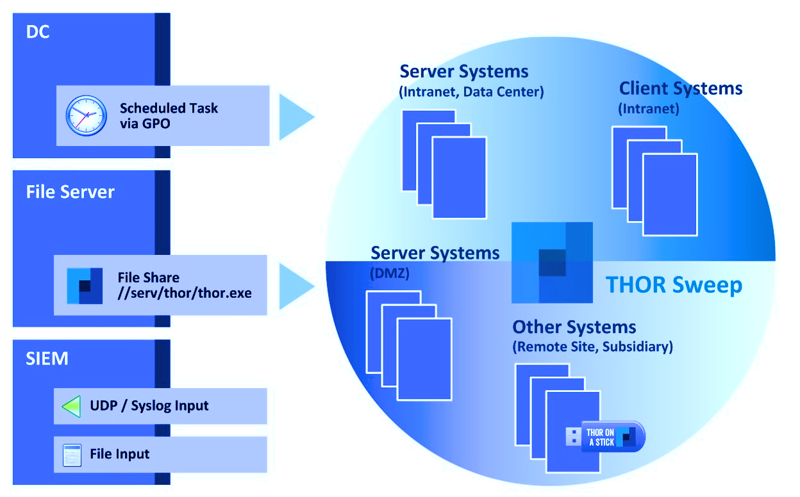

.. Index:: Network Share

Network Share (Windows)
=======================

THOR is a lightweight tool that can be deployed in many different ways.
It does not require installation and leaves only a few temporary files
on the target system.

A simple deployment option is to provide the THOR program folder on a
read-only network share and make it accessible to all systems in the
network. Systems in DMZ networks can still be scanned manually by
transferring a THOR package to the system and running it from the
command line. Locally written log files use the same format as syslog
messages sent to remote SIEM systems, so both can be processed together.

We often recommend triggering the scan through a Scheduled Task
distributed via GPO or PsExec. At the configured time, the target
systems access the file share and start the scan. You can either mount
the network share and run THOR from there or access it directly through
its UNC path, for example ``\\server\share\thor64.exe``.

   Deployment via Network Share

Place THOR on a Network Share
^^^^^^^^^^^^^^^^^^^^^^^^^^^^^

In this setup, all systems start ``thor64.exe`` from a central network
share. THOR reads its license and scan parameters from the program
folder on that share and writes the results to a second share.

1. Create a **read-only** share for the program folder, e.g.
   ``\\fileserver\thor``, and extract the THOR package into its root.
2. Place the license files in the program folder, e.g. in a
   ``licenses`` subfolder. THOR searches its program folder and all
   subfolders for a license that is valid for the scanned system (see
   :ref:`core/licensing:About License Files`).
3. Create a separate **writable** share for the results, e.g.
   ``\\fileserver\thor-logs``.
4. Add your scan parameters to the default config file
   ``config\thor.yml`` in the program folder (see below).

Scheduled Tasks that run as ``SYSTEM`` access network shares with the
computer account of the scanned system (``DOMAIN\HOSTNAME$``). Grant
the ``Domain Computers`` group read access to the program share and
write access to the output share, on both the share and the NTFS
permissions.

THOR always applies the file ``config\thor.yml`` next to the THOR
executable (see :ref:`core/templates:Default Template`). This also
works when THOR runs from a network share. If you put all scan
parameters into this file, every system uses the same settings.

THOR writes its output files to the current working directory by
default. A Scheduled Task usually runs in ``C:\Windows\System32``,
so always set ``output-directory``. THOR names the files after the
scanned system, so all systems can write to the same share. Add the
setting to the existing content of ``config\thor.yml``:

.. code-block:: yaml

   # Write all result files to the output share
   output-directory: \\fileserver\thor-logs

Add other parameters as required (see :ref:`core/flags:Command-Line Options`),
for example ``syslog`` to send the results to your SIEM.

To test the setup:

1. Connect to a system that you want to scan, e.g. via Remote Desktop.
2. Start a command prompt as Administrator (right-click > Run as
   Administrator).
3. Run ``\\fileserver\thor\thor64.exe``.
4. Make sure that the scan starts with a valid license and that the
   result files appear on the output share.

This test runs with your user account, not with the computer account.
To test with the computer account, run THOR as ``SYSTEM``, e.g. with
``psexec -s \\fileserver\thor\thor64.exe``.

Create a Scheduled Task via GPO
^^^^^^^^^^^^^^^^^^^^^^^^^^^^^^^

In a Windows domain environment, distribute a Scheduled Task through
a Group Policy Object. The task starts THOR from the network share.

1. Open the Group Policy Management Console and create a new GPO.
   Link it to the organizational unit that contains the systems to scan.
2. Edit the GPO and go to **Computer Configuration > Preferences >
   Control Panel Settings > Scheduled Tasks**.
3. Select **New > Immediate Task (At least Windows 7)** for a one-time
   scan as soon as the systems apply the policy. Select **New > Scheduled
   Task (At least Windows 7)** instead for scans at a fixed time or on a
   recurring schedule.
4. On the **General** tab:

   - Set a name, e.g. ``THOR Scan``
   - Set the user account to ``NT AUTHORITY\System``
   - Select **Run whether user is logged on or not** and
     **Run with highest privileges**

5. On the **Actions** tab, create a **Start a program** action:

   - Program/script: ``\\fileserver\thor\thor64.exe``

6. On the **Settings** tab, adjust **Stop the task if it runs longer
   than** to a value that is longer than a full scan. The default of
   3 days is usually sufficient. A shorter value terminates long scans.
7. For an Immediate Task, select **Apply once and do not reapply** on
   the **Common** tab. Otherwise, the scan starts again with every
   policy refresh.

The systems apply the policy at the next Group Policy refresh (by
default every 90 minutes, with a random offset of up to 30 minutes).
To apply it immediately on a system, run ``gpupdate /force``.

For more information, see
`Group Policy preferences in Windows <https://learn.microsoft.com/en-us/windows-server/identity/ad-ds/manage/group-policy/group-policy-preferences>`_.

Create a Scheduled Task via PsExec
^^^^^^^^^^^^^^^^^^^^^^^^^^^^^^^^^^

This method uses Sysinternals PsExec and a list of target systems to
connect to each system and create a Scheduled Task from the command
line. For example:

.. code-block:: doscon

   C:\thor>psexec \\server1 -u DOMAIN\admin -p pass schtasks /create /tn "THOR Run" /tr "\\fileserver\thor\thor64.exe" /sc ONCE /st 08:00:00 /ru SYSTEM /rl HIGHEST

Start THOR on the Remote System via WMIC
^^^^^^^^^^^^^^^^^^^^^^^^^^^^^^^^^^^^^^^^

THOR can also be started on a remote system via ``wmic`` using a file
share that contains the THOR package and is readable by the user who
executes the scan.

.. code-block:: doscon

   C:\thor>wmic /node:10.0.2.10 /user:MYDOM\scanadmin process call create "cmd.exe /c \\server\thor10\thor.exe"
