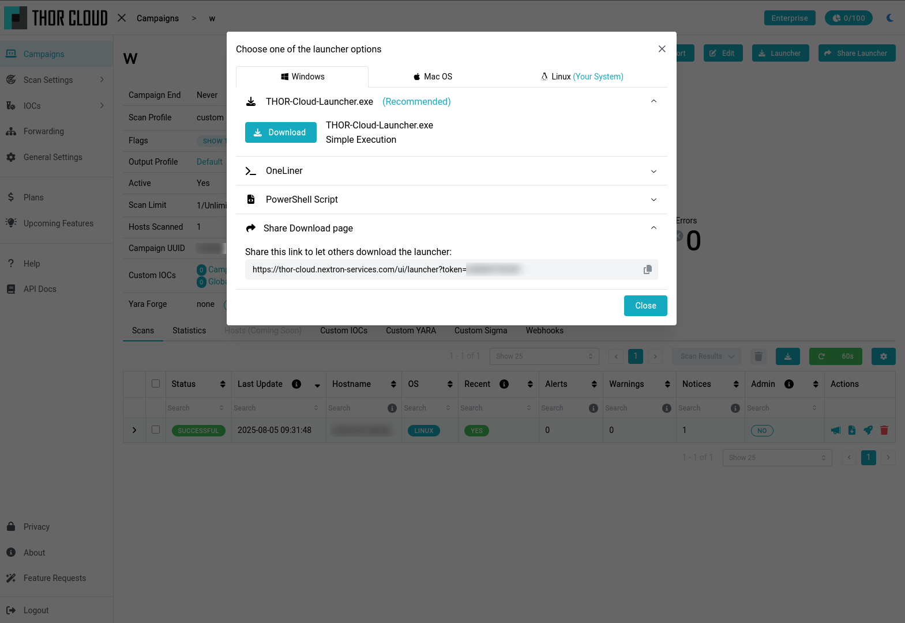

.. Index:: THOR Cloud

THOR Cloud
==========

**THOR Cloud** is a cloud service that lets you run THOR on multiple
endpoints with a single launcher binary, without installing an agent.
It simplifies large-scale distribution and result collection: you launch
the binary and monitor the scan campaign as it progresses.

   Downloading THOR Cloud's Launcher

Within THOR Cloud, you can create separate campaigns, each with its own
scan options. Every campaign also has its own launcher, which helps keep
different scan runs in your environment clearly separated.

There are currently two THOR Cloud variants:

- THOR Cloud Lite

  - Free version of THOR (THOR Lite) with a limited number of monthly scans
  - Contains our Lite Signatures
  - Free sign-up
  - [thorcloud-lite.nextron-systems.com](https://thorcloud-lite.nextron-systems.com/)

- THOR Cloud

  - Enterprise version of THOR
  - Full feature and signature set of THOR
  - Paid; please contact our sales department
  - [thor-cloud.nextron-services.com](https://thor-cloud.nextron-services.com)
