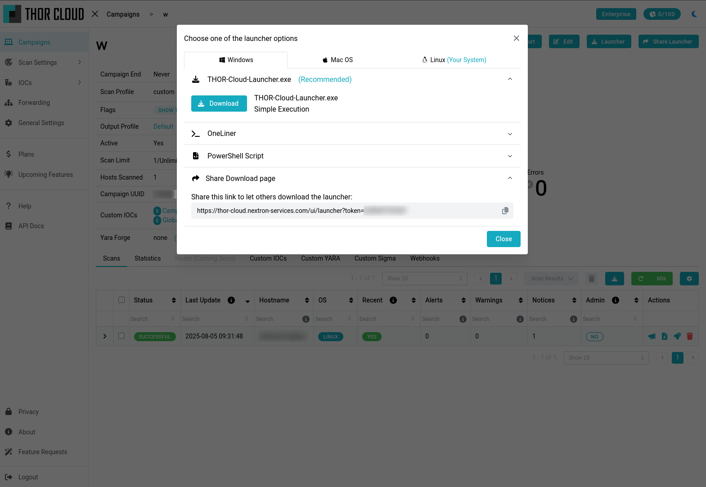

.. Index:: THOR Cloud

THOR Cloud
==========

**THOR Cloud** is a cloud service which allows you to download
and run THOR on multiple endpoints with a single binary, without
installing an agent. This avoids the pain of distributing THOR
and collecting its output in bigger environments, as you can just
run the launcher binary and watch the scan slowly finish.

   Downloading THOR Cloud's Launcher

Within THOR Cloud you can create different campaigns, which all
can be configured with different scan options. Every campaign
also has its own launcher, which helps to separate the different
scans in your environment.

There are two variants of THOR Cloud available today:

- THOR Cloud Lite
  
  - Free version of THOR (THOR Lite), with a limited amount of monthly scans
  - Contains our Lite Signatures
  - Free Sign Up
  - https://thorcloud-lite.nextron-systems.com/

- THOR Cloud

  - Enterprise version of THOR
  - Full Feature and Signature set of THOR
  - Paid, please contact our sales department
  - https://thor-cloud.nextron-services.com