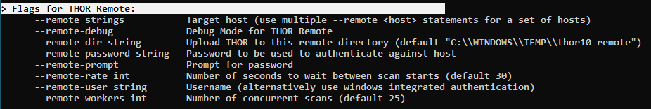
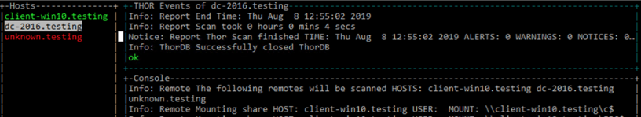

.. Index:: THOR Remote

THOR Remote
===========

THOR Remote is a quick way to distribute THOR in a Windows environment.
It was developed for incident response use cases and uses PsExec to
push and execute THOR with selected parameters on remote systems.

Requirements:

* Administrative Windows domain user account with access rights on the
  target systems
* Reachability of the target systems (Windows Ports):

  - 135/tcp for SCM (Service Management)

  - 445/tcp for SMB (Mounting)

* A list of target systems

Advantages:

* Agent-less
* Convenient scanning without scripting
* Quick results (useful in incident response scenarios)

Disadvantages:

* Requires reachability of Windows ports
* User credentials remain on the target system if THOR Remote is used
  with explicit credentials (NTLM authentication) and the user is not
  already working with an account that has access rights on the target
  systems (Kerberos authentication)

Usage
^^^^^

A list of parameters for the remote scanning function can be found in
the help screen.

   THOR Remote Usage

As shown there, you can provide a list of target hosts using YAML
configuration files. See :ref:`core/templates:scan templates` for more
details.

A YAML file with a list of hosts looks like this:

.. code-block:: yaml

   remote-host:
   - winatl001.dom.int
   - winatl002.dom.int
   - winnyk001.dom2.int

You can then use that file with:

.. code-block:: doscon

   C:\thor>thor64.exe -t targets.yml

THOR Remote Licensing
^^^^^^^^^^^^^^^^^^^^^

Valid licenses for all target systems are required. Place them in the
program folder or any sub folder within the program directory (e.g.
``./licenses``). In case of incident response licenses, just place that
single license in the program folder.

You do not need a valid license for the system that runs THOR's remote
scanning feature, for example the administrator workstation used as the
source system.

.. hint::
   You can pair THOR Remote with the :ref:`core/licensing:customer portal`
   options available within THOR, to make deployment easier.

Output
^^^^^^

The generated log files are collected and written to the folder
``./remote-logs``.

THOR Remote has its own interface, which allows you to monitor scan
progress and view the log files of the different remote systems.

   THOR Remote Interface

Issues
^^^^^^

System Error 5 occurred – Access Denied
"""""""""""""""""""""""""""""""""""""""

See:
`Access denied trying to connect to administrative shares on Windows 7 <https://helgeklein.com/blog/access-denied-trying-to-connect-to-administrative-shares-on-windows-7/>`_

Running THOR from a Network Share
"""""""""""""""""""""""""""""""""

THOR must reside on the local file system of the source system. Do not
run it from a mounted network share. This can lead to the following
error:

.. code-block:: none

   CreateFile .: The system cannot find the path specified.
