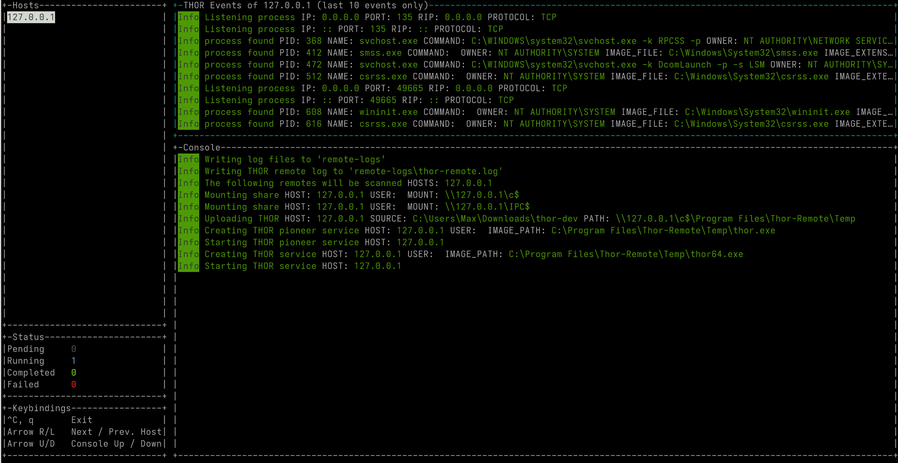

.. Index:: THOR Remote

THOR Remote
-----------

THOR Remote is a quick method to distribute THOR in a Windows
environment. It has been developed during an incident response and can
be considered as a clever hack that makes use of PsExec to push and
execute THOR with certain parameters on remote systems.

Requirements:

* Administrative Domain Windows user account with access rights on the target systems
* Reachability of the target systems (Windows Ports):

  - 135/tcp for SCM (Service Management)

  - 445/tcp for SMB (Mounting)

* A list of target systems

Advantages:

* Agent-less
* Comfortable scanning without scripting
* Quick results (useful in incident response scenarios)

Disadvantages:

* Requires reachability of Windows ports
* User credentials remain on the target system if it is used with explicit credentials
  (NTLM Auth) and the users doesn't already use an account that has access rights on
  target systems (Kerberos Auth)

Usage
^^^^^

A list of parameters used with the remote scanning function can be found
in the help screen.

.. figure:: ../images/image10.png
   :alt: THOR Remote Usage

   THOR Remote Usage

As you can see, a list of target hosts can be provided with the help of
the new YAML config files. See :ref:`core/templates:scan templates` for more
details.

A YAML file with a list of hosts looks like this:

.. code-block:: yaml
   
   remote-host:
   - winatl001.dom.int
   - winatl002.dom.int
   - winnyk001.dom2.int

You can then use that file with:

.. code-block:: doscon
   
   C:\thor>thor64.exe -t targets.yml

THOR Remote Licensing
^^^^^^^^^^^^^^^^^^^^^

Valid licenses for all target systems are required. Place them in the
program folder or any sub folder within the program directory (e.g.
``./licenses``). In case of incident response licenses, just place that
single license in the program folder.

You don't need a valid license for the system that runs THOR's remote
scanning feature (the source system of the scans, e.g. admin
workstation).

.. hint::
   You can pair THOR Remote with the :ref:`core/licensing:customer portal`
   options available within THOR, to make deployment easier.

Output
^^^^^^

The generated log files are collected and written to the folder
``./remote-logs``

The "THOR Remote" function has its own interface, which allows you to
view the progress of the scans, view and scroll through the log files of
the different remote systems.

   THOR Remote Interface

Issues
^^^^^^

System Error 5 occurred – Access Denied
"""""""""""""""""""""""""""""""""""""""

See:
https://helgeklein.com/blog/2011/08/access-denied-trying-to-connect-to-administrative-shares-on-windows-7/

Running THOR from a Network Share
"""""""""""""""""""""""""""""""""

THOR must reside on the local file system of the source system. Don't run
it from a mounted network share. This could lead to the following error:

.. code-block:: none
   
   CreateFile .: The system cannot find the path specified.
