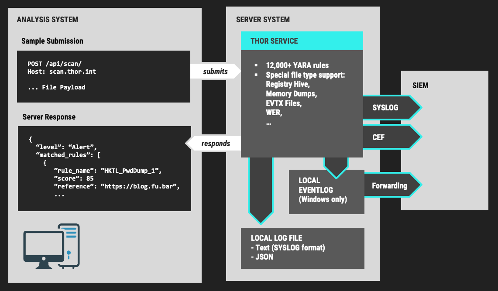
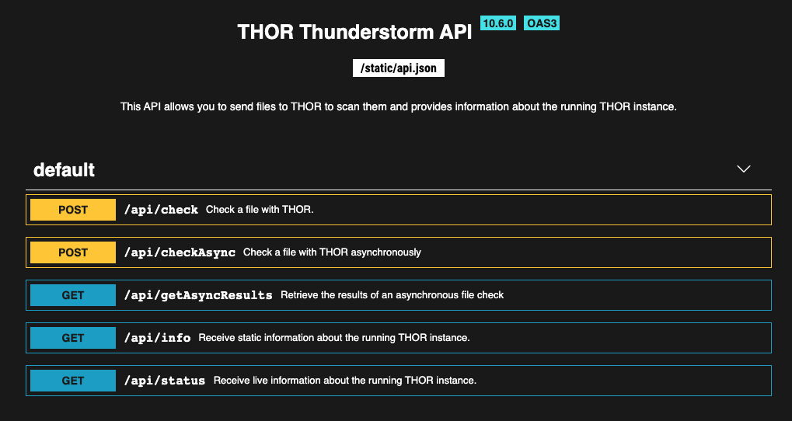
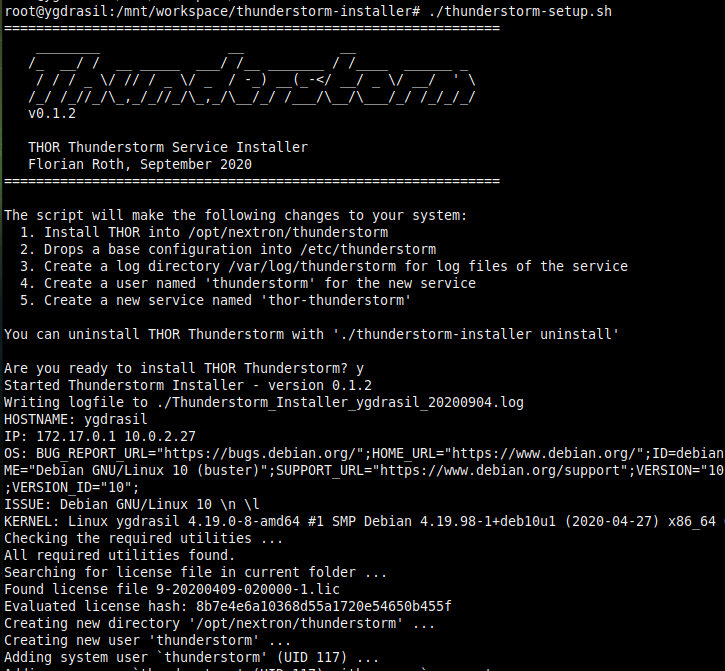

.. Index:: THOR Thunderstorm

THOR Thunderstorm Service
-------------------------

THOR Thunderstorm provides THORs scanning services as a RESTful web
service. This service receives samples and returns a scan result.

Thunderstorm Deployment
^^^^^^^^^^^^^^^^^^^^^^^

The THOR package contains a separate binary under ``tools/thunderstorm``.
This binary, when started, listens on a given network interface and port
while running THOR in the background. When samples are received, it
forwards them to THOR for scanning and returns the results.

   THOR Thunderstorm Overview

The following table contains all Thunderstorm command line flags:

.. csv-table::
  :file: ../csv/thunderstorm.csv
  :widths: 30, 25, 45
  :delim: ;
  :header-rows: 1

The underlying THOR instance can be configured with additional flags
using the THOR template (see :configuration:) to e.g.:

 - Forward logs with ``--syslog``
 - Specify a custom log location
 - Disable some features
 - ...

Service License Type
^^^^^^^^^^^^^^^^^^^^

To run THOR in Thunderstorm service mode, you need a special license
type named "Service License" that allows this mode of operation.

After the launch of THOR Thunderstorm, we may allow other license types
to run THOR in service mode for a limited period of time, so that
customers can test the service and its integration into other solutions.

Thunderstorm Collectors
^^^^^^^^^^^^^^^^^^^^^^^

There are several collectors, both as binary and as scripts, available in
`our GitHub repository <https://github.com/NextronSystems/thunderstorm-collector/>`_.
These collectors can be used to automatically transmit all (or a subset of) files
from an endpoint to a Thunderstorm instance.

Thunderstorm API Client
^^^^^^^^^^^^^^^^^^^^^^^

We provide a free and open source command line client written in Python
to communicate with the Thunderstorm service.

https://github.com/NextronSystems/thunderstormAPI

It can be installed with:

.. code-block:: console

   nextron@unix:~$ pip install thunderstormAPI

Thunderstorm API Documentation
^^^^^^^^^^^^^^^^^^^^^^^^^^^^^^

An API documentation is integrated into the web service.

Simply visit the service URL, e.g.: :samp:`http://my-server:8080/`

   Thunderstorm API documentation

Server Installer Script for Linux
^^^^^^^^^^^^^^^^^^^^^^^^^^^^^^^^^

A script that facilitates the installation on Linux systems can be found
in our github repository.

https://github.com/NextronSystems/nextron-helper-scripts/blob/master/thunderstorm/thunderstorm-installer.sh

The installation of a full THOR Thunderstorm server requires only two
steps.

1. Download and place a THOR Service license file in the current working
   directory

2. Run the following command

.. code-block:: console

   nextron@unix:~$ wget -O - https://raw.githubusercontent.com/NextronSystems/nextron-helper-scripts/master/thunderstorm/thunderstorm-installer.sh | bash

.. warning:: 
   Please inspect scripts from the internet before executing them!

Everything else will automatically be handled by the installer script.
It even supports an “uninstall” flag to remove all files and folders
from the system to get the system clean again after a successful
proof-of-concept.

   Thunderstorm Service Installer

After the installation, the configuration file is located in
``/etc/thunderstorm``.

The log file of the service can be found in ``/var/log/thunderstorm``.

Thunderstorm Update
^^^^^^^^^^^^^^^^^^^

The Thunderstorm service gets updated just as THOR does. Use "thor-util
update" to update signatures or "thor-util upgrade" to update binaries
and signatures. The service has to be stopped during the updates.

Update signatures:

.. code-block:: console

   nextron@unix:~$ thor-util update 

Upgrade signatures:

.. code-block:: console

   nextron@unix:~$ thor-util upgrade

See the `THOR Util Manual <https://thor-util-manual.nextron-systems.com>`_  manual for details on how to use these functions.

Thunderstorm Update Script
""""""""""""""""""""""""""

The Thunderstorm installer script for Linux automatically places an
updater script in the PATH of the server system.

https://github.com/NextronSystems/nextron-helper-scripts/tree/master/thunderstorm

Update binaries and signatures:

.. code-block:: console

   nextron@unix:~$ thunderstorm-update

Stop service, update binaries and signatures, restart
service:

.. code-block:: console

   nextron@unix:~$ thunderstorm-update full

Source Identification
^^^^^^^^^^^^^^^^^^^^^

The log file generated by THOR Thunderstorm doesn't contain the current
host as hostname in each line. By default, it contains the sending
source's FQDN or IP address if a name cannot be resolved using the
locally configured DNS server.

However, every source can set a “source” value in the request and
overwrite the automatically evaluated hostname. This way users can use
custom values that are evaluated or set on the sending on the end
system.

.. code-block:: console

   nextron@unix:~$ curl -X POST "http://myserver:8080/api/check?source=test" -F "file=@sample.exe"

Synchronous and Asynchronous Mode
^^^^^^^^^^^^^^^^^^^^^^^^^^^^^^^^^

It is also important to mention that Thunderstorm supports two ways
to submit samples, a synchronous and an asynchronous mode.

The default is synchronous submission. In this mode, the sender waits
for the scan result, which can be empty in case of no detection or
contains match elements in cases in which a threat could be identified.

In asynchronous mode, the submitter doesn't wait for the scan result but
always gets a send receipt with an id, which can just be discarded or
used to query the service at a later point in time. This mode is best
for use cases in which the submitter doesn't need to know the scan
results and batch submission should be as fast as possible.

.. list-table::
   :header-rows: 1
   :widths: 30, 30, 40

   * - 
     - Synchronous
     - Asynchronous
   * - Server API Endpoint
     - /api/check
     - /api/checkAsync
   * - ThunderstormAPI Client Parameter
     -
     - --asyn
   * - Advantage
     - Returns Scan Result
     - Faster submission
   * - Disadvantage
     - Client waits for result of each sample
     - No immediate scan result on the client side

In asynchronous mode, the Thunderstorm service keeps the samples in a
queue on disk and scans them with THOR as it has time
to scan them. The number of files in this queue can be queried at the
status endpoint **/api/status** and checked on the landing page of the
web GUI.

SSL/TLS
^^^^^^^

We do not recommend the use of SSL/TLS since it impacts the submission
performance. In cases in which you transfer files through networks with
IDS/IPS appliances, the submission in an SSL/TLS protected tunnel
prevents IDS alerts and connection resets by the IPS.

Depending on the average size of the samples, the submission frequency
and the number of different sources that submit samples, the
transmission could take up to twice as much time.

Note: The thunderstormAPI client doesn't verify the server's certificate
by default as in this special case, secrecy isn't important. The main
goal of the SSL/TLS encryption is an obscured method to transport
potentially malicious samples over network segments that could be
monitored by IDS/IPS systems. You can activate certificate checks with
the ``--verify`` command line flag or ``verify`` parameter in API
library's method respectively.
