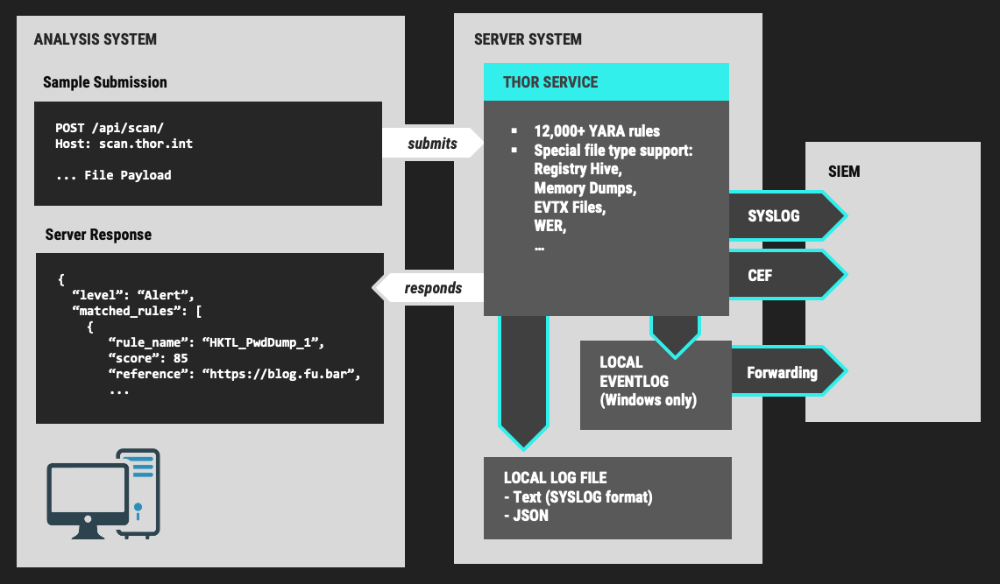
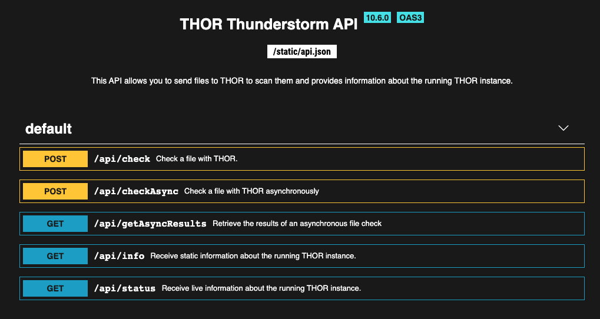
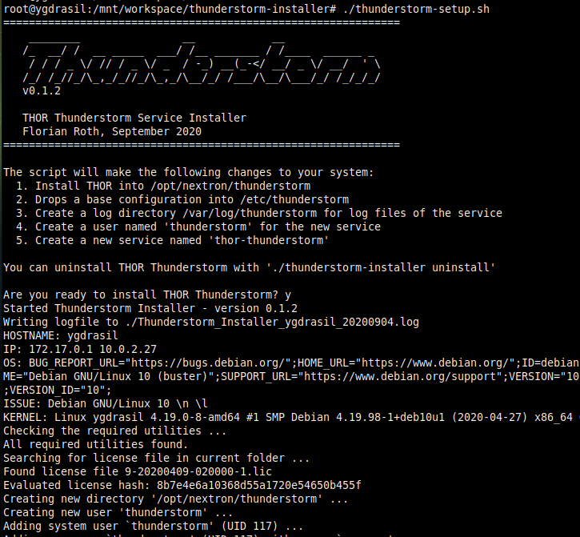

.. Index:: THOR Thunderstorm

THOR Thunderstorm Service
=========================

THOR Thunderstorm exposes THOR's scanning capabilities as a RESTful web
service. It receives submitted samples and returns scan results.

Thunderstorm Deployment
^^^^^^^^^^^^^^^^^^^^^^^

The THOR package contains a separate binary under
``tools/thunderstorm``. When started, this binary listens on a selected
network interface and port while running THOR in the background. When
samples are received, it forwards them to THOR for scanning and returns
the results.

   THOR Thunderstorm Overview

The following table lists all Thunderstorm command-line flags:

.. csv-table::
  :file: ../csv/thunderstorm.csv
  :widths: 30, 25, 45
  :delim: ;
  :header-rows: 1

THOR flags can be passed after the Thunderstorm flags using
``./tools/thunderstorm <thunderstorm-flags> -- <thor-flags>`` or set via
a THOR template (see :ref:`core/templates:scan templates`). This can be
used, for example, to:

* forward logs with ``--remote-log``
* specify a custom log location
* disable selected features

Service License Type
^^^^^^^^^^^^^^^^^^^^

To run THOR in Thunderstorm service mode, you need a special license
type named ``Service License`` that allows this mode of operation.

For limited evaluation periods, we may also allow other license types to
run THOR in service mode so customers can test the service and its
integration into other solutions.

Thunderstorm Collectors
^^^^^^^^^^^^^^^^^^^^^^^

We provide several collectors, both as binaries and as scripts, in
`our GitHub repository <https://github.com/NextronSystems/thunderstorm-collector/>`_.
These collectors can be used to automatically transmit all files, or a
selected subset of files, from an endpoint to a Thunderstorm instance.

Thunderstorm API Client
^^^^^^^^^^^^^^^^^^^^^^^

We provide a free and open-source command-line client written in Python
to communicate with the Thunderstorm service:

`thunderstormAPI on GitHub <https://github.com/NextronSystems/thunderstormAPI>`_

It can be installed with:

.. code-block:: console

   nextron@unix:~$ pip install thunderstormAPI

Thunderstorm API Documentation
^^^^^^^^^^^^^^^^^^^^^^^^^^^^^^

The API documentation is integrated into the web service.

Simply visit the service URL, e.g.: :samp:`http://my-server:8080/`

   Thunderstorm API documentation

Server Installer Script for Linux
^^^^^^^^^^^^^^^^^^^^^^^^^^^^^^^^^

A script that simplifies installation on Linux systems is available in
our GitHub repository:

`thunderstorm-installer.sh <https://github.com/NextronSystems/nextron-helper-scripts/blob/master/thunderstorm/thunderstorm-installer.sh>`_

Installing a full THOR Thunderstorm server requires only two steps:

1. Download and place a THOR Service license file in the current working
   directory

2. Run the following command:

.. code-block:: console

   nextron@unix:~$ wget -O - https://raw.githubusercontent.com/NextronSystems/nextron-helper-scripts/master/thunderstorm/thunderstorm-installer.sh | bash

.. warning::
   Please inspect scripts from the internet before executing them!

The installer script handles the remaining steps automatically. It also
supports an ``uninstall`` flag to remove all files and folders from the
system after a proof-of-concept.

   Thunderstorm Service Installer

After the installation, the configuration file is located in
``/etc/thunderstorm``.

The log file of the service can be found in ``/var/log/thunderstorm``.

Thunderstorm Update
^^^^^^^^^^^^^^^^^^^

The Thunderstorm service is updated in the same way as THOR. Use
``thor-util update`` to update signatures or ``thor-util upgrade`` to
update binaries and signatures. The service must be stopped during the
update.

Update signatures:

.. code-block:: console

   nextron@unix:~$ thor-util update

Upgrade signatures:

.. code-block:: console

   nextron@unix:~$ thor-util upgrade

See the `THOR Util Manual <https://thor-util-manual.nextron-systems.com>`_
for details on how to use these functions.

Thunderstorm Update Script
""""""""""""""""""""""""""

The Linux installer script automatically places an updater script in the
server system's ``PATH``.

`Thunderstorm helper scripts <https://github.com/NextronSystems/nextron-helper-scripts/tree/master/thunderstorm>`_

Update binaries and signatures:

.. code-block:: console

   nextron@unix:~$ thunderstorm-update

Stop service, update binaries and signatures, restart
service:

.. code-block:: console

   nextron@unix:~$ thunderstorm-update full

Source Identification
^^^^^^^^^^^^^^^^^^^^^

The log file generated by THOR Thunderstorm does not include the current
host as the hostname in each line. By default, it uses the sender's
FQDN or IP address if the local DNS server cannot resolve a name.

However, each source can set a ``source`` value in the request and
override the automatically determined hostname. This allows users to use
custom values collected or set on the sending endpoint.

.. code-block:: console

   nextron@unix:~$ curl -X POST "http://myserver:8080/api/check?source=test" -F "file=@sample.exe"

Synchronous and Asynchronous Modes
^^^^^^^^^^^^^^^^^^^^^^^^^^^^^^^^^^

Thunderstorm supports two submission modes: synchronous and
asynchronous.

Synchronous submission is the default. In this mode, the sender waits
for the scan result. The result is empty if no detection occurs, or
contains matching elements if a threat is identified.

In asynchronous mode, the sender does not wait for the scan result.
Instead, it always receives a receipt with an ID, which can either be
discarded or used to query the service later. This mode is best suited
for use cases where the sender does not need immediate scan results and
batch submission speed is the priority.

.. list-table::
   :header-rows: 1
   :widths: 30, 30, 40

   * - Aspect
     - Synchronous
     - Asynchronous
   * - Server API Endpoint
     - /api/check
     - /api/checkAsync
   * - ThunderstormAPI Client Parameter
     -
     - --asyn
   * - Advantage
     - Returns scan result
     - Faster submission
   * - Disadvantage
     - Client waits for the result of each sample
     - No immediate scan result on the client side

In asynchronous mode, the Thunderstorm service keeps submitted samples
in an on-disk queue and scans them as resources become available. The
number of queued files can be queried through the status endpoint
``/api/status`` and viewed on the landing page of the web GUI.

SSL/TLS
^^^^^^^

We generally do not recommend SSL/TLS because it can reduce submission
performance. However, if you transfer files through networks with
IDS/IPS appliances, using an SSL/TLS-protected tunnel can help prevent
IDS alerts and IPS-triggered connection resets.

Depending on average sample size, submission frequency, and the number
of different sources, transmission can take up to twice as much time.

The thunderstormAPI client does not verify the server certificate by
default. In this use case, the main goal of SSL/TLS is often to
transport potentially malicious samples through monitored network
segments without triggering IDS/IPS controls. You can enable
certificate verification with the ``--verify`` command-line flag or the
corresponding ``verify`` parameter in the API library.
