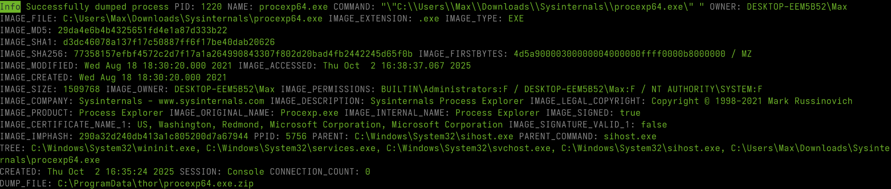

.. Index:: Process Memory Dumps

Process Memory Dumps
--------------------

THOR supports process dumping to backup volatile
malware information. This can be enabled with ``--process-dump``.

When enabled, THOR on Windows creates a process dump of any process that is considered
malicious. Maliciousness is determined as anything that triggers a
warning or an alert.

This process dump can then be analyzed with standard tools later on to
examine the found malware.

   Process dumping

.. figure:: ../images/image24.png
   :alt: Process dumps on disk

   Process dumps on disk

To prevent flooding the disk fully in case many dumps are created, old
dumps of a process are overwritten if a new dump is generated. Also,
THOR will only generate up to 10 dumps per scan. This can be customized
with ``--process-dump-limit``.

Also note that THOR will never dump lsass.exe to prevent these dumps
from potentially being used to extract passwords by any attackers.