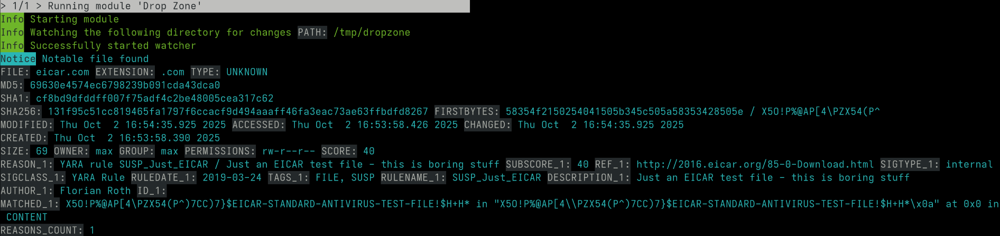
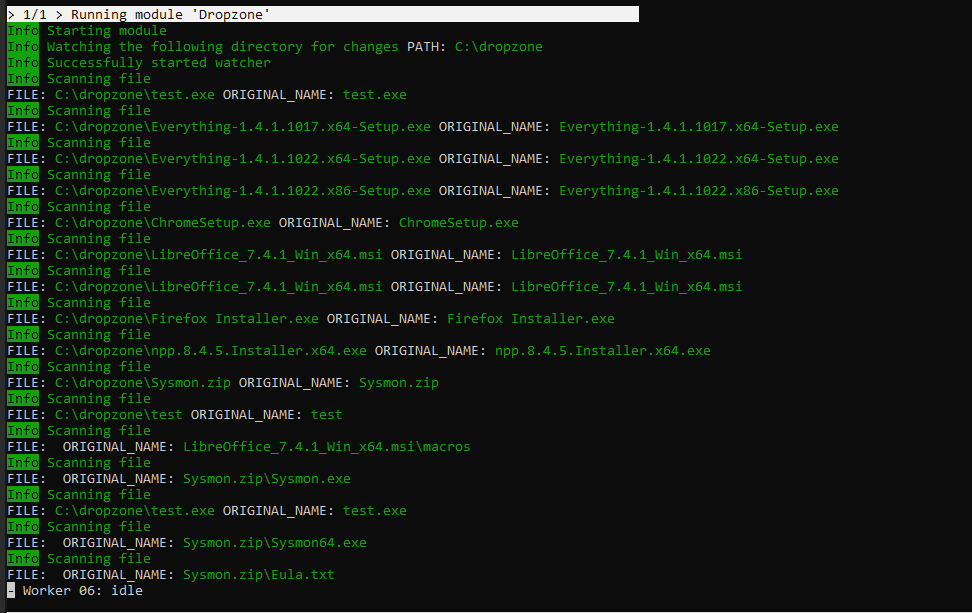
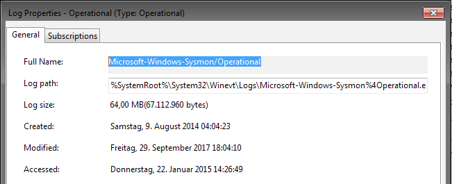
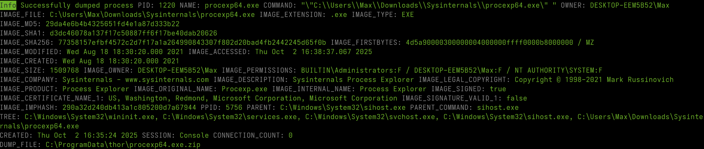
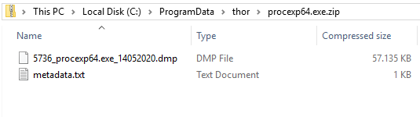

.. Index:: Special Scan Modes

Special Scan Modes
==================

This chapter describes special-purpose scan modes that change THOR's
behavior or enable specific features. Some of these modes require a
special license, which is highlighted in the relevant ``note`` box. If
you have questions about licensing, please contact our sales department
at sales@nextron-systems.com.

Lab Scanning
------------

Lab scanning mode is activated with ``--lab``. It is intended for
scanning mounted forensic images or a single directory on a forensic
workstation. All resource control functions are disabled and deep mode
is activated by default.

The ``--lab`` parameter automatically activates the following options:

* deep (scan every file intensively regardless of extension or magic
  header, with a larger file size limit)
* no-resource-check (do not limit system resources or stop the scan on
  low memory)
* no-soft (do not automatically activate soft mode on systems with a
  single CPU core or low memory)
* no-scan-lock (do not check for other THOR instances on the same
  system and do not stop the scan if another instance is found)
* cross-platform-paths (apply filename IOCs to both Unix-style and
  Windows-style paths)
* multi-threading (automatically set the number of threads to the
  number of CPU cores on the workstation)

The chapter :ref:`use-cases/index:common use cases` contains practical
examples for this scan mode.

.. note::

   If you run multiple THOR scans with multi-threading on a single system,
   resource usage will rise quickly since it scales per thread.

   Consider using ``--threads`` to reduce the number of threads that each THOR
   scan uses, e.g. ``--threads 4`` if running 4 scans on a 16 core system.

Forensic Lab License
^^^^^^^^^^^^^^^^^^^^

Scanning mounted disk or memory images is a use case we refer to as
"lab scanning". It requires a `forensic lab license <https://www.nextron-systems.com/2020/11/11/thor-forensic-lab-license-features/>`__,
which is intended for corporate digital forensic labs.

Other license types are intended for different use cases, usually live
system scanning. A similar but less thorough scan can be performed with
the following command-line flags:

.. code-block:: doscon 

   C:\thor>thor64.exe -a Filescan --deep --no-resource-check --cross-platform-paths -p path-to-scan --threads 0
   
Without a valid lab license, you cannot use multiple THOR instances on a
single system. The features described in the following subsections are
also limited to this license type.

`This article <https://www.nextron-systems.com/2020/11/11/thor-forensic-lab-license-features/>`__
explains the advantages of the lab license.

Path Remapping
^^^^^^^^^^^^^^^^^^^^^

Because THOR enriches messages with additional context, it can be
problematic to scan a mounted drive such as ``S:``, which originally was
the ``C:`` partition on the source system.

For example, an analyst may mount a ``C:`` partition from a source
system as drive ``F:`` on a forensic workstation. If a SHIMCache entry
points to ``C:\temp\mk.exe``, THOR would otherwise look for that file at
``C:\temp\mk.exe`` and fail to find it, because the file does not exist
at that location on the forensic workstation.

Path remapping allows you to virtually map that drive to its
original name. The syntax is as follows:

.. code-block:: none

   --path-remap current-location:original-location

Some examples:

An original ``C:`` partition from the source system has been mounted as
drive ``F:`` on the forensic workstation:

.. code-block:: none

   --path-remap F:C

An original mount point ``/`` has been mounted at ``/mnt/image1`` on a
Linux forensic workstation:

.. code-block:: none

   --path-remap /mnt/image1:/

A Windows image of drive ``C:`` mounted at ``/mnt/image1`` on a Linux
forensic workstation:

.. code-block:: none

   --path-remap /mnt/image1:C

.. note::

    This feature requires a `forensic lab license <https://www.nextron-systems.com/2020/11/11/thor-forensic-lab-license-features/>`__,
    which is intended for forensic lab use.

Hostname Replacement in Logs
^^^^^^^^^^^^^^^^^^^^^^^^^^^^

The ``-j`` parameter sets the hostname used in log files to a specified
identifier instead of using the current workstation name. If you do not
use this flag, all output files created on the forensic workstation will
use the workstation name as the source.

You should use the name of the host from which the image has been
retrieved as the value for that parameter.

.. code-block:: none

   -j orig-hostname

Artefact Collector
^^^^^^^^^^^^^^^^^^

This module is intended to quickly collect and archive system artifacts
into a single ZIP file via THOR. It can be activated with
``--collector`` to run the collector module at the end of a THOR scan,
or with ``--collector-only`` to run only the collector module.

By default, the ZIP archive is written as
``<hostname>_collector.zip``. You can change the output path with
``--collector-output <path>``. The archive includes all collected
artifacts and a file called ``collector.log`` with execution metadata
such as timestamps, hashes, and file sizes.

The default artifact patterns can be previewed with
``--collector-config-preview``. To change the default settings, use
``--collector-config <file>``.

.. tip::
   Pipe the output of ``--collector-config-preview`` to a file and use a
   modified version of it.

To test a collector configuration, use ``--collector-preview``. This
prints the artifacts that would be collected to standard output and does
not create an output ZIP archive. You can also limit artifact size with
``--collector-file-size-limit``.

When run on Windows, the collector module parses the MFT and collects
files based on the extracted information. This allows it to collect
special files such as ``$UsnJrnl``. The downside is slightly longer
runtime. If you do not need these special files and want to speed up the
collection process, use ``--collector-no-mft``.

All flags can be found in the THOR full help (``--help full``).

.. note::
   The ``Artefact Collector`` feature requires the ``THOR Deep
   Forensics`` license.

Examples
^^^^^^^^

THOR Lab Scanning Example
~~~~~~~~~~~~~~~~~~~~~~~~~

The following is a full example command line for a THOR scan in a lab
environment:

.. code-block:: doscon

   C:\thor>thor64.exe --lab -p S:\ --path-remap S:C -j WKS001 -e C:\reports

It instructs THOR to scan the mounted ``S:`` partition in lab scanning
mode, map the current partition ``S:`` to a virtual ``C:`` drive,
replace the hostname in the output with ``WKS001``, and store all output
files in ``C:\reports``.

.. note::
   This feature requires a `forensic lab license <https://www.nextron-systems.com/2020/11/11/thor-forensic-lab-license-features/>`__,
   which is intended for forensic lab use.

Artefact Collector Example
~~~~~~~~~~~~~~~~~~~~~~~~~~

The following is an example of THOR running in collector-only mode:

.. code-block:: doscon

   C:\thor>thor.exe --collector-only

If you want THOR to run a normal scan first and collect artifacts
afterwards, use:

.. code-block:: doscon

   C:\thor>thor.exe <normal-THOR-flags> --collector

.. note::
   This feature requires a `forensic lab license <https://www.nextron-systems.com/2020/11/11/thor-forensic-lab-license-features/>`__,
   which is intended for forensic lab use.

Lookback Mode
-------------

The ``--lookback`` option allows you to restrict Eventlog and log file
scanning to a specific number of days. For example, ``--lookback 3``
instructs THOR to check only entries created during the last three days.

In THOR v10.5, this feature was extended to include all applicable
modules:

* ``FileScan:`` Skipping files that are unchanged since the specified lookback period.
* ``Registry:`` Avoiding redundant analysis of registry keys or entries that have not been modified.
* ``Services:`` Focusing on service configurations or states that have changed.
* ``EVTX Scan:`` Excluding log entries that predate the lookback threshold.

By setting ``--lookback-global --lookback 2``, THOR scans only elements
that were created or modified during the last two days. This can reduce
scan duration significantly.

This mode is well suited for quick scans to verify SIEM-related events
and is used by default in THOR Cloud executions via Microsoft Defender
ATP.

Drop Zone Mode
--------------

Drop zone mode lets you define a folder on a local hard drive that THOR
monitors for changes. When a new file is created in that folder, THOR
scans it and writes a log message if suspicious indicators are found.
The optional ``--dropzone-purge`` parameter removes the dropped file
after it has been scanned. Example:

.. code-block:: doscon

   C:\thor>thor64.exe --dropzone C:\dropzone

.. warning::

    If another process writes a file to the drop zone, this is prone to
    a race condition: THOR might read the file when no or not all data
    has been written yet. THOR tries to detect these cases, but especially
    slow writes (e.g. via network) have been known to cause issues.

    For consistent scan results, move files from another folder to the
    dropzone.

.. note::

    This feature requires a `forensic lab license <https://www.nextron-systems.com/2020/11/11/thor-forensic-lab-license-features/>`__
    or `Thunderstorm license <https://www.nextron-systems.com/thor/license-packs/>`__ which are meant to be used in forensic labs.

Drop Zone Mode Output
^^^^^^^^^^^^^^^^^^^^^

Drop zone mode shows only relevant output after initialization
(``Notice``, ``Warning``, or ``Alert``) to reduce clutter. This can make
it look as if no files are being scanned, even though scanning is
active. To verify that files are being scanned, you can use one of the
following options.

You can drop the `EICAR test file <https://www.eicar.org/download-anti-malware-testfile/>`_ into the
defined dropzone to test if findings are shown properly:

Alternatively, you can print all files with ``--log-object file``. This
may clutter the output:

Dump Scan Mode
--------------

Dump scan mode is intended only for unmountable images or memory dumps.
If you have a forensic image of a remote system, we recommend mounting
the image and scanning it with Lab Scanning (``--lab``) instead.

Dump scan mode performs a deep dive on a given data file. File type,
structure, and size are therefore not relevant. The ``DeepDive`` module
processes the file in overlapping chunks and checks those chunks only
with the configured YARA rule base, including custom YARA signatures.

The main use case is scanning a memory dump with your own YARA
signatures stored in ``./custom-signatures/yara``.

Chunk Size in DeepDive
^^^^^^^^^^^^^^^^^^^^^^

The chunk size used by the ``DeepDive`` module is defined with
``--chunk-size``. ``DeepDive`` uses overlapping chunks of this size for
YARA rule scanning.

Example: If the chunk size is set to the default of ``12 MB``,
``DeepDive`` uses the following chunks when applying the YARA rules:

.. code-block:: none

   Chunk 1: Offset 0 – 12
   Chunk 2: Offset 6 – 18
   Chunk 3: Offset 12 – 24
   Chunk 4: Offset 18 – 30

File Restoration
^^^^^^^^^^^^^^^^

Dump scanning extracts every executable file and applies all
YARA signatures.

As a side effect of this dissection, all the embedded executables in
other file formats like RTF or PDF are also detected, provided that
they aren't further obfuscated.

There are some limitations to the ``DeepDive`` detection engine:

* The file name cannot be extracted from the raw executable code
* The file path of the reported sample is unknown

These files can also be written to disk. When you provide a directory
with ``--memory-dump-extraction-directory``, THOR writes extracted PE
files that matched YARA rules to that directory, including the offset
they were extracted from and the matching score.

By default, all files with a score of ``50`` or higher are written to
disk. This can be customized with
``--memory-dump-extraction-score``.

Usage Examples
^^^^^^^^^^^^^^

.. code-block:: doscon

   C:\thor>thor64.exe --memory-dump-file systemX123.mem -j systemX123 -e C:\reports

.. note::

    This feature requires a `forensic lab license <https://www.nextron-systems.com/2020/11/11/thor-forensic-lab-license-features/>`__
    type which is meant to be used in forensic labs. 

Eventlog Analysis
-----------------

Eventlog scan mode allows scanning selected Windows Event Logs.

In deep mode, all Event Logs are scanned. In normal or soft mode, THOR
scans the following Event Logs:

- System
- Application
- Security
- Windows PowerShell
- Microsoft-Windows-AppLocker/EXE and DLL
- Microsoft-Windows-AppLocker/MSI and Script
- Microsoft-Windows-CodeIntegrity/Operational
- Microsoft-Windows-DeviceGuard/Operational
- Microsoft-Windows-Folder Redirection/Operational
- Microsoft-Windows-PowerShell/Operational
- Microsoft-Windows-Sysmon/Operational
- Microsoft-Windows-Security-Mitigations/KernelMode
- Microsoft-Windows-Shell-Core/Operational
- Microsoft-Windows-SmbClient/Security
- Microsoft-Windows-SMBServer/Security
- Microsoft-Windows-TaskScheduler/Operational
- Microsoft-Windows-WMI-Activity/Operational
- Microsoft-Windows-Windows Defender/Operational
- Microsoft-Windows-Windows Firewall With Advanced Security/Firewall
- Microsoft-Windows-WinINet-Config/ProxyConfigChanged
- Microsoft-Windows-VHDMP-Operational
- Microsoft-Windows-WLAN-AutoConfig/Operational
- Microsoft-Windows-Winlogon/Operational
- Microsoft-Windows-UniversalTelemetryClient/Operational

The ``-n`` parameter works like ``-p`` in the Filesystem module. It
takes the full name of the target Windows Event Log as its value.

.. code-block:: doscon

   C:\thor>thor64.exe -a Eventlog -n "Microsoft-Windows-Sysmon/Operational"

You can also scan all Event Logs by using ``-n all``.

You can get the full name of a Windows Event Log by right-clicking the
log in Windows Event Viewer and selecting ``Properties``.

   Windows Eventlog Properties

The ``-n`` parameter can also be used to restrict Eventlog scanning to
specific logs. The following command starts a default THOR scan and
instructs the Eventlog module to scan only the ``Security`` and
``System`` logs.

.. code-block:: doscon

   C:\thor>thor64.exe -n Security -n System

MFT Analysis
------------

The MFT analysis module reads and parses the ``Master File Table``
(``MFT``) of a partition. It takes a significant amount of time and is
active only in deep scan mode by default.

You can activate MFT analysis in any mode by using ``--mft-analysis``.

Pure YARA mode
--------------

In pure YARA mode (``--pure-yara``), THOR applies only the built-in and
custom YARA rules to the submitted samples. This mode is lightweight and
fast.

However, in this mode THOR does not parse and analyze most file formats,
including Windows Event Logs (EVTX), registry hives, memory dumps,
Windows Error Reports (WER), and more.

Under normal circumstances, we recommend the full-featured mode. Because
most files do not trigger expensive parsing functions, processing speed
is often similar to ``--pure-yara``.

Process Memory Dumps
--------------------

THOR supports process dumping to preserve volatile malware information.
This can be enabled with ``--process-dump``.

When enabled on Windows, THOR creates a process dump of any process that
is considered malicious. In this context, malicious means any process
that triggers a warning or an alert.

These process dumps can then be analyzed later with standard tools.

   Process dumping

   Process dumps on disk

To prevent excessive disk usage when many dumps are created, older dumps
of the same process are overwritten when a new dump is generated. THOR
also creates at most 10 dumps per scan by default. This can be
customized with ``--process-dump-limit``.

THOR never dumps ``lsass.exe`` in order to avoid creating dumps that
could be misused to extract passwords.

THOR DB
-------

THOR creates an SQLite database by default. Its location depends on the
operating system and whether THOR runs as administrator or root:

.. list-table::
   :widths: 50, 50

   * - Windows (as administrator)
     - **C:\\ProgramData\\thor\\thor10.db**
   * - Windows (not as administrator)
     - **%LOCALAPPDATA%\\thor\\thor10.db**
   * - Unix (as administrator)
     - **/var/lib/thor/thor10.db**
   * - Unix (not as administrator)
     - **~/.local/state/thor/thor10.db**

You can disable THOR DB and all related features with the
``--exclude-component ThorDB`` flag.

THOR DB stores persistent information across scan runs:

* Timing information

  * Helps analyze why a specific THOR scan took a long time

* Scan state information

  * Used to resume scans that were interrupted

* Delta comparison

  * Compares previous module results with current results to highlight
    suspicious changes between scan runs

The THOR DB related command line options are:

.. list-table::
   :header-rows: 1
   :widths: 25, 75

   * - Parameter
     - Description
   * - **--exclude-component ThorDB**
     - Disables THOR DB completely. All related features will be disabled as well.
   * - **--thordb-path [string]**
     - Allows to define a location of the THOR database file. File names or path names are allowed. If a path is given, the database file ``thor10.db`` will be created in the directory. Environment variables are expanded.
   * - **--resume-scan**
     - Resumes a previous scan (if scan state information is still available and the exact same command line arguments are used)
   * - **--resume-only**
     - Only resume a scan if a scan state is available. Do not run a full scan if no scan state can be found.

Resume a Scan
^^^^^^^^^^^^^

THOR attempts to resume a scan when you use ``--resume-scan``.

It resumes the previous scan only if:

1. You have started the scan with ``--resume-scan``

2. The argument list is exactly the same as in the first scan attempt

3. You haven't disabled the :ref:`scanning/special-scan-modes:THOR DB`

4. Scan state information is still available (could have been cleared by
   running THOR a second time without the ``--resume-scan`` parameter)

You can always clear the resume state and discard an old state by
running ``thor.exe`` once without ``--resume-scan``.

Delta Comparison
^^^^^^^^^^^^^^^^

The delta comparison feature compares previous scan results on a system
with the current results to highlight changes in system configurations
and components.

Currently, delta comparison is available in the following modules:

* Autoruns

  * THOR compares the output of the Autoruns module with the previous
    scan. The Autoruns module checks not only autorun locations, but
    also elements such as browser plugins, drivers, LSA providers, WMI
    objects, and scheduled tasks.

* Services
  
  * Detects and reports new service entries.

* Hosts

  * New or changed entries in the ``hosts`` file can indicate attacker
    modifications intended to block security functions or intercept
    connections.
