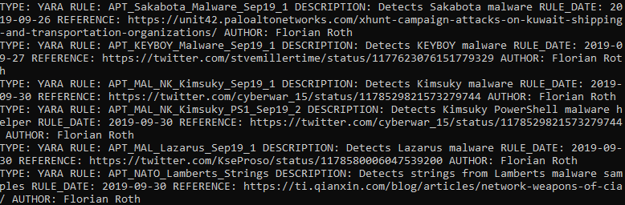
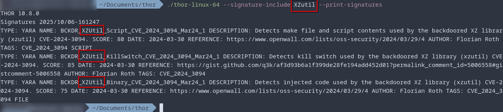

.. Index:: Using THOR

Using THOR
==========

This chapter is a quick introduction on how to run a THOR scan
and how to personalize scans to better fit your environment and
expectations.

Please note, the command line arguments are used to fine tune
your scans and yield potentially better results for your use cases.

There is no "one fits all" command line argument, but we designed
THOR to cover the broadest area with minimal impact in the default
operating mode. Default in this case means **no additional command
line arguments**.

Quick Start
-----------

Follow these steps to complete your first THOR scan

1. Open a command line as administrative user

   a. Administrator on Windows
   b. root on Linux, macOS or AIX

2. Navigate to the folder in which you've extracted the THOR package and placed the license file(s)
3. Start THOR on your command line

   a. ``thor64.exe`` on 64-bit Windows systems
   b. ``thor.exe`` on 32-bit Windows systems
   c. ``thor-linux-64`` on x86-64 Linux systems
   d. ``thor-linux`` on i386 Linux systems
   e. ``thor-macos`` on macOS
   f. ``thor-aix`` on AIX

4. Wait until the scan has completed (this can take between 20 and 180 minutes)
5. When the scan is finished, check the HTML report or JSON log in the THOR program directory

Often Used Parameters
---------------------

.. list-table::
  :header-rows: 1
  :widths: 30, 70

  * - Parameter
    - Description
  * - **--soft**
    - Reduce CPU usage, skip all checks that can consume a lot of memory (even if only for a few seconds)
  * - **--fast**
    - Perform a fast scan (skips Eventlog and checks only recent files and the most relevant folders); see :ref:`scanning/scan-modes:scan modes`
  * - **-e target-folder**
    - Write all output files to the given folder

Parameters possibly relevant for your Use Case
-----------------------------------------------

.. list-table::
  :header-rows: 1
  :widths: 30, 70

  * - Parameter
    - Description
  * - **-c, --cpu-limit integer**
    - Instruct THOR to pause all scanning if the systems CPU load is higher than the value specified.

      Please see :ref:`scanning/using-thor:cpu limit` for more information.
  * - **--all-hard-drives**
    - By default THOR scans only the C: partition on Windows machines and other files/folders only
      in cases in which some reference points to a different partition (e.g. configured web root of IIS
      is on ``D:\inetpub``, registered service runs from ``D:\vendor\service``).
      This changes the behavior to scan all local hard drives (network paths or drives are still ignored).
  * - **--lookback <days>**

      **--lookback-global**
    - Only check the elements changed or created during the last X days in all available modules (reduces the scan duration significantly)

Risky Flags
-----------

This list contains flags that should better be avoided unless you know exactly what you're doing.

.. list-table::
  :header-rows: 1
  :widths: 30, 70

  * - Parameter
    - Description
  * - **--deep**
    - long runtime, stability issues due to disabled resource control
  * - **--c2-memory-analysis**
    - many false positives on user workstations (especially browser memory)
  * - **--all-drives**
    - long runtime, stability issues due to scan on network drives or other remote file systems
  * - **--mft-analysis**
    - stability issues due to high memory usage
  * - **--process-dump**
    - stability issues, possibly high disk space usage (free disk space checks are implemented but may fail)
  * - **--no-builtin-registry-excludes**
    - longer runtime, low positive impact

Lesser Known But Useful Flags
-----------------------------

This list contains flags that are often used by analysts to tweak the scan in useful ways.

.. list-table::
  :header-rows: 1
  :widths: 30, 70

  * - Parameter
    - Description
  * - **--alert-reason-limit**
    - Show more reasons than the default (2) that led to a certain score
  * - **--log-object**
    - Print all objects of a specific type (e.g. SHIM cache entries) into the log
  * - **--timestamp-utc**
    - Print all timestamps in UTC (helpful when creating timelines)
  * - **--match-context num-chars**
    - Number of characters preceding and following the string match to show in the output

CPU Limit
---------

Since the ``--cpu-limit`` behavior can cause some confusion, we will
explain the functionality of it a bit more in detail here.

This argument will take an integer (default 95; minimum 15), which
represents the maximum CPU load at which THOR will be actively scanning.
The value can be seen as percentage of the systems maximum CPU load.

This can be helpful to reduce the load on server systems with real-time
services, or to reduce the noise produced by fans in laptops.
      
The specified value instructs THOR to pause (all scanning), if the load
of the systems CPU is higher than the ``cpu-limit``. One example would be,
if a user is doing something CPU intensive, and THOR is running at the same
time, THOR will pause and wait until the CPU load drops below the limit
before continuing.

To illustrate this a bit, please see the table below:

.. list-table:: --cpu-limit 40
   :header-rows: 1

   * - Total CPU load of system
     - THOR status
   * - 20 %
     - running
   * - 80 % (user is running CPU intensive tools)
     - paused/idle
   * - 30 %
     - running

.. hint::
   A tool like ``top`` might show values greater than 100% for a running THOR
   process. Please see ``Irix Mode`` in the man page of
   ``top``: https://man7.org/linux/man-pages/man1/top.1.html

File Size Limit
---------------

The default file size limit for deeper investigations (hash
calculation and YARA scanning) is 30 MB. The file size limit for the
``--deep`` scan mode is 200 MB.

You can adjust the values in ``./config/thor.yml``. This file does not
get overwritten by an update or upgrade.

Some features like the EVTX or Memory Dump scan ignore these
limits. See :ref:`scanning/features:Features` for a full list of features
and how they interact with the file size limit.

Help and Debugging
------------------

You can use the following parameters help you to understand THOR and the output better.

.. list-table::
  :header-rows: 1
  :widths: 30, 70

  * - Parameter
    - Description
  * - **--debug**
    - Get debug information if errors occur
  * - **--help (short|full|detailed)**
    - Print a help with a variable amount of information:

      - **short**: Summaries of the most important scan options
      - **full**: Summaries of all options
      - **detailed**: Long descriptions of all options

Run a Scan with Specific Modules
--------------------------------

With the parameter ``-a`` you can run a single module or select a set of
modules that you'd like to run. All available modules can be found in the
section :ref:`scanning/modules:modules`.

Run a Rootkit check only:

.. code-block:: none

  thor64.exe -a Rootkit

Run the Eventlog and file system scan:

.. code-block:: none
	
  thor64.exe -a Eventlog -a Filescan

Select or filter Signatures during Initialization
-------------------------------------------------

The ``Signature Includes``  and ``Signature Excludes`` functionalities alow users to
fine-tune and customize their scanning process for
improved accuracy and efficiency.

You can use these flags to limit the signature set to a certain campaign,
threat or threat actor.

The filter values are applied to:

- Rule name
- Tags
- Description

Here are some examples:

Scan only with ProxyShell related signatures:

.. code-block:: none

  thor64.exe --signature-include ProxyShell

You can pass multiple selector keywords separated by comma:

.. code-block:: none

  thor64.exe --signature-include RANSOM,Lockbit

Or filter a set of signatures that only cause false positives in your environment:

.. code-block:: none

  thor64.exe --signature-exclude AutoIt

It is important to note that while these features offer flexibility
and customization, we recommend utilizing a limited signature set only
for specific use cases. This approach is particularly suitable when
scanning exclusively for indicators related to a specific campaign.
By understanding the proper utilization of Signature Includes and Excludes, 
users can optimize their scanning process and effectively
identify targeted threats.

The main advantages of a reduced signature set are:

- improved scan speed
- lower memory usage

List loaded signatures
----------------------

By using the ``--list-signatures`` flag, you can get a list of all
initialized YARA and Sigma rules.

   Signature Metadata

This information can also be printed machine readable as JSON by using the ``--list-signatures-json`` flag.

The output of this argument also reflects any signature selectors or filters
set via command line argument. Please see :ref:`scanning/using-thor:select or filter signatures during initialization`
for more information.

This can be a nice way to verify which signatures will be used during a
scan when setting specific arguments. Additionally, this way of looking
for a specific signature or vulnerability can show you quickly if
we have any signatures for your specific use case available.

   Signatures-Include with --list-signatures

PE-Sieve Integration
--------------------

THOR integrates `PE-Sieve <https://github.com/hasherezade/pe-sieve>`__,
an open-source tool by @hasherezade to check for malware masquerading
as benevolent processes.

PE-Sieve is part of the ProcessIntegrity feature, which can be activated
by using the ``--process-integrity`` flag. It runs on Windows as part of
the ProcessCheck module and is capable of detecting advanced techniques
such as "Process Doppelganging".

When investigating infections, you can also raise
the sensitivity of the integrated PE-Sieve beyond the default with
``--process-integrity-full`` (at the cost of possible false positives).

THOR reports PE-Sieve results as follows:

.. list-table::
  :header-rows: 1
  :widths: 50, 50

  * - Findings
    - THOR's Reporting Level
  * - Replaced PE File
    - Score 70
  * - Implanted PE File
    - Score 70
  * - Unreachable File
    - Score 50
  * - Patched
    - Score 50
  * - IAT Hooked
    - Score 50
  * - Others
    - No Output in THOR

See the `PE-Sieve documentation <https://github.com/hasherezade/pe-sieve/wiki>`__
for more details on these values.

Multi-Threading
---------------

THOR supports scanning a system with multiple
threads in parallel, allowing for a significant increase in speed in
exchange for a higher CPU usage.

To use this feature, use the ``--threads`` flag which allows you to
specify THOR's number of parallel threads.

When using the ``--lab`` (Lab Scanning), ``--dropzone`` (sample drop
zone) or ``--thunderstorm`` (Thunderstorm) command line flags, THOR will
default to using as many threads as the system has CPU cores; otherwise,
THOR will default to running with a single thread.

.. note::
  The above listed modes are only available with the "Lab", "Thunderstorm"
  and "Incident Response" license type.

Enabled Modules
^^^^^^^^^^^^^^^

Not all modules support multi-threading. It is currently supported for:

* Filescan
* RegistryChecks
* Eventlog
* ProcessCheck
* Thunderstorm (Thunderstorm License needed)
* Dropzone (Lab License needed)

Plugins
-------

THOR 11 supports plugins. They can support a THOR scan in several ways:

* Parsing a file format that THOR does not (yet) support
* Checking more complex conditions that cannot be written as custom IOCs or rules
* Extending THOR output in custom, user-defined ways
* ...

Plugins need to be placed in the ``plugins`` folder in the THOR directory. For
details on how to write a plugin, required ingredients, limitations and
examples, refer to https://github.com/NextronSystems/thor-plugin.

To disable the feature and thus all plugins, use ``--no-plugins``.

.. warning::
  Plugins contain executable code that is run by THOR. For this reason, never run any plugins that do
  not come from a trusted source.
