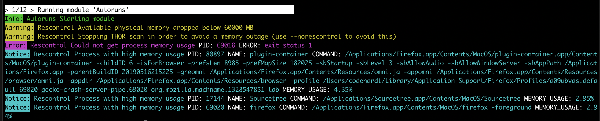
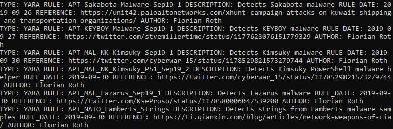
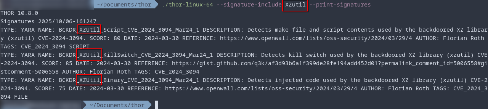

.. Index:: Using THOR

Using THOR
==========

This chapter provides a quick introduction to running THOR and
adjusting scans to better fit your environment and use case.

Command-line arguments allow you to fine-tune scans and improve
results for specific environments and investigations.

There is no "one-size-fits-all" set of command-line arguments. THOR is
designed to provide broad coverage with minimal impact in its default
operating mode, which means running it with **no additional command-line
arguments**.

Quick Start
-----------

Follow these steps to complete your first THOR scan:

1. Open a command line with administrative privileges

   a. Use ``Administrator`` on Windows
   b. Use ``root`` on Linux, macOS, or AIX

2. Navigate to the folder where you extracted the THOR package and
   placed the license file or files
3. Start the appropriate THOR binary:

   a. ``thor64.exe`` on 64-bit Windows systems
   b. ``thor.exe`` on 32-bit Windows systems
   c. ``thor-linux-64`` on x86-64 Linux systems
   d. ``thor-linux`` on i386 Linux systems
   e. ``thor-macos`` on macOS
   f. ``thor-aix`` on AIX

4. Wait for the scan to complete. Depending on the system, this can
   take between 20 and 180 minutes
5. When the scan has finished, review the HTML report or JSON log in
   the THOR program directory

Often Used Parameters
---------------------

.. list-table::
  :header-rows: 1
  :widths: 30, 70

  * - Parameter
    - Description
  * - **--soft**
    - Reduce CPU usage by skipping checks that may consume a lot of
      memory, even if only briefly
  * - **--fast**
    - Perform a faster scan. This skips Eventlog checks and limits file
      scanning to recent files and the most relevant folders; see
      :ref:`scanning/scan-modes:scan modes`
  * - **-e target-folder**
    - Write all output files to the given folder

Parameters Possibly Relevant to Your Use Case
---------------------------------------------

.. list-table::
  :header-rows: 1
  :widths: 30, 70

  * - Parameter
    - Description
  * - **-c, --cpu-limit integer**
    - Pause scanning when the system CPU load rises above the specified
      value

      Please see :ref:`scanning/using-thor:cpu limit` for more information.
  * - **--all-hard-drives**
    - By default, THOR scans only the ``C:`` partition on Windows.
      Files and folders on other local partitions are scanned only when
      an artifact points to them, for example when an IIS web root is on
      ``D:\inetpub`` or a registered service runs from
      ``D:\vendor\service``. This flag changes that behavior and scans
      all local hard drives. Network paths and network drives are still
      ignored
  * - **--lookback <days>**

      **--lookback-global**
    - Limit checks to elements created or modified during the last
      ``X`` days. ``--lookback`` applies to Windows Event Logs by
      default; ``--lookback-global`` applies the limit to all supported
      modules

Risky Flags
-----------

This list contains flags that should generally be avoided unless you
know exactly what you are doing.

.. list-table::
  :header-rows: 1
  :widths: 30, 70

  * - Parameter
    - Description
  * - **--deep**
    - Long runtime and possible stability issues because resource
      control is disabled
  * - **--c2-memory-analysis**
    - Many false positives on user workstations, especially in browser
      memory
  * - **--all-drives**
    - Long runtime and possible stability issues because network drives
      or other remote file systems may be scanned
  * - **--mft-analysis**
    - Possible stability issues due to high memory usage
  * - **--process-dump**
    - Possible stability issues and high disk space usage. Free disk
      space checks are implemented but may still fail
  * - **--no-builtin-registry-excludes**
    - Longer runtime with limited benefit

Lesser Known But Useful Flags
-----------------------------

This section contains flags that analysts often use to refine scan
behavior.

Alert Reason Limit
^^^^^^^^^^^^^^^^^^
``--alert-reason-limit <limit>`` configures how many reasons are shown
for each finding. Reasons with higher scores are prioritized over those
with lower scores.

The default is ``2``, but depending on your use case, higher values or
``0`` (unlimited) may be useful.

Object Logging
^^^^^^^^^^^^^^

``--log-object "object type"`` specifies that objects of a specific type
should be logged as informational messages, even if they do not reach
the ``--score-info`` threshold.

To avoid flooding the log, you can also specify a limit per object
type. This limit applies only to messages generated by this feature and
does not suppress elements that already reach the ``--score-info``
threshold. Set it with ``--log-object "object type:limit"``.

``--log-object`` comes with an extensive default list:

.. csv-table::
  :file: ../csv/log-object-defaults.csv
  :widths: 50, 33
  :delim: ;
  :header-rows: 1

These defaults can be overwritten by specifying a custom limit for an
object type.

To disable an entry from this default list, use ``--log-object "object-type:0"``:
this overwrites the default limit with zero and disables
``--log-object`` for that object type.

UTC Timestamps
^^^^^^^^^^^^^^

With ``--timestamp-utc``, all timestamps are printed in UTC instead of
the local time zone. This can be helpful when creating timelines.

Match Context
^^^^^^^^^^^^^

``--match-context num-chars`` controls how many characters before and
after a string match are shown in the output. These characters are not
part of the match itself, but they often provide useful context to an
analyst. By default, THOR prints 50 characters before and after each
match.

CPU Limit
---------

Because the behavior of ``--cpu-limit`` can be confusing at first, it is
explained in more detail here.

This argument accepts an integer (default ``95``; minimum ``15``) that
represents the maximum CPU load at which THOR will actively scan. The
value is interpreted as a percentage of the system's total CPU
capacity.

This can help reduce load on server systems with real-time services or
reduce fan noise on laptops.

If the system's CPU load rises above the configured limit, THOR pauses
scanning and resumes only after the load falls below that limit. For
example, if a user starts a CPU-intensive task while THOR is running,
THOR waits until enough CPU capacity is available again.

To illustrate this, see the table below:

.. list-table:: --cpu-limit 40
   :header-rows: 1

   * - Total CPU load of system
     - THOR status
   * - 20 %
     - running
   * - 80 % (user is running CPU intensive tools)
     - paused/idle
   * - 30 %
     - running

.. hint::
   A tool such as ``top`` might show values greater than 100% for a running THOR
   process. Please see ``Irix Mode`` in the man page of
   ``top``: https://man7.org/linux/man-pages/man1/top.1.html

Resource Control
----------------

THOR's internal resource control prioritizes system stability and the
responsiveness of running services.

Resource control is active by default. You can disable it with
**--no-resource-check**.

Because of resource control, THOR may terminate a scan before it
completes. This happens under the following conditions:

1. If available physical memory drops below ``50 MB`` (can be
   customized with ``--memory-limit``)

2. | If more than ``60 MB`` of log data have been written to disk or
   | syslog (can be customized with ``--log-size-limit``)
   | In this case, THOR switches to "reduced-logging" mode, in which it
   | transmits only "Notices, Warnings and Alerts". After another
   | ``4 MB`` of log data, THOR terminates itself to prevent log
   | flooding caused by a large number of false positives.

If scans terminate repeatedly, check what is causing the performance
issues or choose times with less workload, for example at night or on
weekends. To troubleshoot such situations, inspect the last warning that
THOR writes before exiting the scan. It includes the top memory
consumers that may have caused the memory exhaustion.

   Resource Control Scan Termination

.. warning:: 
  Disabling Resource Control on already constrained systems can put
  system stability at risk.

File Size Limit
---------------

The default file size limit for content checks such as hash calculation
and YARA scanning is ``64 MB``. In ``--deep`` scan mode, the limit is
``200 MB``.

You can adjust the values in ``./config/thor.yml``. This file does not
get overwritten by an update or upgrade.

Some features, such as EVTX or memory dump scanning, ignore these
limits. See :ref:`scanning/features:Features` for a full list of features
and how they interact with the file size limit.

Help and Debugging
------------------

You can use the following parameters to better understand THOR and its
output.

.. list-table::
  :header-rows: 1
  :widths: 30, 70

  * - Parameter
    - Description
  * - **--debug**
    - Print debug information if errors occur
  * - **--help (short|full|detailed)**
    - Print help with different levels of detail:

      - **short**: Summaries of the most important scan options
      - **full**: Summaries of all options
      - **detailed**: Long descriptions of all options

Run a Scan with Specific Modules
--------------------------------

With the ``-a`` parameter, you can run a single module or select a set
of modules. All available modules can be found in the
section :ref:`scanning/modules:modules`.

Run a Rootkit check only:

.. code-block:: doscon

  C:\thor>thor64.exe -a Rootkit

Run the Eventlog and file system scan:

.. code-block:: doscon
	
  C:\thor>thor64.exe -a Eventlog -a Filescan

Select or filter Signatures during Initialization
-------------------------------------------------

The ``--signature-include`` and ``--signature-exclude`` options allow
you to fine-tune the initialized signature set for improved focus and
efficiency.

You can use these flags to limit the signature set to a specific
campaign, threat, or threat actor.

The filter values are applied to:

- Rule name
- Tags
- Description

Here are some examples:

Scan only with ProxyShell-related signatures:

.. code-block:: doscon

  C:\thor>thor64.exe --signature-include ProxyShell

You can pass multiple selector keywords separated by commas:

.. code-block:: doscon

  C:\thor>thor64.exe --signature-include RANSOM,Lockbit

Or exclude a set of signatures that cause false positives in your
environment:

.. code-block:: doscon

  C:\thor>thor64.exe --signature-exclude AutoIt

These options are most useful for targeted use cases, for example when
you want to scan only for indicators related to a specific campaign. A
reduced signature set can improve scan speed and lower memory usage.

The main advantages of a reduced signature set are:

- improved scan speed
- lower memory usage

List loaded signatures
----------------------

Using the ``--list-signatures`` flag, you can print a list of all
initialized YARA and Sigma rules.

   Signature Metadata

This information can also be printed as machine-readable JSON by using
the ``--list-signatures-json`` flag.

The output also reflects any signature selectors or filters set via
command-line arguments. Please see
:ref:`scanning/using-thor:select or filter signatures during initialization`
for more information.

This is a useful way to verify which signatures THOR will initialize
for a specific command line. It can also help you quickly check whether
signatures for a particular vulnerability or use case are available.

   Signatures-Include with --list-signatures

PE-Sieve Integration
--------------------

THOR integrates `PE-Sieve <https://github.com/hasherezade/pe-sieve>`__,
an open-source tool by @hasherezade to check for malware masquerading as
legitimate processes.

PE-Sieve is part of the ProcessIntegrity feature, which can be activated
with the ``--process-integrity`` flag. It runs on Windows as part of the
ProcessCheck module and can detect advanced techniques such as "Process
Doppelganging".

When investigating infections, you can also increase the sensitivity of
the integrated PE-Sieve beyond the default with
``--process-integrity-full`` at the cost of possible false positives.

THOR reports PE-Sieve results as follows:

.. list-table::
  :header-rows: 1
  :widths: 50, 50

  * - Findings
    - THOR's Reporting Level
  * - Replaced PE File
    - Score 70
  * - Implanted PE File
    - Score 70
  * - Unreachable File
    - Score 50
  * - Patched
    - Score 50
  * - IAT Hooked
    - Score 50
  * - Others
    - No Output in THOR

See the `PE-Sieve documentation <https://github.com/hasherezade/pe-sieve/wiki>`__
for more details on these values.

Multi-Threading
---------------

THOR can scan a system with multiple threads in parallel, which can
significantly increase scan speed at the cost of higher CPU usage.

To use this feature, set the ``--threads`` flag to the desired number of
parallel threads.

When using the ``--lab`` (Lab Scanning), ``--dropzone`` (sample drop
zone) or ``--thunderstorm`` (Thunderstorm) command line flags, THOR will
default to using as many threads as the system has CPU cores. Otherwise,
THOR defaults to running with a single thread.

.. note::
  The modes listed above are available only with the "Lab",
  "Thunderstorm", and "Incident Response" license types.

Enabled Modules
^^^^^^^^^^^^^^^

Not all modules support multi-threading. It is currently supported for:

* Filescan
* RegistryChecks
* Eventlog
* ProcessCheck
* Thunderstorm (Thunderstorm License needed)
* Dropzone (Lab License needed)

Plugins
-------

THOR 11 supports plugins. They can assist a THOR scan in several ways:

* Parsing file formats that THOR does not yet support
* Checking more complex conditions that cannot be written as custom IOCs or rules
* Extending THOR output in custom, user-defined ways

Plugins must be placed in the ``plugins`` folder in the THOR directory.
For details on how to write a plugin, required components, limitations,
and examples, refer to https://github.com/NextronSystems/thor-plugin.

To disable all plugins, use ``--no-plugins``.

.. warning::
  Plugins contain executable code that is run by THOR. For this reason,
  never run plugins that do not come from a trusted source.
