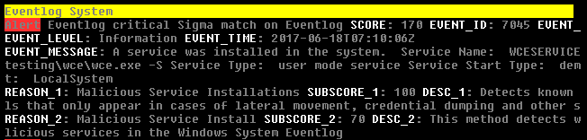

.. Index:: Sigma Rules

Sigma Rules
===========

Sigma is a generic rule format for detections on structured data. Sigma
is to log data what Snort is to network packets and YARA is to files.

THOR ships with the public Sigma rule set, maintained by the community
at `<https://github.com/SigmaHQ/sigma>`_, as well as additional Nextron
rules.

THOR applies Sigma rules to all objects it encounters. This is
especially relevant for Windows Event Logs and log files on disk
(``.log``).

By default, only the results of ``critical`` and ``high`` Sigma rules
are shown. When THOR is run with ``--deep``, ``medium`` level rules are
applied as well.

Custom Sigma rules must use the ``.yml`` extension for unencrypted
rules and the ``.yms`` extension for encrypted rules.

   Example Sigma match on Windows Eventlog

Scores
^^^^^^

The :ref:`score<signatures/scores:Scoring>` of a Sigma match is based on
the Sigma rule level:

 - Level low translates to score 40
 - Level medium translates to score 50
 - Level high translates to score 70
 - Level critical translates to score 100

Scanning Logfiles with Sigma
^^^^^^^^^^^^^^^^^^^^^^^^^^^^

Perform a scan with Sigma rules on the local Windows Event Logs by
using ``-a Eventlog``:

.. code-block:: doscon

   C:\thor>thor64.exe -a Eventlog

Perform a scan with Sigma rules on Linux log files:

.. code-block:: console

   $ ./thor-linux-64 -a Filescan -p /var/log

Writing Custom Sigma Rules for THOR Object Types
^^^^^^^^^^^^^^^^^^^^^^^^^^^^^^^^^^^^^^^^^^^^^^^^^

Sigma rules can also be written to match THOR-generated content, that
is, rules that match **any object type** produced by THOR, not just,
e.g., Windows Event Logs. This allows you to detect suspicious
processes, persistence mechanisms, fileless malware, and much more by
using the open Sigma standard.

This feature is available in both **THOR** and **THOR Lite**.

Logsource Format
****************

To target a THOR object type, use this logsource configuration:

.. code-block:: yaml

   logsource:
       product: THOR
       service: <Object Type Name>

The ``service`` field must match the object type name exactly, for
example ``Linux kernel module``, ``AmCache entry``, or ``cron job``.

Discovering Object Types
************************

The available object types are listed with ``--describe-object-type all``.
All objects of a specific type can also be printed by using
``--log-object specificobjecttype``. The following summary lists these
and other related command-line flags that can be used to explore
available object types:

.. list-table::
   :header-rows: 1
   :widths: 40, 60

   * - Flag
     - Purpose
   * - ``--describe-object-type all``
     - List all object types with their JSON schemas
   * - ``--describe-object-type "<type>"``
     - View schema for a specific object type
   * - ``--log-object "<type>"``
     - Log all objects of a type during a scan
   * - ``--log-object "<type>:<limit>"``
     - Log objects with a limit (e.g., ``"process:50"``)

Example: View the process object schema:

.. code-block:: console

   $ ./thor-linux-64 --describe-object-type "process"

Example: Log process objects during a scan:

.. code-block:: console

   $ ./thor-linux-64 --module ProcessCheck --log-object "process:10"

Check the :ref:`signatures/sigma:object type reference` for an overview
of commonly used object types.

Field Name Mapping
******************

Fields for matching can be derived from the JSON schema of the object
type published at
`<https://github.com/NextronSystems/jsonlog/releases>`_. Each field of
the JSON representing an object type can be used directly using its
name, with nested field names separated by dots; for array-like fields,
the nested field name is the integer index of the element. For example,
if matching on an AmCache entry requires the hash and the associated
file's path, the detection snippet should look like:

.. code-block:: yaml

   detection:
       selection:
           sha1: DEADBEEFDEADBEEFDEADBEEFDEADBEEFDEADBEEF
       filter:
           file.path|endswith: \benign.exe
       condition: selection and not filter

To match null (nonexistent) fields:

.. code-block:: yaml

   detection:
       selection:
           file: null

To match empty (but existent) fields:

.. code-block:: yaml

   detection:
       selection:
           file: ''

A quick overview of commonly used fields for different object types is
available in the :ref:`signatures/sigma:quick field reference`.

For further examples, see the :ref:`signatures/sigma:detection examples`
section.

Deploying Custom Sigma Rules
****************************

1. Save the rule as a ``.yml`` file.
2. Copy it to the THOR custom signatures folder:

   .. code-block:: console

      $ cp my-rule.yml /path/to/thor/custom-signatures/sigma/

3. For encrypted rules, use the ``.yms`` extension.
4. Verify that the rule was loaded with ``--list-signatures``:

   .. code-block:: console

      $ ./thor-linux-64 --list-signatures | grep "my-rule"

Testing Your Rules
******************

Examine real objects before writing rules:

.. code-block:: console

   $ ./thor-linux-64 --module ProcessCheck --log-object "process:10" --console-json

Adjust the Sigma threshold if you want to see lower-level matches:

.. code-block:: console

   $ ./thor-linux-64 --sigma-threshold medium

Object Type Reference
*********************

THOR includes many object types. The following are among the most
commonly used in detection rules:

.. TODO: Adapt to root object rework of processes.

**Process and Memory:**
   ``process``, ``process.connection``, ``process.handle``, ``process.thread``

**Persistence Mechanisms:**
   ``autorun entry``, ``cron job``, ``scheduled task``, ``at job``,
   ``Windows service``, ``systemd service``, ``init.d service``,
   ``WMI startup command``

**File System Artifacts:**
   ``file``, ``MFT entry``, ``jump list entry``, ``prefetch info``,
   ``shim cache entry``

**Registry:**
   ``registry key``, ``registry value``

**Users and Authentication:**
   ``Windows user``, ``Unix user``, ``authorized_keys entry``,
   ``logged in user``, ``LSA session``

**Network:**
   ``DNS cache entry``, ``firewall rule``, ``hosts file entry``,
   ``network session``, ``network share``

**Security and Kernel:**
   ``Linux kernel module``, ``eBPF program``, ``mutex``, ``named pipe``,
   ``antivirus exclusion``

**Logs and Events:**
   ``eventlog entry``, ``log line``, ``journal log entry``, ``audit log entry``

**Execution History:**
   ``AmCache entry``, ``shim cache``, ``web page visit``, ``web download``

Quick Field Reference
*********************

.. list-table::
   :header-rows: 1
   :widths: 25, 25, 50

   * - Use Case
     - Object Type
     - Key Fields
   * - Process monitoring
     - ``process``
     - command, name, owner, pid
   * - Linux persistence
     - ``cron job``
     - command, user, schedule
   * - Windows persistence
     - ``scheduled task``
     - commands.0, user, run_level
   * - Autoruns
     - ``autorun entry``
     - launch_string, location
   * - Services (Windows)
     - ``Windows service``
     - service_name, image.path
   * - Services (Linux)
     - ``systemd service``
     - command, run_as_user
   * - Kernel rootkits
     - ``Linux kernel module``
     - file, included_in_kernel
   * - File hashes
     - ``file``
     - hashes.md5, hashes.sha1, hashes.sha256, path
   * - Execution history
     - ``AmCache entry``
     - sha1, file.path, product

Detection Examples
******************

**Example 1: Execution of Known Malicious Hash via AmCache**

.. code-block:: yaml

   title: Execution of Known Malicious Hash via Amcache
   logsource:
       product: THOR
       service: AmCache entry
   detection:
       selection:
           sha1: DEADBEEFDEADBEEFDEADBEEFDEADBEEFDEADBEEF
       filter:
           file.path|endswith: \benign.exe
       condition: selection and not filter
   falsepositives:
       - Known good files matching the hash
   level: critical

**Example 2: Linux Kernel Module Without File (Rootkit Detection)**

.. code-block:: yaml

   title: Kernel Module Without File
   status: experimental
   description: Detects dynamically loaded kernel modules without associated files
   logsource:
       product: THOR
       service: Linux kernel module
   detection:
       selection:
           file: null
           included_in_kernel: false
       condition: selection
   falsepositives:
       - Custom kernels with manually loaded modules
   level: medium

**Example 3: Suspicious Process with Encoded PowerShell**

.. code-block:: yaml

   title: Process with Encoded PowerShell Execution
   logsource:
       product: THOR
       service: process
   detection:
       selection:
           command|contains:
               - ' -enc '
               - ' -EncodedCommand '
           name|endswith:
               - 'powershell.exe'
               - 'pwsh.exe'
       condition: selection
   level: high

**Example 4: Suspicious Cron Job (Linux Persistence)**

.. code-block:: yaml

   title: Cron Job with Suspicious Download Command
   logsource:
       product: THOR
       service: cron job
   detection:
       selection_download:
           command|contains:
               - 'wget '
               - 'curl '
       selection_pipe:
           command|contains:
               - '| bash'
               - '| sh'
       condition: selection_download and selection_pipe
   level: medium

**Example 5: Autorun Entry from Suspicious Location**

.. code-block:: yaml

   title: Autorun Entry from Suspicious Location
   logsource:
       product: THOR
       service: autorun entry
   detection:
       selection_path:
           launch_string|contains:
               - '\AppData\Roaming\'
               - '\Users\Public\'
               - '\Temp\'
       selection_script:
           launch_string|contains:
               - '.vbs'
               - '.hta'
               - 'powershell'
       condition: selection_path and selection_script
   level: high

**Example 6: Windows Service with Suspicious Binary Path**

.. code-block:: yaml

   title: Windows Service from Temp Directory
   logsource:
       product: THOR
       service: Windows service
   detection:
       selection:
           image.path|contains:
               - '\Temp\'
               - '\Users\Public\'
               - '\AppData\'
       condition: selection
   level: high
