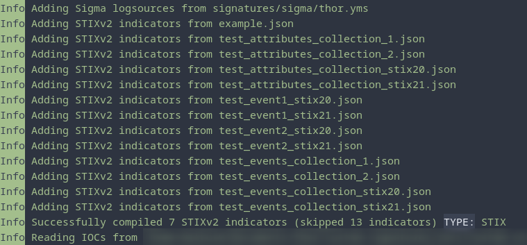

.. Index:: STIX IOCs

STIX IOCs
=========

THOR can read and apply IOCs provided in STIXv2 JSON files.
They must have the ``.json`` extension for unencrypted STIXv2 files
and the ``.jsos`` extension for encrypted STIXv2 files.

.. hint::
  STIXv1 is not supported

   STIXv2 Initialization during startup

The following observables are supported.

* ``file:name`` with

  * **=**
  * **!=**
  * **LIKE**
  * **MATCHES**

* ``file:parent_directory_ref.path`` with

  * **=**
  * **!=**
  * **LIKE**
  * **MATCHES**

* ``file:hashes.sha-256`` / ``file:hashes.sha256`` with
   
  * **=**
  * **!=**

* ``file:hashes.sha-1`` / ``file:hashes.sha1`` with

  * **=**
  * **!=**

* ``file:hashes.md-5`` / ``file:hashes.md5`` with

  * **=**
  * **!=**

* ``file:size`` with

  * **<**
  * **<=**
  * **>**
  * **>=**
  * **=**
  * **!=**

* ``file:created`` with

  * **<**
  * **<=**
  * **>**
  * **>=**
  * **=**
  * **!=**

* ``file:modified`` with

  * **<**
  * **<=**
  * **>**
  * **>=**
  * **=**
  * **!=**

* ``file:accessed`` with

  * **<**
  * **<=**
  * **>**
  * **>=**
  * **=**
  * **!=**

* ``win-registry-key:key`` with

  * **=**
  * **!=**
  * **LIKE**
  * **MATCHES**

* ``win-registry-key:values.name`` with

  * **=**
  * **!=**
  * **LIKE**
  * **MATCHES**

* ``win-registry-key:values.data with`` with

  * **=**
  * **!=**
  * **LIKE**
  * **MATCHES**

* ``win-registry-key:values.modified_time`` with

  * **<**
  * **<=**
  * **>**
  * **>=**
  * **=**
  * **!=**

