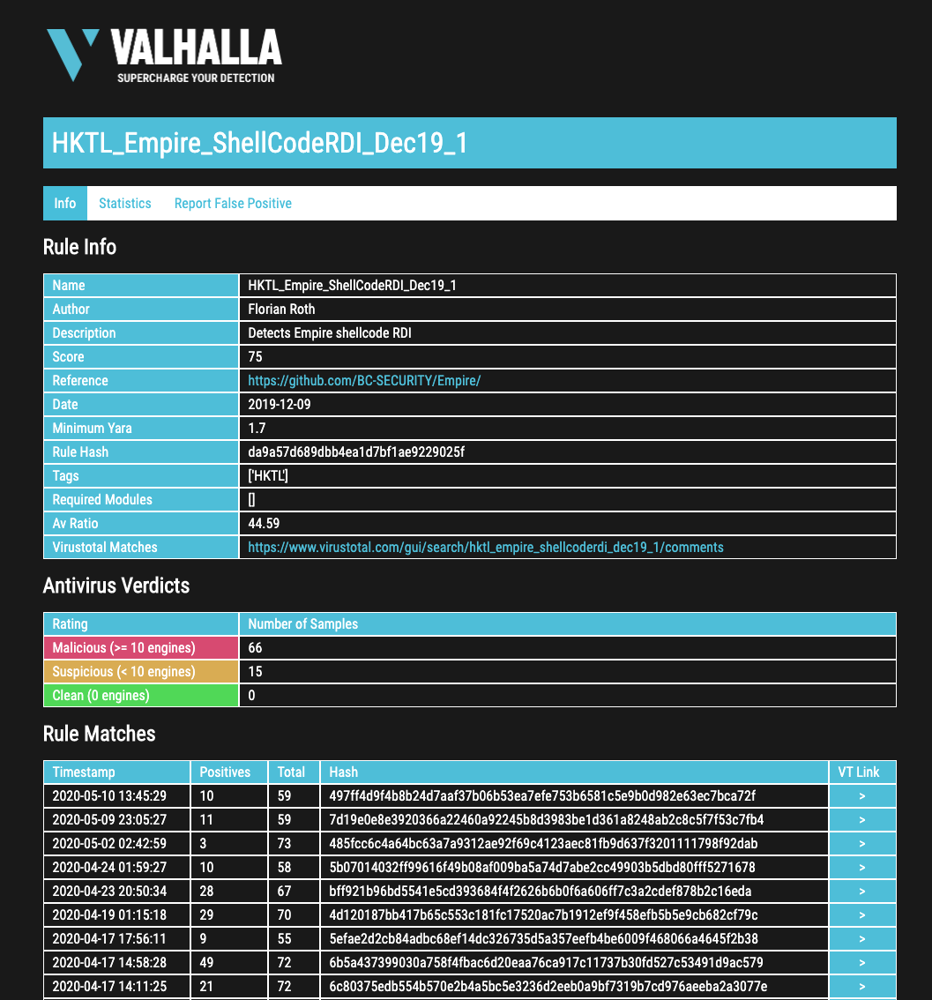

Analysis and Info
=================

Log Analysis Manual
-------------------

You can find our Log Analysis Manual online:

https://log-analysis-manual.nextron-systems.com

This will help to process the events generated by THOR.

VALHALLA Rule Lookup
--------------------

The new rule info pages allow you to get more information on a certain
rule. You can find all the meta data, as well as past rule matches and
previous antivirus verdicts. A second tab contains statistics. You can
also report false positives that you've encountered with that rule using
the button in the tab bar.

Note that the rule info lookups in the web GUI are rate limited. If you
query rule infos too often, you get blocked.

The rule info pages can be access using this URL scheme:

:samp:`https://valhalla.nextron-systems.com/info/rule/RULE\_NAME`

For example:

https://valhalla.nextron-systems.com/info/rule/HKTL_Empire_ShellCodeRDI_Dec19_1

   
   Rule Info Page

Rule List Output
----------------

By using the ``--print-signatures`` flag, you can get a list of all
initialized YARA and Sigma rules.

.. figure:: ../images/image35.png
   :alt: Rule List Output

   Rule List Output
