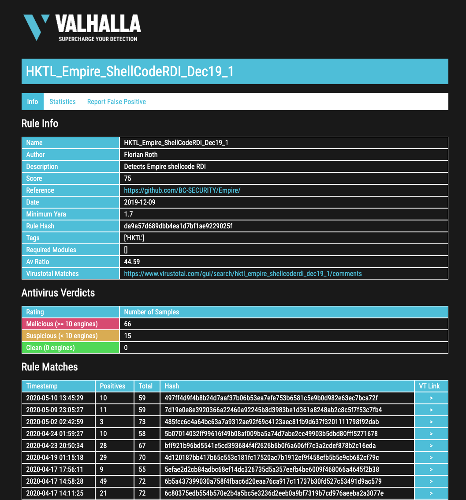
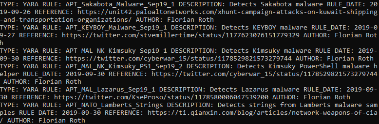

Analysis and Info
=================

Log Analysis Manual
-------------------

You can find our Log Analysis Manual online:

`log-analysis-manual.nextron-systems.com <https://log-analysis-manual.nextron-systems.com>`__

It provides guidance for working with the events generated by THOR.

VALHALLA Rule Lookup
--------------------

The rule info pages provide additional information about a specific
rule. You can find metadata, past rule matches, and previous antivirus
verdicts. A second tab contains statistics. You can also report false
positives for that rule using the button in the tab bar.

Rule info lookups in the web GUI are rate-limited. If you query rule
information too often, access may be temporarily blocked.

The rule info pages can be accessed using the following URL scheme:

:samp:`https://valhalla.nextron-systems.com/info/rule/RULE\_NAME`

For example:

`valhalla.nextron-systems.com/info/rule/HKTL_Empire_ShellCodeRDI_Dec19_1 <https://valhalla.nextron-systems.com/info/rule/HKTL_Empire_ShellCodeRDI_Dec19_1>`__

   
   Rule Info Page

Rule List Output
----------------

By using the ``--print-signatures`` flag, you can get a list of all
initialized YARA and Sigma rules.

   Rule List Output

This information can also be printed in machine-readable JSON format by
using the ``--print-signatures-json`` flag.
