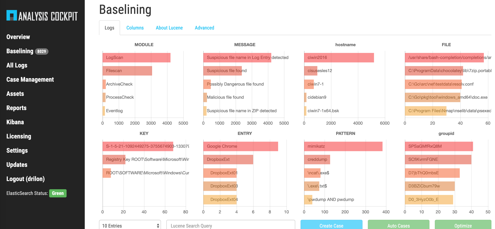
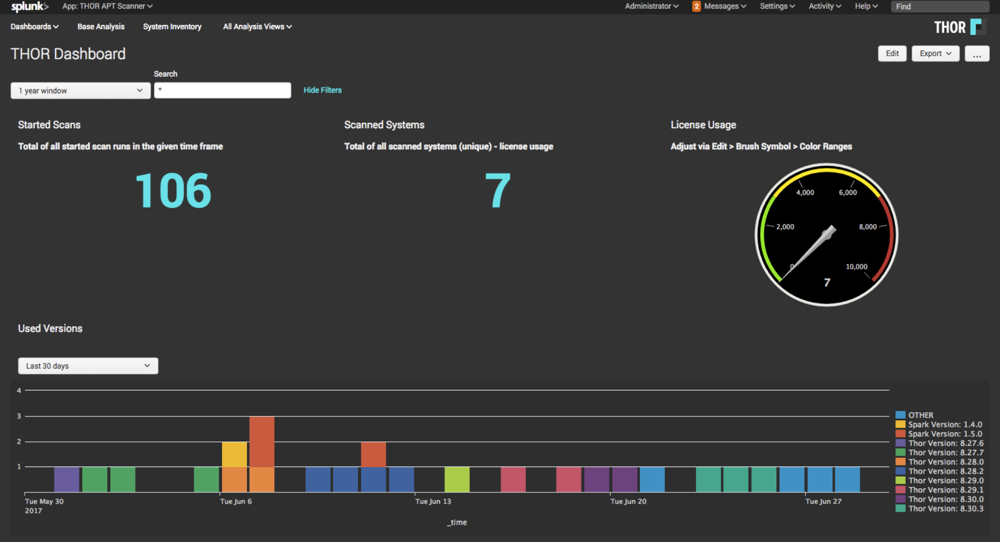
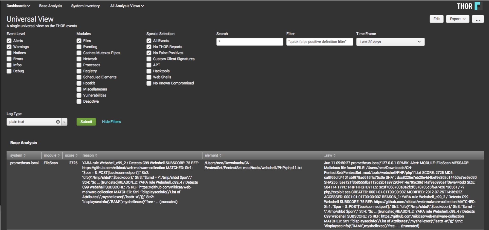
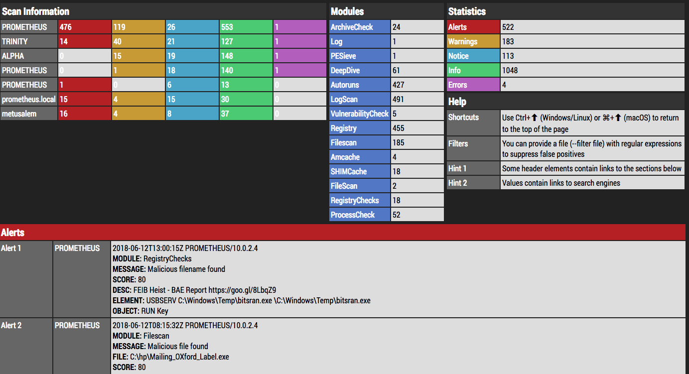
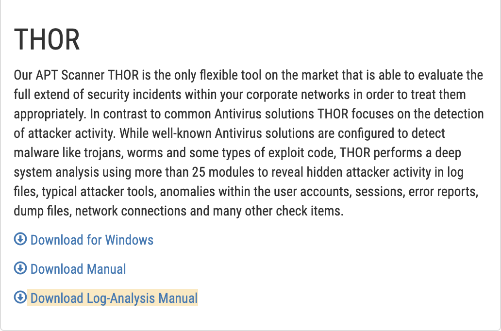

Analysis
========

This chapter explains the possibilities for collecting and analyzing
THOR logs.

ASGARD Analysis Cockpit
-----------------------

The ANALYSIS COCKPIT is the central platform for analyzing THOR logs. It
can be used in an environment where scans are controlled by ASGARD
Management Center and can also be used where THOR is executed manually
or controlled by third party solutions. It is available as a virtual
appliance on VMWare and also as a dedicated hardware appliance.

THOR can also be seen or used as hunting solution, it is optimized to
avoid false negatives – meaning optimized to not miss an indicator of
compromise. On the other side this clearly leads to more anomalies and
false positives being reported.

In a scenario where you scan your infrastructure frequently you would
either be seeing the same anomalies again and again or you would need to
create many rules to filter out these anomalies in order to save
analysis time.

The ANALYSIS COCKPIT is designed to facilitate this process and help you
generate these rules automatically, so that you can set your
baseline-filters after the first scan. After setting the first baseline
it is now easy to focus on relevant Alerts and Warnings as only
differences between the first and second scans are shown.

The ANALYSIS COCKPIT comes with an integrated and highly configurable
ticketing system that helps organizing your analysis workflow.
Furthermore, the ANALYSIS COCKPIT comes with a rule based alert
forwarding and SIEM integration that makes it easy for your organization
to react quickly on new incidents.

   Analysis Cockpit View

Splunk
------

We offer a THOR Splunk App and Add-on via the official Splunk App Store.
This App helps you to extract the event fields and provides dashboards
to get a better overview on distributed runs on multiple systems.

   THOR Splunk App (free)

   Splunk THOR App Universal View

THOR APT Scanner App

https://splunkbase.splunk.com/app/3717/

THOR Add-On

https://splunkbase.splunk.com/app/3718/

THOR Util Report Feature
------------------------

THOR Util provides a feature called "report" that creates HTML reports
from text logs of one or more scanned systems.

   THOR Util's Report Output

Find more information about this feature on our website or the separate
THOR Util manual.

https://www.nextron-systems.com/2018/06/20/thor-util-with-html-report-generation/

Log Analysis Manual
-------------------

The Customer Portal contains a log analysis manual in the "Downloads"
section.

   Log Analysis Manual Download Link

https://portal.nextron-systems.com/webshop/downloads
