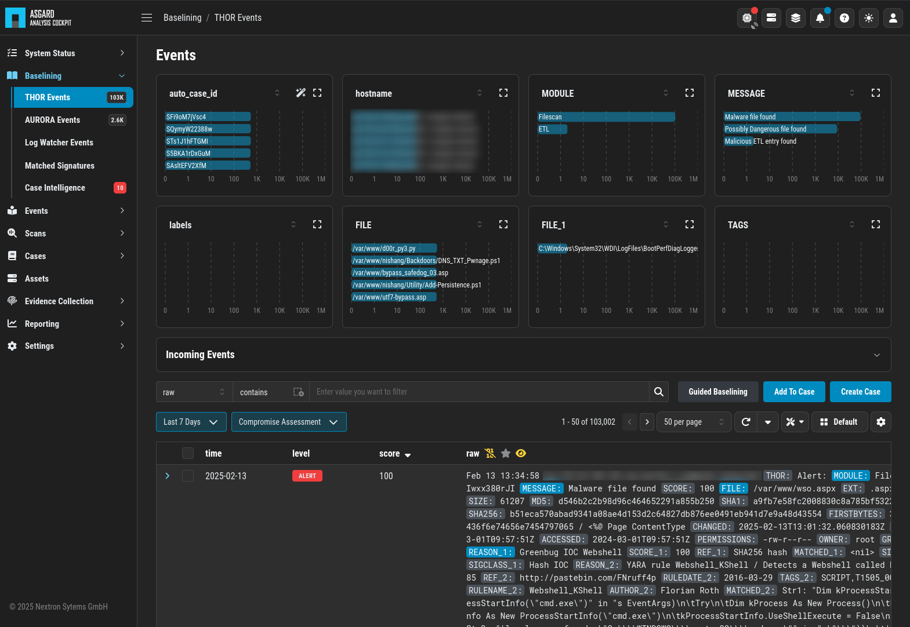
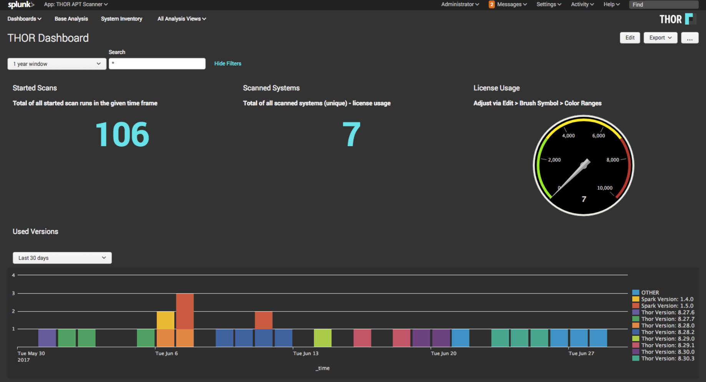
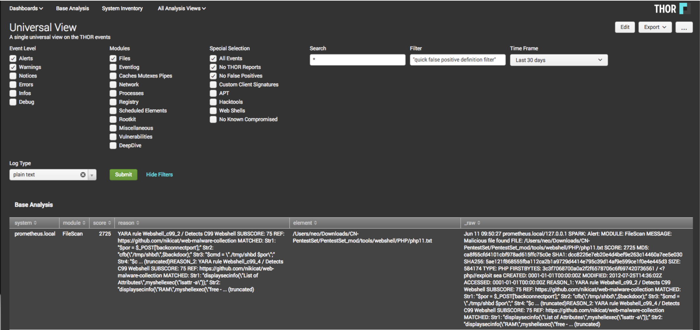
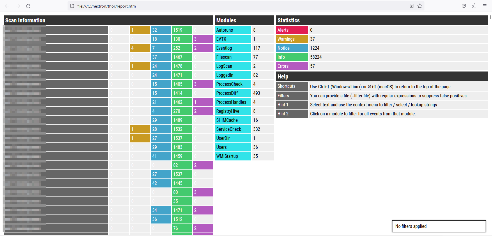

Analysis
========

This chapter describes the available options for collecting and
analyzing THOR logs.

ASGARD Analysis Cockpit
-----------------------

The ANALYSIS COCKPIT is the central platform for analyzing THOR logs.
It can be used in environments where scans are controlled by the ASGARD
Management Center, but also when THOR is executed manually or managed
by third-party solutions. It is available as a virtual appliance on
VMware and also as dedicated hardware.

THOR is optimized to avoid false negatives, which means it is designed
not to miss indicators of compromise. As a result, it also reports more
anomalies and false positives than a narrowly tuned scanner.

In environments with regular scans, you would otherwise see the same
anomalies repeatedly or have to create many rules to filter them out.

The ANALYSIS COCKPIT is designed to make this process easier and can
help you generate these rules automatically so that you can establish
baseline filters after the first scan. Once the baseline is in place,
you can focus on relevant alerts and warnings because only the
differences between scans are highlighted.

The ANALYSIS COCKPIT also includes an integrated and highly
configurable ticketing system to support analysis workflows. In
addition, it offers rule-based alert forwarding and SIEM integration to
help organizations react quickly to new incidents.

   Analysis Cockpit View

Splunk
------

We offer a THOR Splunk App and Add-on through the official Splunk App
Store. These help extract event fields and provide dashboards for a
better overview of distributed runs across multiple systems.

   THOR Splunk App (free)

   Splunk THOR App Universal View

`THOR APT Scanner App <https://splunkbase.splunk.com/app/3717/>`__

`THOR Add-On <https://splunkbase.splunk.com/app/3718/>`__

THOR Util Report Feature
------------------------

THOR Util provides a feature called "report" that creates HTML reports
from text logs of one or more scanned systems.

   THOR Util's Report Output

Find more information about this feature on our website or in the
separate THOR Util manual:

`THOR Util with HTML report generation <https://www.nextron-systems.com/2018/06/20/thor-util-with-html-report-generation/>`__

Log Analysis Manual
-------------------

We have written a detailed Log Analysis Manual that:

* Explains how to analyze THOR logs
* Contains example logs
* Lists potential false positives you might encounter
* Explains how different attributes should be evaluated

`log-analysis-manual.nextron-systems.com <https://log-analysis-manual.nextron-systems.com>`__
