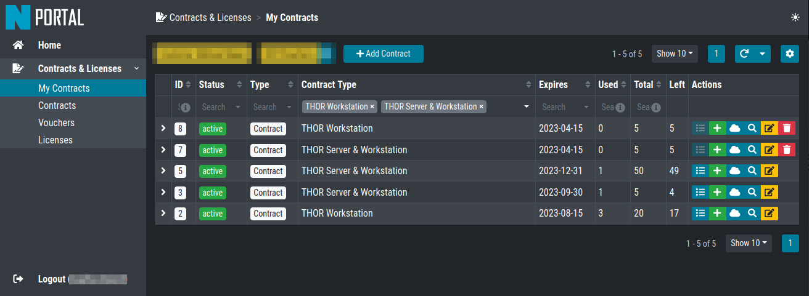
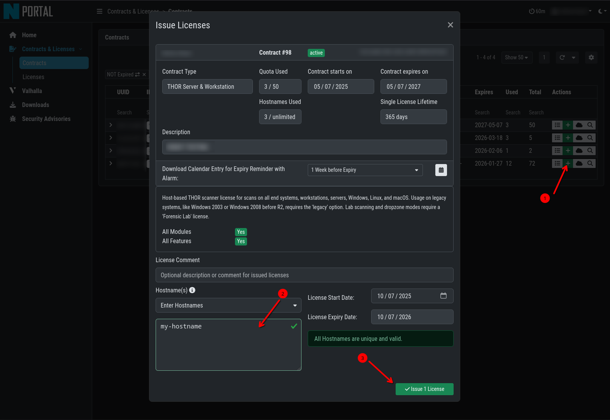
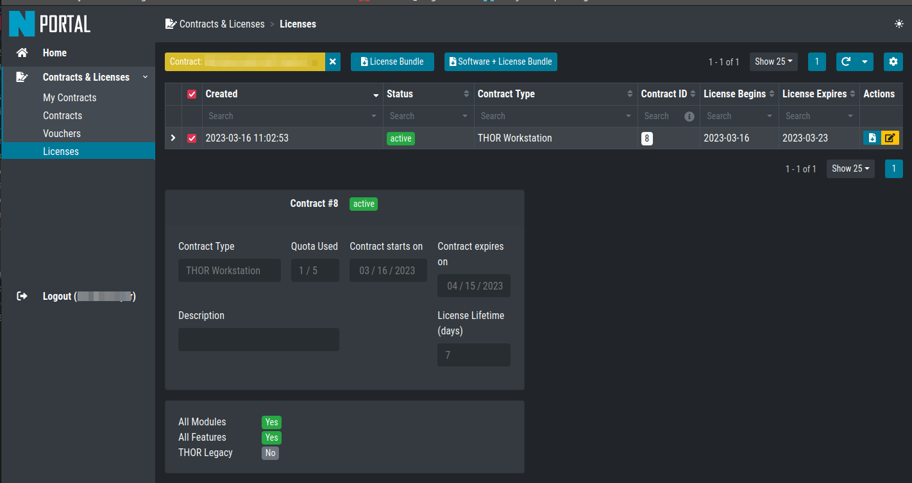
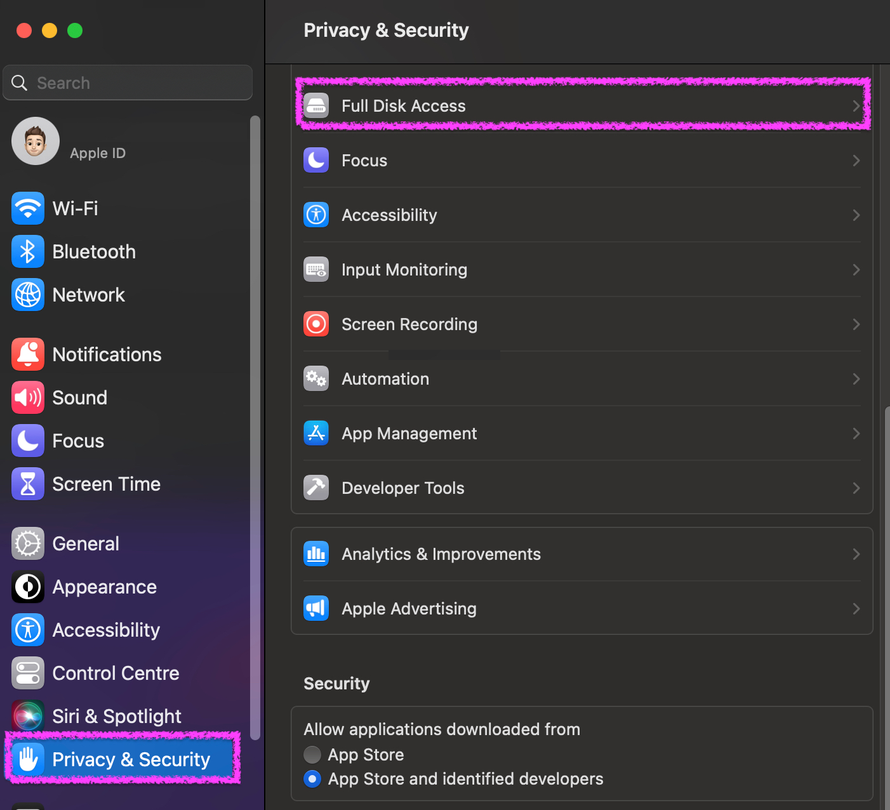
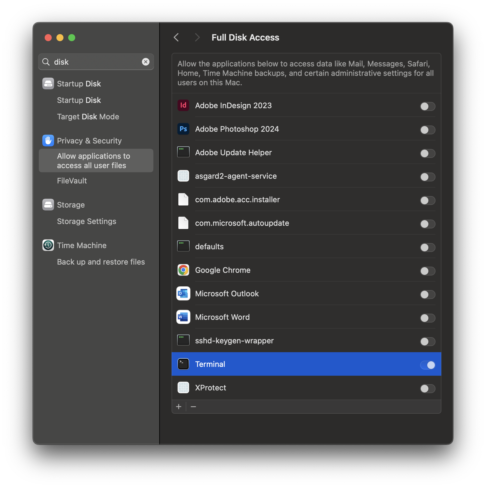
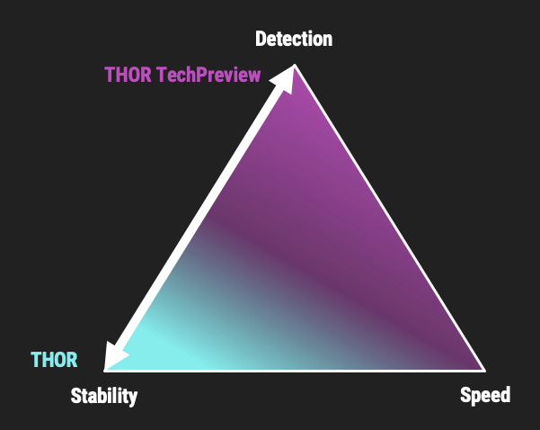

Before You Begin
================

Before using THOR for the first time, read this section to understand
what is required to use THOR effectively.

Licensing
---------

THOR requires a valid license to run. After you
:ref:`usage/beforeyoubegin:generate a license`, place the license file
in the THOR program folder. THOR scans the program folder and all
subfolders for valid license files (``*.lic``). Alternatively, you can
specify a search path with ``--licensepath <path>``. For details, refer
to :ref:`usage/beforeyoubegin:About License Files`. For automation
purposes, THOR also supports
:ref:`usage/beforeyoubegin:license injection via environment`.

.. tip::
   THOR can also retrieve licenses from our licensing portal or from a
   local Management Center. See
   :ref:`usage/other-topics:license retrieval` for more information.

Generate a License
^^^^^^^^^^^^^^^^^^

You can generate a valid license in our `customer portal <https://portal.nextron-systems.com/>`__.

Navigate to ``Contracts & Licenses`` > ``My Contracts`` and select the
appropriate contract type to generate a new license. Use either
``THOR Workstation`` or ``THOR Server & Workstation`` as the license
type.

The following overview shows which license type to use:

* THOR Workstation: host-based THOR scanner license for Windows
  workstations and macOS only. It cannot be used on Windows servers or
  Linux systems, regardless of their role. Usage on legacy systems such
  as Windows XP requires the ``legacy`` option.
* THOR Server & Workstation: host-based THOR scanner license for scans
  on workstations and servers running Windows, Linux, or macOS. Usage
  on legacy systems such as Windows 2003 or Windows 2008 before R2
  requires the ``legacy`` option.

   Contract Overview in the Portal

Click the green ``Plus`` icon for your contract and fill in all
required fields. After clicking ``Check Hostnames``, you can issue the
license if all hostnames are unique and valid.

   Generate a License in the Portal

To generate a license, use the hostname of the system on which THOR
will run. On Windows, use the ``computername`` as the hostname during
license creation:

.. code-block:: doscon

   C:\Users\nextron>echo %COMPUTERNAME%
   WIN11-TESTING

On Linux, use the ``hostname`` command:

.. code-block:: console

   nextron@unix:~$ hostname
   unix

On macOS use the following command:

.. code-block:: console

   MacBook:~ nextron$ sysctl kern.hostname
   MacBook

Additional notes on hostname values:

* Use only the hostname part of an FQDN (**master1** from
  **master1.internal.net**)
* Letter casing does not matter (case-insensitive)
* We do not store hostnames in the portal

After you issue the license, your browser opens the ``Licenses``
section of the portal. There you can see all licenses issued for the
contract you just used. You can download a single ``License``, a
``License Bundle`` containing all selected licenses in one ZIP file, or
a ``Software + License Bundle`` containing the correct THOR version
together with your license(s). To see licenses across all contracts,
remove the filter at the top labeled ``Contract: xyz``.

   Licenses Overview in the Portal

About License Files
^^^^^^^^^^^^^^^^^^^

THOR scans its program folder and all subfolders for valid ``.lic``
files and uses the first valid license it finds.

This behavior simplifies rollouts with the host-based license model.

You can generate licenses for many systems, store them in a subfolder
named ``licenses`` (for example ``thor-system1.lic``,
``this-system2.lic``, ``...``), and distribute the THOR program folder
with that subfolder to all licensed systems. On each system, you can
then simply run ``thor64.exe``. There is no limit to the number of
license files that can be placed in this folder.

This allows you to prepare one USB drive for all systems or provide a
network share with one THOR copy that already includes all required
licenses. Another use case is :ref:`usage/deployment:Thor Remote`,
which requires a license for every remote system you plan to scan.

License Injection via Environment
^^^^^^^^^^^^^^^^^^^^^^^^^^^^^^^^^

Instead of using license files, you can provide a specific license
through THOR's execution environment. This is particularly useful for
automation, for example if THOR runs inside a container.

Use a valid license file and store its content as a **base64-encoded
string** in the ``THOR_LICENSE`` environment variable:

**Linux**

.. code-block:: console

   nextron@unix:~$ export THOR_LICENSE=$(base64 < /path/to/thor.lic)

**Windows**

.. code-block:: powershell

   $env:THOR_LICENSE = [Convert]::ToBase64String([System.IO.File]::ReadAllBytes("C:\path\to\thor.lic"))

Then run THOR as usual.

Upgrade THOR and Update The Signatures
--------------------------------------

Run the following command to update THOR and its signatures:

Windows:

.. code-block:: doscon

   C:\nextron\thor>thor-util.exe upgrade
   Jan 10 09:24:20 win11-testing THOR_UTIL: Info: Read configuration from C:\nextron\thor\config\thor-util.yml

       ________ ______  ___    __  ______________
      /_  __/ // / __ \/ _ \  / / / /_  __/  _/ /
       / / / _  / /_/ / , _/ / /_/ / / / _/ // /__
      /_/ /_//_/\____/_/|_|  \____/ /_/ /___/____/

      Copyright by Nextron Systems GmbH, 2023                                       
      v1.11.0+thor10.7.20      

   Jan 10 09:24:20 win11-testing THOR_UTIL: Info: Starting Upgrade Process
   Jan 10 09:24:20 win11-testing THOR_UTIL: Info: License file found OWNER: Rick Roll TYPE: client STARTS: 2022/08/09 EXPIRES: 2023/08/09
   Jan 10 09:24:20 win11-testing THOR_UTIL: Info: Downloading 'thor-win'
   Jan 10 09:24:20 win11-testing THOR_UTIL: Info: Downloading from: https://update1.nextron-systems.com/[...]
   Jan 10 09:24:20 win11-testing THOR_UTIL: Info: already up-to-date
   Jan 10 09:24:20 win11-testing THOR_UTIL: Info: THOR 10 detected, also updating signatures ...
   Jan 10 09:24:20 win11-testing THOR_UTIL: Info: Starting Upgrade Process
   Jan 10 09:24:20 win11-testing THOR_UTIL: Info: License file found OWNER: Rick Roll TYPE: client STARTS: 2022/08/09 EXPIRES: 2023/08/09
   Jan 10 09:24:21 win11-testing THOR_UTIL: Info: Downloading 'signatures'
   Jan 10 09:24:21 win11-testing THOR_UTIL: Info: Downloading from: https://update1.nextron-systems.com/[...]
   Jan 10 09:24:21 win11-testing THOR_UTIL: Info: downloaded package as zip
   Jan 10 09:24:28 win11-testing THOR_UTIL: Info: Successfully upgraded from Signatures 23.1.5-122954 to Signatures 23.1.9-153938

Linux:

.. code-block:: console

   nextron@unix:~/Documents/thor$ ./thor-util upgrade
   Jan 10 09:33:10 unix THOR_UTIL: Info: Read configuration from /home/nextron/Documents/thor/config/thor-util.yml

       ________ ______  ___    __  ______________
      /_  __/ // / __ \/ _ \  / / / /_  __/  _/ /
       / / / _  / /_/ / , _/ / /_/ / / / _/ // /__
      /_/ /_//_/\____/_/|_|  \____/ /_/ /___/____/

      Copyright by Nextron Systems GmbH, 2023                                       
      v1.11.0+thor10.7.20      

   Jan 10 09:33:10 unix THOR_UTIL: Info: Starting Upgrade Process
   Jan 10 09:33:10 unix THOR_UTIL: Info: License file found OWNER: Rick Roll TYPE: client STARTS: 2023/01/10 EXPIRES: 2023/08/14
   Jan 10 09:33:10 unix THOR_UTIL: Info: Downloading 'thor-linux'
   Jan 10 09:33:10 unix THOR_UTIL: Info: Downloading from: https://update1.nextron-systems.com/[...]
   Jan 10 09:33:11 unix THOR_UTIL: Info: already up-to-date
   Jan 10 09:33:11 unix THOR_UTIL: Info: THOR 10 detected, also updating signatures ...
   Jan 10 09:33:11 unix THOR_UTIL: Info: Starting Upgrade Process
   Jan 10 09:33:11 unix THOR_UTIL: Info: License file found OWNER: Rick Roll TYPE: client STARTS: 2023/01/10 EXPIRES: 2023/08/14
   Jan 10 09:33:11 unix THOR_UTIL: Info: Downloading 'signatures'
   Jan 10 09:33:11 unix THOR_UTIL: Info: Downloading from: https://update1.nextron-systems.com/[...]
   Jan 10 09:33:11 unix THOR_UTIL: Info: already up-to-date

We strongly recommend updating THOR before running it for the first
time, because the downloaded package or the included signatures may
already be out of date.

.. note::
   The upgrade requires a valid license for the host that performs the
   update. If you do not want to use a regular license on that host,
   ask us for a ``silent license``. It can be used for testing purposes
   and also allows THOR and signature updates.

Define an Antivirus / EDR Exclusion
-----------------------------------

Because THOR accesses process memory and probes for suspicious mutexes,
named pipes, and event values, we recommend excluding THOR from
antivirus and EDR scanning.

Adding such exclusions can also significantly reduce runtime, because
access to process memory and files is no longer intercepted.

.. note::
   We have seen major runtime increases with Windows Defender since
   April 2021 (+50-100%). When using Windows Defender, we strongly
   recommend excluding THOR from scanning.

The quickest way to add an exclusion on a single system is to use the
following command. Adjust the path in ``-ExclusionProcess`` as needed.

Windows command line:

.. code-block:: doscon

   C:\Users\nextron>powershell -ep bypass -Command "Add-MpPreference -ExclusionProcess 'c:\temp\thor\thor64.exe'"

PowerShell:

.. code-block:: ps1con

   PS C:\Users\nextron> Add-MpPreference -ExclusionProcess 'c:\temp\thor\thor64.exe'

For more information, see
`the Microsoft documentation <https://learn.microsoft.com/en-us/defender-endpoint/configure-process-opened-file-exclusions-microsoft-defender-antivirus?view=o365-worldwide>`__.

A Note on SentinelOne
^^^^^^^^^^^^^^^^^^^^^

On systems running SentinelOne, process memory may contain suspicious
strings introduced by the product itself. The most common false
positive is related to the keyword ``ReflectiveLoader``, but other
rules may also match.

It is unclear how SentinelOne modifies the memory of many system
processes. We cannot generally exclude these signatures from the scan.
Be aware that results from the ``ProcessCheck`` module on a system
running SentinelOne may contain many false positives.

A Note on McAfee
^^^^^^^^^^^^^^^^

Defining THOR exclusions across all relevant McAfee services is not
straightforward. You need to exclude the process in multiple sections
(AV, EDR, On-Access). We have compiled a list of recommended
exclusions, which you can find
`here <https://management-center-manual.nextron-systems.com/en/latest/requirements/av_edr.html#mcafee-edr-exclusions>`__.

Grant Full Disk Access on macOS
-------------------------------

THOR requires Full Disk Access (FDA) for some data like Mail, Messages and certain
administrative settings for all users, while scanning macOS, although THOR itself
must be executed with administrative privileges.

You can grant FDA to ``Terminal`` (as executing application) on demand while scanning,
by allowing access when prompted. Alternatively, you can grant access before, to perform
the scan unattended. Please keep in mind that also administrative privileges on the
machine are needed to perform this change.

To do this, navigate on your Mac to ``System Settings`` > ``Privacy & Security`` > ``Full Disk Access``:

   System Settings View

You need to add ``Terminal`` to the listed application.

   Full Disk Access View

.. note::
   Once your scan is complete, it's strongly recommended to disable Full Disk Access for Terminal and only re-enable it when performing another scan.

Choose The Right THOR Variant
-----------------------------

We offer THOR in different variants.

* THOR
* THOR TechPreview
* THOR Legacy (limited support and compatibility)

   THOR Default and TechPreview Focus

THOR
^^^^

The default version of THOR is the most stable version, intensively tested and
without any broadly tested performance and detection tweaks.

The default version should be used for:

* Scan sweeps on hundreds or thousands of systems
* Continuous compromise assessments on hundreds or thousands of systems
* Systems with high requirements on stability

THOR TechPreview
^^^^^^^^^^^^^^^^

The TechPreview version is focused on detection and speed. This
`blog post <https://www.nextron-systems.com/2020/08/31/introduction-thor-techpreview/>`__
contains more information on the differences.

The TechPreview version should be used for:

* Digital forensic lab scanning
* Dropzone mode scanning
* Image scanning
* THOR Thunderstorm setups
* Single system live forensics on systems that don't have the highest priority on stability

You can find the information on how to get the TechPreview version in
the `THOR Util manual <https://thor-util-manual.nextron-systems.com/en/latest/usage/download-packages.html#thor-techpreview-version>`__.

THOR Legacy
^^^^^^^^^^^

THOR Legacy is a stripped-down version that includes all modules that can be used
on outdated operating systems. This
`blog post <https://www.nextron-systems.com/2020/12/17/thor-10-legacy-for-windows-xp-and-windows-2003/>`__
contains more information on the legacy version.

The legacy version lacks:

* Diagnostic features of THOR Util
* UPX unpacking
* ADS scanning
* Module: Process scanning
* Module: Eventlog scanning
* Module: THOR Thunderstorm
* Module: ETW Watcher
* Module: Task scheduler
* HTML report generation

.. note::
   We only offer limited support for this version, since we cannot guarantee a successful
   stable scan on platforms that have already been deprecated.

To use THOR Legacy, you need a special license. Contact sales to get more information regarding
Legacy licenses.

To download THOR Legacy, you can either download it directly from
our portal (recommended; continue at step 5), or follow these steps:

1. Download a normal THOR package (non-legacy)
2. Use thor-util to download THOR Legacy:

   ``thor-util.exe download --legacy -t thor10-win``

3. You will get a zip file with the following name:

   ``thor-win-10.6.22_<date>-<time>.zip``

4. The content of this zip file should be as follows:

   .. figure:: ../images/thor_legacy_content.png
      :alt: THOR Legacy content

5. You can now transfer this package to your Legacy system. Please do an upgrade
   before you start using this:

   ``thor-legacy-util.exe upgrade``

   ``thor-legacy-util.exe update``

6. Place your Legacy license inside this folder and start using THOR Legacy

Choose The Right Architecture
-----------------------------

You will find a 32 and 64-bit version of the executable in the program folder. Never run
the 32-bit version of THOR named ``thor.exe`` on a 64-bit system. The 32-bit version has some
limitations that the 64-bit version doesn't have (memory usage, sees different folders
on disk and registry versions).

Make sure to run the correct binary for your target architecture.

Choose The Right Command Line Flags
-----------------------------------

The recommended way to run THOR has already been put into the default. So, the recommended
way to start a THOR is without any command line flags.

However, special circumstances can lead to different requirements and thus a different set
of command line flags. See chapter :ref:`usage/scan:scan` for often used flags.

Add Command Line Completions (optional)
---------------------------------------

Since version 10.7.15, THOR offers shell completions for browsing the flags. These completions can be generated by using:

   ``thor-linux-64 --completions <bash/zsh/fish/powershell>``

This generates a snippet for the specified shell that can be loaded for the current terminal using the following command, depending on your shell:

- bash:

   ``source <(thor-linux-64 --completions bash)``

- zsh:

   ``source <(thor-linux-64 --completions zsh)``

- fish:

   ``thor-linux-64 --completions fish | source``

- PowerShell:

   ``thor64.exe --completions powershell | Out-String | Invoke-Expression``

Verify Public Key Signatures (optional)
---------------------------------------

You can verify the executable files in the THOR package with

* their digital signature (PE signature) issued by "Nextron Systems GmbH"
* thor-util's "verify" feature
* openssl verifying the integrity of executables manually

Find more information on THOR Util in its dedicated `online manual <https://thor-util-manual.nextron-systems.com>`__.

.. hint::
   THOR Util automatically verifies the signatures of the contained
   binaries in an update package and exits if one or more signatures cannot
   be verified. You don't have to check them manually unless you distrust
   the THOR Util itself. In this case, you can use the public key published
   on `our knowledge base <https://knowledge.nextron-systems.com/general/key-certificates>`__.

After downloading the public key the signatures can be manually verified with the following command:

.. code-block:: doscon

   C:\Users\nextron>openssl dgst -sha256 -verify <Path to public key .pem> -signature <Path to signature .sig> <Path to the executable>

Example Windows:

.. code-block:: doscon

   C:\Users\nextron>openssl dgst -sha256 -verify codesign.pem -signature thor64.exe.sig thor64.exe
   Verified OK

Example Linux:

.. code-block:: console

   user@unix:~/thor$ openssl sha256 -verify codesign.pem -signature thor-linux.sig thor-linux
   Verified OK

