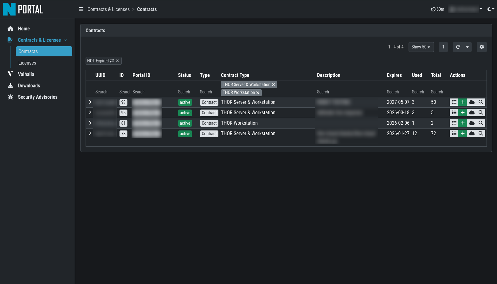

Before You Begin
================

Before you begin to use THOR for the first time, you should read through
this section to get a better understanding of what is needed to use THOR.

In the following chapters you should learn how THOR works.

Add License File
----------------

Place a valid license file into the THOR program folder. THOR checks the
program folder and all sub folder for valid license files (``*.lic``).
Alternatively, you can specify a specific path with ``--licensepath <path>``.

.. tip::
   THOR is also able to fetch licenses from our licensing portal or a local
   ASGARD Management Center. Please see chapter :ref:`usage/other-topics:license retrieval`
   for more information about license retrieval.

Generate a License 
^^^^^^^^^^^^^^^^^^

You can generate a valid license in our `customer portal <https://portal.nextron-systems.com/>`__.

Navigate to ``Contracts & Licenses`` > ``My Contracts`` and choose the
correct Contract Type to generate a new license. You can use ``THOR Workstation`` 
or ``THOR Server & Workstation`` as the License Type.

Here is an Overview of which type of license you need to use:

* THOR Workstation

  - Host-based THOR scanner license for Windows workstations and macOS only.
    Not usable on Windows servers or Linux systems, regardless of their
    actual usage (e.g. Linux Desktop systems). Usage on legacy systems,
    such as Windows XP, requires the ``legacy`` option.

* THOR Server & Workstation

  - Host-based THOR scanner license for scans on all end systems, workstations,
    servers, Windows, Linux, and macOS. Usage on legacy systems, like Windows
    2003 or Windows 2008 before R2, requires the ``legacy`` option.

   Contract Overview in the Portal

Click on the green ``Plus`` icon of your contract and fill all the mandatory
fields. After clicking on ``Check Hostnames``, you can issue the license
if all the hostnames are unique and valid.

.. figure:: ../images/portal_generate_license.png
   :alt: Generate a License in the Portal

   Generate a License in the Portal

For the license generation it is necessary to use the hostname of the system
which will run THOR. On Windows system you should use the ``computername``
as hostname during license creation: 

.. code-block:: doscon 

   C:\Users\nextron>echo %COMPUTERNAME%
   WIN11-TESTING

On Linux use the ``hostname`` command:

.. code-block:: console 

   nextron@unix:~$ hostname
   unix

On macOS use the following command: 

.. code-block:: console 

   MacBook:~ nextron$ sysctl kern.hostname
   MacBook

Some more remarks regarding the hostname values: 

* Use only the hostname of a FQDN (**master1** of **master1.internal.net**)
* The casing of the letters doesn't matter (case-insensitive)
* We do not store the hostnames anywhere in our portal

After you issued your license, your browser will forward you to the ``Licenses``
section of the portal. You will be able to see all the issued licenses for the contract
you just used earlier. You can either download a single ``License``, a ``License Bundle``,
which contains all the selected licenses in one zip file, or a ``Software + License
Bundle``, which contains the correct THOR version plus your license(s).
If you want to see all your issued licenses for all of your contracts, you can remove the
filter on the top which says ``Contract: xyz``.

.. figure:: ../images/portal_licenses_overview.png
   :alt: Licenses Overview in the Portal

   Licenses Overview in the Portal

About License Files
^^^^^^^^^^^^^^^^^^^

THOR processes its program folder and all sub folders in search for a
valid license file with a ``.lic`` extension, and picks the first
valid license it can find.

This change has been made to facilitate the rollout using the new host
based license model.

You can now generate licenses for a big set of systems, store all the
licenses as ``thor-system1.lic``, ``this-system2.lic``" and so on in
a sub folder ``./licenses`` and transfer the THOR program folder with
the "licenses" sub folder to all the different systems, for which you have
generated licenses and just run the ``thor.exe`` executable.

Upgrade THOR and Update The Signatures 
--------------------------------------

Run the following command to update THOR and its signatures:

Windows:

.. code-block:: doscon 
   
   C:\nextron\thor>thor-util.exe upgrade
   Jan 10 09:24:20 win11-testing THOR_UTIL: Info: Read configuration from C:\nextron\thor\config\thor-util.yml

       ________ ______  ___    __  ______________
      /_  __/ // / __ \/ _ \  / / / /_  __/  _/ /
       / / / _  / /_/ / , _/ / /_/ / / / _/ // /__
      /_/ /_//_/\____/_/|_|  \____/ /_/ /___/____/

      Copyright by Nextron Systems GmbH, 2021
      v1.10.6+thor10.6.19

   Jan 10 09:24:20 win11-testing THOR_UTIL: Info: Starting Upgrade Process
   Jan 10 09:24:20 win11-testing THOR_UTIL: Info: License file found OWNER: Rick Roll TYPE: client STARTS: 2022/08/09 EXPIRES: 2023/08/09
   Jan 10 09:24:20 win11-testing THOR_UTIL: Info: Downloading 'thor-win'
   Jan 10 09:24:20 win11-testing THOR_UTIL: Info: Downloading from: https://update1.nextron-systems.com/getupdate.php?full=1&lic=00000000000000000000000000000000&product=thor10-win&thorupgrader=1.10.6%2Bthor10.6.19&thorversion=10.6.19&upgrade_only=1
   Jan 10 09:24:20 win11-testing THOR_UTIL: Info: already up-to-date
   Jan 10 09:24:20 win11-testing THOR_UTIL: Info: THOR 10 detected, also updating signatures ...
   Jan 10 09:24:20 win11-testing THOR_UTIL: Info: Starting Upgrade Process
   Jan 10 09:24:20 win11-testing THOR_UTIL: Info: License file found OWNER: Rick Roll TYPE: client STARTS: 2022/08/09 EXPIRES: 2023/08/09
   Jan 10 09:24:21 win11-testing THOR_UTIL: Info: Downloading 'signatures'
   Jan 10 09:24:21 win11-testing THOR_UTIL: Info: Downloading from: https://update1.nextron-systems.com/getupdate.php?full=1&lic=00000000000000000000000000000000&product=signatures&thorupgrader=1.10.6%2Bthor10.6.19&thorversion=23.1.5-122954&upgrade_only=1
   Jan 10 09:24:21 win11-testing THOR_UTIL: Info: downloaded package as zip
   Jan 10 09:24:28 win11-testing THOR_UTIL: Info: Successfully upgraded from Signatures 23.1.5-122954 to Signatures 23.1.9-153938

Linux:

.. code-block:: console

   nextron@unix:~/Documents/thor$ ./thor-util upgrade                                                                                           
   Jan 10 09:33:10 unix THOR_UTIL: Info: Read configuration from /home/nextron/Documents/thor/config/thor-util.yml

       ________ ______  ___    __  ______________                                   
      /_  __/ // / __ \/ _ \  / / / /_  __/  _/ /                                   
       / / / _  / /_/ / , _/ / /_/ / / / _/ // /__                                  
      /_/ /_//_/\____/_/|_|  \____/ /_/ /___/____/                                  

      Copyright by Nextron Systems GmbH, 2021                                       
      v1.10.6+thor10.6.19                                                           
                                                                             
   Jan 10 09:33:10 unix THOR_UTIL: Info: Starting Upgrade Process
   Jan 10 09:33:10 unix THOR_UTIL: Info: License file found OWNER: Rick Roll TYPE: client STARTS: 2023/01/10 EXPIRES: 2023/08/14
   Jan 10 09:33:10 unix THOR_UTIL: Info: Downloading 'thor-linux'
   Jan 10 09:33:10 unix THOR_UTIL: Info: Downloading from: https://update1.nextron-systems.com/getupdate.php?full=1&lic=00000000000000000000000000000000&product=thor10-linux&thorupgrader=1.10.6%2Bthor10.6.19&thorversion=10.6.19&upgrade_only=1
   Jan 10 09:33:11 unix THOR_UTIL: Info: already up-to-date
   Jan 10 09:33:11 unix THOR_UTIL: Info: THOR 10 detected, also updating signatures ...
   Jan 10 09:33:11 unix THOR_UTIL: Info: Starting Upgrade Process
   Jan 10 09:33:11 unix THOR_UTIL: Info: License file found OWNER: Rick Roll TYPE: client STARTS: 2023/01/10 EXPIRES: 2023/08/14
   Jan 10 09:33:11 unix THOR_UTIL: Info: Downloading 'signatures'
   Jan 10 09:33:11 unix THOR_UTIL: Info: Downloading from: https://update1.nextron-systems.com/getupdate.php?full=1&lic=00000000000000000000000000000000&product=signatures&thorupgrader=1.10.6%2Bthor10.6.19&thorversion=23.1.9-153938&upgrade_only=1
   Jan 10 09:33:11 unix THOR_UTIL: Info: already up-to-date

It is **important** that you update THOR after you have downloaded it from
the customer portal, since the packages do not contain the newest signature files. 
(caused by internal integrity checks)

.. note::
   The upgrade requires a valid license for the host that performs the update. 
   If you don't want to use a license for that host, ask us for a ``silent license``, 
   which can be used for all kinds of testing purposes and also allows to update THOR
   and its signatures.

Define an Antivirus / EDR Exclusion
-----------------------------------

Since THOR accesses different process memories and probes for malicious
Mutex, Named Pipes and Event values, it is recommended to exclude THOR
from Antivirus / EDR scanning.

The Antivirus exclusion could also lead to a significant runtime
reduction, since access to processes memory and files will not get
intercepted anymore.

.. note:: 
   We see massive runtime changes with Windows Defender since April 2021 (+50-100%). 
   It is highly recommended to exclude THOR from scanning when using Windows Defender. 

The quickest way to add an exclusion on a single system is wit the following command
(change the path in ``-ExclusionProcess`` accordingly).

Windows command line:

.. code-block:: doscon 

   C:\Users\nextron>powershell -ep bypass -Command "Add-MpPreference -ExclusionProcess 'c:\temp\thor\thor64.exe'"

PowerShell:

.. code-block:: ps1con

   PS C:\Users\nextron> Add-MpPreference -ExclusionProcess 'c:\temp\thor\thor64.exe'

For more information visit `https://docs.microsoft.com <https://docs.microsoft.com/en-us/microsoft-365/security/defender-endpoint/configure-process-opened-file-exclusions-microsoft-defender-antivirus?view=o365-worldwide>`__.

A Note on SentinelOne
^^^^^^^^^^^^^^^^^^^^^

The process memory of systems running SentinelOne is polluted with suspicious strings.
The most prevalent false positive is related to the keyword "ReflectiveLoader",
but any other rule can match as well.

It is unclear what SentinelOne does to the process memory of many system processes.
We cannot exclude these signatures from the scan. Be aware that the results from
the "ProcessCheck" module on a system running SentinelOne can contain many false positives.

A Note on McAfee
^^^^^^^^^^^^^^^^

It is not an easy task to define exclusions for THOR in all the different services
when running McAfee products. You have to exclude the process in different sections
(AV, EDR, On-Access). We've compiled a list of exclusions for our ASGARD customers,
which you can find `here <https://asgard-manual.nextron-systems.com/en/latest/usage/requirements.html#mcafee-edr-exclusions>`__.

Choose The Right THOR Variant 
-----------------------------

We offer THOR in different variants. 

* THOR 
* THOR TechPreview
* THOR Legacy (limited support and compatibility)

.. figure:: ../images/techpreview.png
   :alt: THOR Default and TechPreview Differences

   THOR Default and TechPreview Focus

THOR
^^^^

The default version of THOR is the most stable version, intensively tested and
without any broadly tested performance and detection tweaks.

The default version should be used for: 

* Scan sweeps on hundreds or thousands of systems
* Continuous compromise assessments on hundreds or thousands of systems
* Systems with high requirements on stability

THOR TechPreview 
^^^^^^^^^^^^^^^^

The TechPreview version is focussed on detection and speed. This
`blog post <https://www.nextron-systems.com/2020/08/31/introduction-thor-techpreview/>`__
contains more information on the differences. 

The TechPreview version should be used for: 

* Digital forensic lab scanning
* Dropzone mode scanning 
* Image scanning 
* THOR Thunderstorm setups
* Single system live forensics on systems that don't have highest priority on stability 

You can find the information on how to get the TechPreview version in
the `THOR Util manual <https://thor-util-manual.nextron-systems.com/en/latest/usage/download-packages.html#thor-techpreview-version>`__.

THOR Legacy 
^^^^^^^^^^^

THOR Legacy is a stripped down version that includes all modules that can be used
on outdated operating systems. This
`blog post <https://www.nextron-systems.com/2020/12/17/thor-10-legacy-for-windows-xp-and-windows-2003/>`__
contains more information on the legacy version.

The legacy version lacks: 

* Diagnostic features of THOR Util
* UPX unpacking
* ADS scanning
* Module: Process scanning
* Module: Eventlog scanning
* Module: THOR Thunderstorm
* Module: ETW Watcher
* Module: Task scheduler
* HTML report generation

.. note::
   We only offer limited support for this version, since we cannot guarantee a successful
   stable scan on platforms that have already been deprecated.

To use THOR Legacy, you need a special license. Contact sales to get more information regarding
Legacy licenses.

To download THOR Legacy, you can either download it directly from
our portal (recommended; continue at step 5), or follow these steps:

1. Download a normal THOR package (non-legacy)
2. Use thor-util to download THOR Legacy:

   ``thor-util.exe download --legacy -t thor10-win``

3. You will get a zip file with the following name:

   ``thor-win-10.6.20_<date>-<time>.zip``

4. The content of this zip file should be as follows:

   .. figure:: ../images/thor_legacy_content.png
      :alt: THOR Legacy content

5. You can now transfer this package to your Legacy system. Please do an upgrade
   before you start using this:

   ``thor-legacy-util.exe upgrade``

   ``thor-legacy-util.exe update``

6. Place your Legacy license inside this folder and start using THOR Legacy

Choose The Right Architecture 
-----------------------------

You will find a 32 and 64 bit version of the executable in the program folder. Never run
the 32bit version of THOR named ``thor.exe`` on 64bit system. The 32bit version has some
limitations that the 64bit version doesn't have (memory usage, sees different folders
on disk and registry versions).

Make sure to run the correct binary for your target architecture.

Choose The Right Command Line Flags 
-----------------------------------

The recommended way to run THOR has already been put into the default. So, the recommended
way to start a THOR is without any command line flags.

However, special circumstances can lead to different requirements and thus a different set
of command line flags. See chapter :ref:`usage/scan:scan` for often used flags.

Add Command Line Completions (optional)
---------------------------------------

Since version 10.7.15, THOR offers shell completions for browsing the flags. These completions can be generated by using:

   ``thor-linux-64 --completions <bash/zsh/fish/powershell>``

This generates a snippet for the specified shell that can be loaded for the current terminal using the following command, depending on your shell:

- bash:

   ``source <(thor-linux-64 --completions bash)``

- zsh:

   ``source <(thor-linux-64 --completions zsh)``

- fish:

   ``thor-linux-64 --completions fish | source``

- PowerShell:

   ``thor64.exe --completions powershell | Out-String | Invoke-Expression``

Verify Public Key Signatures (optional)
---------------------------------------

You can verify the executable files in the THOR package with

* their digital signature (PE signature) issued by "Nextron Systems GmbH"
* thor-util's "verify" feature
* openssl verifying the integrity of executables manually

Find more information on THOR Util in its dedicated `online manual <https://thor-util-manual.nextron-systems.com>`__. 

.. hint::
   THOR Util automatically verifies the signatures of the contained 
   binaries in an update package and exits if one or more signatures cannot
   be verified. You don't have to check them manually unless you distrust 
   the THOR Util itself. In this case, you can use the public key published
   on `our web page <https://www.nextron-systems.com/pki/>`__.
   
After downloading the public key the signatures can be manually verified with the following command:

.. code-block:: doscon

   C:\Users\nextron>openssl dgst -sha256 -verify <Path to public key .pem> -signature <Path to signature .sig> <Path to the executable>

Example Windows:

.. code-block:: doscon
   
   C:\Users\nextron>openssl dgst -sha256 -verify codesign.pem -signature thor64.exe.sig thor64.exe
   Verified OK

Example Linux:

.. code-block:: console

   user@unix:~/thor$ openssl sha256 -verify codesign.pem -signature thor-linux.sig thor-linux
   Verified OK

