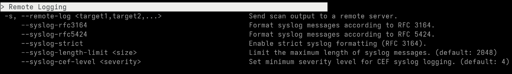

Configuration
=============

Scan Templates
--------------

THOR 10 accepts config files (called “templates”) in YAML format. They
reflect all command options to make them flexible and their use as
comfortable as possible.

This means that every parameter set via command line can be provided in
the form of a config file. You can even combine several of these config
files in a single scan run.

Default Template
^^^^^^^^^^^^^^^^

By default, THOR only applies the file named **thor.yml** in the
**./config** sub folder. Other config files can be applied using the
**-t** command line parameter.

Apply Custom Scan Templates
^^^^^^^^^^^^^^^^^^^^^^^^^^^

The following command line provides a custom scan template named
**mythor.yml**.

.. code:: batch
   
   thor.exe -t mythor.yml

Example Templates
^^^^^^^^^^^^^^^^^

The default config **thor.yml** in the **./config** folder has the
following content.

Content of THOR's Default Config 'thor.yml':

.. code:: yaml 

   # This is the default config for THOR
   # Terminate THOR if he runs longer than 72 hours
   max_runtime: 72
   # Minimum score to report is 40
   min: 40
   # Skip files bigger than 12000000 bytes
   max_file_size: 12000000
   # Skip files bigger than 30000000 bytes in intense mode (--fsonly, --intense)
   max_file_size_intense: 30000000
   # Limit THOR's CPU usage to 95%
   cpulimit: 95
   # The minimum amount of free physical memory to proceed (in MB)
   minmem: 50
   # Truncate THOR's field values after 2048 characters
   truncate: 2048

Content of Config File ‘mythor.yml':

.. code:: yaml 

   resume: true
   cpulimit: 40
   intense: true
   max_file_size: 7500000
   syslog:
      - foo.nextron
      - bar.nextron:514:TCP

The default scan template is always applied first. Custom templates can
then overwrite settings in the default template. In the example above,
the **cpulimit** and **max\_file\_size** parameters are overwritten by
the custom template.

As you can see in the example file, you have to use the long form of the
command line parameter (e.g. **syslog**) and not the short form (e.g.
**s**) in the template files. The long forms can be looked up in the
command line help using **--help**.

   Lookup command line parameter long forms using –help

Maximum File Size
-----------------

The default maximum file size for deeper investigations (hash
calculation and YARA scanning) is 20 MB. The maximum file size for the
"**intense**" scan mode is 100 MB.

You can adjust the values in "**./config/thor.yml**". This file does not
get overwritten by an update or upgrade.

Special scan features like the EVTX or Memory Dump scan ignore these
limits.

Features that obey the file size limit:

- YARA Matching
- Hash calculation
- STIX IOC application
- ArchiveScan 

Features that ignore the file size limit: 

- LogScan
- RegistryHive scanning 
- EVTX scanning 
- DeepDive on memory dumps (selected by .dmp and magic headers)
- Filename IOCs 
- YARA meta rules (only check the first 100 bytes of a file and all meta data)

If the ``--intense`` flag is used, a different file size limit is applied. 

The only exception is ``ArchiveScan`` (e.g. ZIP file analysis) that has no file size limit in intense scan. 

Chunk Size in DeepDive
^^^^^^^^^^^^^^^^^^^^^^

The chunk size in DeepDive module is set to the value defined as 
**maximum file size**. DeepDive uses overlapping chunks of this size for 
YARA rule scanning.

Example: If the maximum file size is set to a default of 12 MB, DeepDive use the
following chunks in its scan to apply the YARA rule set:

.. code:: 

   Chunk 1: Offset 0 – 12
   Chunk 2: Offset 6 – 18
   Chunk 3: Offset 12 – 24
   Chunk 4: Offset 18 – 30

Exclude Elements
----------------

Files and Directories
^^^^^^^^^^^^^^^^^^^^^

You may use the file "**directory-excludes.cfg**" to exclude directories
and files(! The name of the config file is misleading) from the scan.

THOR will not scan the contents of these directories. This
"**directory-excludes.cfg**" config is meant to avoid scanning
sensitive files like databases or directories with a lot of content. If
you want to suppress false positives that are generated in these
directories, please see the following chapter and how to suppress them
by using "**false\_positive\_filters.cfg**".

The exclusion file contains regular expressions that are applied to each
scanned element. Each element consists of the file path and file name
(e.g. C:\\IBM\\temp\_tools\\custom.exe). If one of the defined
expressions matches, the element is excluded. Exclusions can be defined
for a full element name, at the beginning at the end or somewhere in the
element name.

As the configured exclusions are treated as regular expressions, special
characters must be masqueraded by backslash. This applies at least for:
**[]\\^$.\|?\*+()-**

+-------------------------------------------------------------+---------------------------------------+
| Element to exclude                                          | Possible solution                     |
+=============================================================+=======================================+
| C:\\IBM\\temp\_tools\\custom.exe                            | C:\\\\IBM\\\\temp\_tools\\\\          |
+-------------------------------------------------------------+---------------------------------------+
| Log folder of the tool "hpsm" regardless on the partition   | \\\\HPSM\\\\log\\\\                   |
+-------------------------------------------------------------+---------------------------------------+
| Every file with the extension .nsf                          | \\.nsf$                               |
+-------------------------------------------------------------+---------------------------------------+
| THOR custom signatures                                      | \\\\THOR\\\\custom\\-signatures\\\\   |
+-------------------------------------------------------------+---------------------------------------+

Eventlogs
^^^^^^^^^

Eventlog sources can be excluded as whole in
"**eventlog-excludes.cfg**". The file holds one expression per line
and applies them as regular expression on the name of the Eventlog.
(e.g. “Microsoft-Windows-Windows Defender/Operational“)

+--------------------------------------------------+----------------------+
| Element to exclude                               | Possible solution    |
+==================================================+======================+
| Windows PowerShell                               | Windows PowerShell   |
+--------------------------------------------------+----------------------+
| Microsoft-Windows-Windows Defender/Operational   | Windows Defender     |
+--------------------------------------------------+----------------------+

Registry
^^^^^^^^

Registry paths/keys can be excluded in “\ **registry-excludes.cfg**\ ”.
The file holds one expression per line and applies them as regular
expression on each registry key. (e.g. “Software\\WOW6432Node“). Don’t
include the root of the key, e.g. HKLM.

+---------------------------------------+--------------------------------------------------+
| Element to Exclude                    | Exclude Definition                               |
+=======================================+==================================================+
| | HKEY\_LOCAL\_MACHINE\\Software\\ ⏎  | Symantec Endpoint Protection\\AV\\Exclusions     |
| | Wow6432Node\\Symantec\\Symantec ⏎   |                                                  |
| | Endpoint Protection\\AV\\Exclusions |                                                  |
+---------------------------------------+--------------------------------------------------+

False Positives
^^^^^^^^^^^^^^^

The false positive filters work like the directory/file excludes. A
regular expression is applied to the full content of the "**MESSAGE:**"
value.

E.g. if you want to Exclude all messages that contain the string
"**Trojan\_Buzus\_dev**" you just add this string to the
"**false\_positive\_filters.cfg**" file. The file works with regular
expressions so you could also define something like
"**chinese\_(charcode\|keyboard)**".

Filter Verification
^^^^^^^^^^^^^^^^^^^

If you are unsure about the filters you just set, we recommend a test
run on a certain directory that matches the criteria.

You can start a short test run on a certain directory with:

.. code:: batch
   
   thor.exe -a FileScan --intense -p C:\\TestDir

Personal Information
^^^^^^^^^^^^^^^^^^^^

THOR features an option named **--brd** that allows to filter the output
messages and replace all known locations and fields that can contain
user names or user ids with the value "**ANONYMIZED\_BY\_THOR**".

What it does is:

* Replace all "USER" and "OWNER" field values of all modules with the anonymized string value
* Replaced the subfolder names of "**C:\\Users**" and "**C:\\Documents and Settings**" with the anonymized string value

There is no guarantee that all user IDs will be removed by the filter,
as they may appear in the most unexpected locations, but in most cases
this approach is sufficient to comply with data protection requirements.
