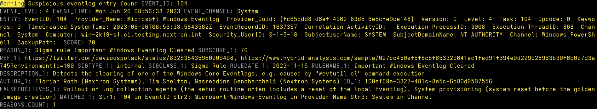

Custom Signatures
=================

There are several ways to integrate your own IOCs and rule sets in THOR.

Simple IOCs
-----------

Simple IOC files are basically CSV files that include the IOC and
comments. The simple IOC config files can be found in the folder
**./custom-signatures/iocs**. The folder contains a sub folder
**./custom-signatures/iocs/templates** that contains template files from
which you can create your own IOC files.

Hashes
^^^^^^

Files with the keyword "**hash**" or "**hashes**" in their name
get initialized as hash IOC sets. Every match with one of these hashes
receives a sub score of 100.

You can add MD5, SHA1 or SHA256 hashes and add a comment in a second
column, which is separated by a semicolon.

.. figure:: ../images/image28.png
   :target: ../_images/image28.png
   :alt: Example hash IOC file

   Example hash IOC file

File Name Characteristics
^^^^^^^^^^^^^^^^^^^^^^^^^

In the "**custom-filename-iocs.txt**" you are able to define IOCs based
on file name and path using regular expressions. You can add or reduce
the total score of a file element during the scan with a positive (e.g.
"40") or negative score (e.g. "-30").

While this can also be used to define false positives, or reduce the
score of well-known files and locations, it gives you all the
flexibility to add scores according to your needs.

.. figure:: ../images/image29.png
   :target: ../_images/image29.png
   :alt: File "filename-characterisitcs.txt"

   File "filename-characteristics.txt"

For example, if you know that administrators in your organization use
"PsExec.exe" in a folder "Sysinternals" and any other location should be
reported as suspicious you could define the following statements:

+------------------------------------------+
| | \\\\PsExec\\.exe;60                    |
| | \\\\SysInternals\\\\PsExec\\.exe;-60   |
+------------------------------------------+

This following example represents the 3\ :sup:`rd` generation filename
IOC format introduced with THOR version 8.30 and SPARK version 1.5,
which is now the recommended form to define such signatures.

It contains three fields:

* Column 1: Regex
* Column 2: Score
* Column 3: False Positive Regex

The False Positive Regex statement is only evaluated if the Regex
statement in column 1 matched.

+--------------------------------------------+
| \\\\PsExec\\.exe;60;\\\\SysInternals\\\\   |
+--------------------------------------------+

We use this new format internally to describe abnormal locations of
system files like

+---------------------------------------------------------------------------------------------------------------------------------------------------------------------------------------------------------------------------------+
| ([C-Zc-z]:\|\\\\\\\\).{1,40}\\\\svchost\\.exe;65;(?i)(HKCR\\\\Applications\|System32\|system32\|SYSTEM32\|winsxs\|WinSxS\|SysWOW64\|SysWow64\|syswow64\|SYSNATIVE\|Sysnative\|dllcache\|WINXP\|WINDOWS\|i386\|%system32%)\\\\   |
+---------------------------------------------------------------------------------------------------------------------------------------------------------------------------------------------------------------------------------+

You could also score down directories with many false positives reported
as "Notices" or "Warnings" like this:

+-------------------------------------------------------+
| \\\\directory\_with\_many\_false\_positives\\\\;-30   |
+-------------------------------------------------------+

Keyword IOCs
^^^^^^^^^^^^

The keyword-based IOC files contain plain strings that are matched
against the output lines of almost every module (e.g. Eventlog entries,
log lines, Autoruns elements, local user names, at jobs etc.)

Every line is treated as case-sensitive string. The comment above each
block is used as reference in the THOR log entries.

.. figure:: ../images/image30.png
   :target: ../_images/image30.png
   :alt: Keyword IOC Example

   Keyword IOC Example

C2 IOCs 
^^^^^^^

C2 IOCs support domain names, FQDNs, single IPs and IP address ranges in
CIDR notation.

+--------------------------+
| # OpMuhadib C2 servers   |
|                          |
| | 182.34.23.10           |
| | update1.usul.ru        |
| | usul-updates.info      |
| | 182.34.23.0/24         |
+--------------------------+

Mutex or Event Values
^^^^^^^^^^^^^^^^^^^^^

Custom mutex or event values can be provided in a file that contains the
“handles” keyword in its filename. The entries can be string or regular
expression values. The entries are applied to the processes handles as
“startswith”, “endswith” and “equals”.

You can decide if you want to set a scope by using a prefix “Global\\”
or e.g. “BaseNamedObjects\\”. If you decide to use none, your expression
will be applied to any scope.

+--------------------------------------------------------------------------+
| | Global\\mymaliciousmutex;Operation Fallout – RAT Mutex                 |
| | Global\\WMI\_CONNECTION\_RECV;Flame Event https://bit.ly/2KjUTuP       |
| | Dwm-[a-f0-9]{4}-ApiPort-[a-f0-9]{4};Chinese campaign malware June 19   |
+--------------------------------------------------------------------------+

Named Pipes
^^^^^^^^^^^

Custom named pipe values can be provided in a file that contains the
“pipes” keyword in its filename. The entries should be regular
expressions that match the malicious named pipes. The "\\\\.\\pipe\\"
prefix should not be part of the entry.

Optionally, a score can be added as 2nd field. If none is present, it
defaults to 100.

+-----------------------------------------------------------------------------+
| | MyMaliciousNamedPipe;Malicious pipe used by known RAT                     |
| | MyInteresting[a-z]+Pipe;50;Interesting pipe we have seen in new malware   |
+-----------------------------------------------------------------------------+

Initialization Based on Strings in File Names
^^^^^^^^^^^^^^^^^^^^^^^^^^^^^^^^^^^^^^^^^^^^^

THOR checks the contents of the "**./custom-signatures**" folder and
processes every file in this folder based on string tags in the file
names.

For example, every file that contains the string "**c2**" will be
initialized as Simple IOC indicators file with C2 server information.
Internally we use the regex "**[\\W]c2[\\W]**" to detect the
tag, so "**mysource-c2-iocs.txt**" and
"**dec15-batch1-c2-indicators.txt**" would be detected correctly,
whereas on the contrary "**filenameiocs.txt**" or "**myc2iocs.txt**" would
not.

The following tags are currently supported:

* "**c2**" or "**domains**" for C2 server IOCs like IPs and host names
* "**filename**" or "**filenames**" for file name IOCs
* "**hash**" or "**hashes**" for MD5, SHA1, SHA256 hash IOCs
* "**keyword**" or "**keywords**" for string based keywords
* "**trusted-hash**" or "**trusted-hashes**" or "**falsepositive-hash**" or "**falsepositive-hashes**" for hashes that you trust (also expects CSV format in the form "**hash;comment**" like the hash IOCs)
* "**handles**" for malicious Mutex, Event or Named Pipe values

See chapter 0 for more information on files that can be used in the
**"./custom-signatures**" folder. IOC files must have the extensions
"**.txt**". Only "**.dat**" extensions are treated differently as THOR
expects "**.dat**" files to be encrypted (with “thor-util” – see
separate manual)

+------------------------+-------------------------------------+
| Keyword in File Name   | Example                             |
+========================+=====================================+
| c2                     | misp-c2-domains-iocs.txt            |
+------------------------+-------------------------------------+
| filename               | Case-UX22-filename-iocs.txt         |
+------------------------+-------------------------------------+
| filenames              | Malicious-filenames-unitX.txt       |
+------------------------+-------------------------------------+
| hash                   | op-aura-hash-iocs.cfg               |
+------------------------+-------------------------------------+
| hashes                 | int-misp-hashes.txt                 |
+------------------------+-------------------------------------+
| keyword                | keywords-incident-3389.txt          |
+------------------------+-------------------------------------+
| keywords               | Incident-22-keyword.cfg             |
+------------------------+-------------------------------------+
| trusted-hash           | my-trusted-hashes.dat (encrypted)   |
+------------------------+-------------------------------------+
| handles                | Operation-fallout-handles.txt       |
+------------------------+-------------------------------------+

Sigma
-----

Sigma is a generic rule format for detections on log data. Sigma is for
log data, as Snort is for network packets and YARA is for files.

THOR applies Sigma rules to Windows Eventlogs and log files on disk
(\*.log). By default, THOR ships with the public Sigma rule set, which
is maintained by the community on Github.

To activate Sigma scanning, you have to use the **--sigma** command line
option or perform an **--intense** scan. Sigma scanning is not activated
by default. This behavior may change in the future.

Custom Sigma rules have to be placed in the
**./custom-signatures/sigma** folder and can be encrypted using “THOR
Util”. You can find details on the encryption in the separate
"THOR\_Util\_Manual.pdf".

   Example Sigma match on Windows Eventlog

Sigma Examples
^^^^^^^^^^^^^^

Perform a scan with the Sigma rules on the different local Windows
Eventlogs (-a Eventlog)

.. code:: batch

   thor64.exe -a Eventlog --sigma

Perform a scan with the Sigma rules on logs of Linux systems (-a
LogScan) only

.. code:: batch

   thor64 -a Filesystem -p /var/log –sigma

STIX
----

THOR can read and apply IOCs provided in STIXv2 JSON files by placing
them with the “.json” file extension in the “./custom-signatures/stix”
folder.

.. figure:: ../images/image32.png
   :target: ../_images/image32.png
   :alt: STIXv2 Initialization during startup

   STIXv2 Initialization during startup

The following observables are supported.

* file:name with = != LIKE and MATCHES
* file:parent\_directory\_ref.path with = != LIKE and MATCHES
* file:hashes.sha-256 / file:hashes.sha256 with = and !=
* file:hashes.sha-1 / file:hashes.sha1 with = and !=
* file:hashes.md-5 / file:hashes.md5 with = and !=
* file:size with < <= > >= = !=
* file:created with < <= > >= = !=
* file:modified with < <= > >= = !=
* file:accessed with < <= > >= = !=
* win-registry-key:key with = != LIKE and MATCHES
* win-registry-key:values.name with = != LIKE and MATCHES
* win-registry-key:values.data with = != LIKE and MATCHES
* win-registry-key:values.modified\_time with < <= > >= = !=

STIX v1
^^^^^^^

STIX version 1 is not supported.

Encrypted STIX IOC Files
^^^^^^^^^^^^^^^^^^^^^^^^

THOR Util supports the encryption of the "**.json**" STIX files to
encrypted files with the "**.jsos**" file extension. See the
"THOR\_Util\_Manual.pdf" for more information on the "encrypt" feature.

YARA
----

THOR offers an interface to include own rules based on the YARA format.
Just place valid rule files with the Extension "**.yar**" in the custom
signature folder ("**/custom-signatures/yara**").

Yara rules are widely used in THOR.

There are basically two custom YARA rule types that you can define in
THOR:

1. Generic Rules

2. Specific Rules

Generic YARA Rules
^^^^^^^^^^^^^^^^^^

The "Generic" rules are standard YARA rules that are applied to payloads
of files and memory. Just place any file with "**\*.yar**" extension in
the "**./custom-signatures/yara**" folder. See chapter “Encrypted Custom
Signatures” for information on encrypted forms of these signature files
in cases in which you do not want an adversary to be able to see your
clear text signature files.

Generic rules are applied to the following elements:

* | Files
  | THOR applies the Yara rules to all files that are smaller than the size limit set in the **thor.yml**. It extends the standard conditions by THOR specific extensions (see below).
* | Process Memory
  | THOR also uses the process memory scan function of the Yara python module. It carefully selects only processes with a working set memory size of a certain limit that can be altered by the "**--maxpmemsize**" parameter.
* | Data Chunks
  | The rules are applied to the data chunks read during the DeepDive scan. DeepDive only reports and restores chunks if the score level of the rule is high enough. (Warning Level)

Specific YARA Rules
^^^^^^^^^^^^^^^^^^^

The specific YARA rules contain certain keywords in their filename in
order to select them for application in certain modules only.

* | Registry Keys
  | Keyword: **‘registry’**
  | Rules are applied to a whole key and all of its values. This means that you can combine several key values in a single YARA rule. (see chapter 22.5.3 for details)
* | Log Files
  | Keyword: **‘log’**
  | Rules are applied to each log line (or a bigger set of log lines if the aggregator features is active).
* | Process Memory
  | Keyword: **'process'** or **‘memory’**
  | Rules are applied to process memory only
* | All String Checks
  | Keyword: **'keyword'**
  | Rules are applied to all string checks in many different modules

YARA Rule Application
^^^^^^^^^^^^^^^^^^^^^

The following table shows in which modules the Generic YARA rules are
applied to content.

+------------------------------------+---------------------------+
| Applied in Module                  | Examples                  |
+====================================+===========================+
| Filescan, ProcessCheck, DeepDive   | | incident-feb17.yar      |
|                                    | | misp-3345-samples.yar   |
+------------------------------------+---------------------------+

The following table shows in which modules the Specific YARA rules are
applied to content.

+------------------------+-----------------------------------------------------------------+---------------------------------+
| Keyword in File Name   | Applied in Module                                               | Examples                        |
+========================+=================================================================+=================================+
| registry               | Registry                                                        | incident-feb17-registry.yar     |
+------------------------+-----------------------------------------------------------------+---------------------------------+
| log                    | Eventlog, Logscan                                               | general-log-strings.yar         |
+------------------------+-----------------------------------------------------------------+---------------------------------+
| process                | ProcessCheck (only on process memory)                           | case-a23-process-rules.yar      |
+------------------------+-----------------------------------------------------------------+---------------------------------+
| keyword                | | Mutex, Named Pipes, Eventlog, MFT, 			   | misp-3345-keyword-extract.yar   |
|			 | | ProcessCheck (on all process handles),       		   |				     |
| 			 | | ProcessHandles, ServiceCheck, AtJobs,                         |				     | 
|			 | | LogScan, AmCache, SHIMCache, 				   | 				     |
|			 | | Registry	   			   			   |                                 |
+------------------------+-----------------------------------------------------------------+---------------------------------+

You can restrict the Specific YARA rules to certain modules to avoid
false positives. Please check chapter 22.5.5 for details.

Also see the link section in chapter 23 for a YARA rule exporter script
that extracts YARA Keyword rules automatically from a MISP threat feed.

Create YARA Rules
^^^^^^^^^^^^^^^^^

Using the UNIX "string" command on Linux systems or in a CYGWIN
environment enables you to extract specific strings from your sample
base and write your own rules within minutes. Use "**string -el**" to
also extract the UNICODE strings from the executable.

A useful Yara Rule Generator called "yarGen" provided by our
developers can be downloaded from Github. It takes a target directory
as input and generates rules for all files in this directory and so
called "super rules" if characteristics from different files can be
used to generate a single rule to match them all. (https://github.com/Neo23x0/yarGen)

Another project to mention is the "Yara Generator", which creates a
single Yara rule from one or multiple malware samples. Placing several
malware files of the same family in the directory that gets analyzed by
the generator will lead to a signature that matches all descendants of
that family. (https://github.com/Xen0ph0n/YaraGenerator)

We recommend testing the Yara rule with the "yara" binary before
including it into THOR because THOR does not provide a useful debugging
mechanism for Yara rules. The Yara binary can be downloaded from the
developer's website (https://code.google.com/p/yara-project/).

The options for the Yara tool are listed below. The most useful options
are "**-r**" to recursively scan a path and "**-s**" to show all
matching strings.

The best practice steps to generate a custom rule are:

1. | Extract information from the malware sample
   | (Strings, Byte Code, MD5 …)

2. Create a new Yara rule file. It is important to:

   a. Define a unique rule name – duplicates lead to severe errors

   b. Give a description that you want to see when the signature matches

   c. Define an appropriate score (optional but useful in THOR, default
      is 50)

3. Check your rule by scanning the malware with the "Yara Binary" from
   the project’s website to verify a positive match

4. Check your rule by scanning the "Windows" or "Program Files"
   directory with the "Yara Binary" from the project’s website to detect
   possible false positives

5. Copy the file to the "/custom-signatures/yara" folder of THOR and
   start THOR to check if the rule integrates well and no error is
   thrown

There are some THOR specific add-ons you may use to enhance your rules.

Also see these articles on how to write "simple but sound" YARA rules:

https://www.bsk-consulting.de/2015/02/16/write-simple-sound-yara-rules/

https://www.bsk-consulting.de/2015/10/17/how-to-write-simple-but-sound-yara-rules-part-2/

Typical Pitfalls
^^^^^^^^^^^^^^^^

Some signatures - even the ones published by well-known vendors - cause
problems on certain files. The most common source of trouble is the use
of regular expressions with a variable length as shown in the following
example. This APT1 rule published by the AlienVault team caused the Yara
Binary as well as the THOR binary to run into a loop while checking
certain malicious files. The reason why this happened is the string
expression "$gif1" which causes Yara to check for a "word character" of
undefined length. Try to avoid regular expressions of undefined length
and everything works fine.

AlientVault APT1 Rule:

+----------------------------------------------------------+
| rule APT1\_WEBC2\_TABLE {                                |
| meta:                                                    |
|    author = "AlienVault Labs"                            |
| strings:                                                 |
|    $msg1 = "Fail To Execute The Command" wide ascii      |
|    $msg2 = "Execute The Command Successfully" wide ascii |
|    $gif1 = /\\w+\\.gif/                                  |
|    $gif2 = "GIF89" wide ascii                            |
| condition:                                               |
|    3 of them                                             |
| }                                                        |
+----------------------------------------------------------+

Copying your rule to the signatures directory may cause THOR to fail
during rule initialization as shown in the following screenshot. In the
current state of development, the error trace back is not as verbose as
desired but gives the reason why the rule compiler failed. If this
happens you should check your rule again with the Yara binary. Usually
this is caused by a duplicate rule name or syntactical errors.

YARA Rule Performance
^^^^^^^^^^^^^^^^^^^^^

We compiled a set of guidelines to improve the performance of YARA
rules. By following these guidelines you avoid rules that cause many CPU
cycles and hamper the scan process.

https://gist.github.com/Neo23x0/e3d4e316d7441d9143c7

Enhance YARA Rules with THOR Specific Attributes
------------------------------------------------

The following listing shows a typical YARA rule with the three main
sections "meta", "strings" and "condition". The YARA Rule Manual which
can be downloaded as PDF from the developer’s website and is bundled
with the THOR binary is a very useful guide and reference to get a
function and keyword overview and build your own rules based on the YARA
standard.

The "meta" section contains all types of meta information and can be
extended freely to include own attributes. The "strings" section lists
strings, regular expressions or hex string to identify the malware or
hack tool. The condition section defines the condition on which the rule
generates a "match". It can combine various strings and handles keywords
like "not" or "all of them".

Simple Yara Rule:

+-----------------------------------------------+
| rule simple\_demo\_rule\_1 {                  |
|                                               |
| meta:                                         |
|                                               |
|    description = "Demo Rule"                  |
|                                               |
| strings:                                      |
|                                               |
|    $a1 = "EICAR-STANDARD-ANTIVIRUS-TEST-FILE" |
|                                               |
| condition:                                    |
|                                               |
|    $a1                                        |
|                                               |
| }                                             |
+-----------------------------------------------+

The following listing shows a more complex rule that includes a lot of
keywords used in typical rules included in the rule set.

Complex Yara Rule:

+-----------------------------------------------+
| rule complex\_demo\_rule\_1 {                 |
|                                               |
| meta:                                         |
|                                               |
|    description = "Demo Rule"                  |
|                                               |
| strings:                                      |
|                                               |
|    $a1 = "EICAR-STANDARD-ANTIVIRUS-TEST-FILE" |
|                                               |
|    $a2 = "li0n" fullword                      |
|                                               |
|    $a3 = /msupdate\\.(exe\|dll)/ nocase       |
|                                               |
|    $a4 = { 00 45 9A ?? 00 00 00 AA }          |
|                                               |
|    $fp = "MSWORD"                             |
|                                               |
| condition:                                    |
|                                               |
|    1 of ($a\*) and not $fp                    |
|                                               |
| }                                             |
+-----------------------------------------------+

The example above shows the most common keywords used in our THOR rule
set. These keywords are included in the YARA standard. The rule does not
contain any THOR specific expressions.

Yara provides a lot of functionality but lacks some mayor attributes
that are required to describe an indicator of compromise (IOC) defined
in other standards as i.e. OpenIOC entirely. Yara’s signature
description aims to detect any kind of string or byte code within a file
but is not able to match on meta data attributes like file names, file
path, extensions and so on.

THOR adds functionality to overcome these limitations.

Score
^^^^^

THOR makes use of the possibility to extend the Meta information section
by adding a new parameter called "score".

This parameter is the essential value of the scoring system, which
enables THOR to increment a total score for an object and generate a
message of the appropriate level according to the final score.

Every time a signature matches the value of the score attribute is added
to the total score of an object.

Yara Rule with THOR specific attribute "score":

+-----------------------------------------------+
| rule demo\_rule\_score {                      |
|                                               |
| meta:                                         |
|                                               |
|    description = "Demo Rule"                  |
|					        | 
|    score = 80                                 |
|                                               |
| strings:                                      |
|                                               |
|    $a1 = "EICAR-STANDARD-ANTIVIRUS-TEST-FILE" |
|                                               |
|    $a2 = "honkers" fullword                   |
|                                               |
| condition:                                    |
|                                               |
|    1 of them                                  |
|                                               |
| }                                             |
+-----------------------------------------------+

Feel free to set your own "score" values in rules you create. If you
don’t define a "score" the rule gets a default score of 75.

The scoring system allows you to include ambiguous, low scoring rules
that can’t be used with other scanners, as they would generate to many
false positives. If you noticed a string that is used in malware as well
as legitimate files, just assign a low score or combine it with other
attributes, which are used by THOR to enhance the functionality and are
described in chapter 22.5.2.

Additional Attributes
^^^^^^^^^^^^^^^^^^^^^

THOR allows using certain external variables in you rules. They are
passed to the "match" function and evaluated during matching.

The external variables are:

* "**filename**" - single file name like "**cmd.exe**"
* "**filepath**" - file path without file name like "**C:\\temp**"
* "**extension**" - file extension with a leading "**.**", lower case like "**.exe**"
* "**filetype**" - type of the file based on the magic header signatures (for a list of valid file types see: "**./signatures/file-type-signatures.cfg**") like "**EXE**" or "**ZIP**"
* "**timezone**" – the system’s time zone (see https://golang.org/src/time/zoneinfo_abbrs_windows.go for valid values)
* "**language**" – the systems language settings (see https://docs.microsoft.com/en-us/windows/win32/intl/sort-order-identifiers)

The "**filesize**" value is a build-in variable and therefore not
mentioned as THOR specific external variables.

Yara Rule with THOR External Variable: 

+-----------------------------------------------+
| rule demo\_rule\_enhanced\_attribute\_1 {     |
|                                               |
| meta:                                         |
|                                               |
|    description = "Demo Rule - Eicar"          |
|                                               |
| strings:                                      |
|                                               |
|    $a1 = "EICAR-STANDARD-ANTIVIRUS-TEST-FILE" |
|                                               |
| condition:                                    |
|                                               |
|    $a1 and filename matches /eicar.com/       |
|                                               |
| }                                             |
+-----------------------------------------------+

A more complex rule using several of the THOR external variables would
look like the one in the following listing.

This rule matches to all files containing the EICAR string, having the
name "**eicar.com**", "**eicar.dll**" or "**eicar.exe**" and a file size
smaller 100byte.

Yara Rule with more complex THOR Enhanced Attributes.

+--------------------------------------------------------------------------+
| rule demo\_rule\_enhanced\_attribute\_2 {                                |
|                                                                          |
| meta:                                                                    |
|                                                                          |
|    author = "F.Roth"                                                     |
|                                                                          |
| strings:                                                                 |
|                                                                          |
|    $a1 = "EICAR-STANDARD-ANTIVIRUS-TEST-FILE"                            |
|                                                                          |
| condition:                                                               |
|                                                                          |
|    $a1 and filename matches /eicar\\.(com\|dll\|exe)/ and filesize < 100 |
|                                                                          |
| }                                                                        |
+--------------------------------------------------------------------------+

The following YARA rule shows a typical combination used in one of the
client specific rule sets, which are integrated in THOR. The rule
matches on "**.idx**" files that contain strings used in the Java
Version of the VNC remote access tool. Without the enhancements made
this wouldn’t be possible as there would be no way to apply the rule
only to a special type of extension.

Real Life Yara Rule:

+---------------------------------------------------------+
| rule HvS\_Client\_2\_APT\_Java\_IDX\_Content\_hard {    |
|                                                         |
| meta:                                                   |
|                                                         |
|    description = "VNCViewer.jar Entry in Java IDX file" |
|                                                         |
| strings:                                                |
|                                                         |
|    $a1 = "vncviewer.jar"                                |
|                                                         |
|    $a2 = "vncviewer/VNCViewer.class"                    |
|                                                         |
| condition:                                              |
|                                                         |
|    1 of ($a\*) and extension matches /\\.idx/           |
|                                                         |
| }                                                       |
+---------------------------------------------------------+

THOR YARA Rules for Registry Detection
^^^^^^^^^^^^^^^^^^^^^^^^^^^^^^^^^^^^^^

THOR allows checking a complete registry path key/value pairs with Yara
rules. To accomplish this, he composes a string from the key/value pairs
of a registry key path and formats them as shown in the following
screenshot.

.. figure:: ../images/image33.png
   :target: ../_images/image33.png
   :alt: Composed strings from registry key/value pairs

   Composed strings from registry key/value pairs

The composed format is:

| **KEYPATH;KEY;VALUE\\n**
| **KEYPATH;KEY;VALUE\\n**
| **KEYPATH;KEY;VALUE\\n**

This means that you can write a Yara rule that looks like this (remember
to escape all back slashes):

Registry Yara Rule Example:

+----------------------------------------------------------+
| rule Registry\_DarkComet {                               |
|                                                          |
| meta:                                                    |
|                                                          |
|    description = "DarkComet Registry Keys"               |
|                                                          |
| strings:                                                 |
|                                                          |
|    $a1 = "LEGACY\_MY\_DRIVERLINKNAME\_TEST;NextInstance" |
|                                                          |
|    $a2 = "CurrentVersion\\\\Run;MicroUpdate"             |
|                                                          |
| condition:                                               |
|                                                          |
|    1 of them                                             |
|                                                          |
| }                                                        |
+----------------------------------------------------------+

Since version 7.25.5 THOR is even able to apply these rules to non-DWORD
registry values. This means that e.g. a REG\_BINARY value contains an
executable as in the following example, you can write a YARA rule to
detect this binary value in Registry as shown below.

**REG\_BINARY = 4d 5a 00 00 00 01 .. ..**

Corresponding YARA rule to detect executables in Registry values:

+-----------------------------------------------------------+
| rule registry\_binary\_exe {                              |
|                                                           |
| meta:                                                     |
|                                                           |
|    description = "Detects executables in Registry values" |
|                                                           |
| strings:                                                  |
|                                                           |
|    $a1 = "Path;Value;4D5A00000001"                        |
|                                                           |
| condition:                                                |
|                                                           |
|    1 of them                                              |
|                                                           |
| }                                                         |
+-----------------------------------------------------------+

The letters in the expression have to be all uppercase. Remember that
you have to use the keyword ‘\ **registry’** in the file name that is
placed in the "**./custom-signatures/yara**" folder in order to
initialize the YARA rule file as registry rule set. (e.g.
"**registry\_exe\_in\_value.yar**")

Important
~~~~~~~~~

Please notice that strings like HKEY\_LOCAL\_MACHINE, HKLM, HKCU,
HKEY\_CURRENT\_CONFIG are not used in the strings that your YARA rules
are applied to. They depend on the analyzed hive and should not be in
the strings that you define in your rules. The strings for the YARA
matching look like:

\\SOFTWARE\\Microsoft\\GPUPipeline;InstallLocation;Test

Restrict Yara Rule Matches in Generic Rules
^^^^^^^^^^^^^^^^^^^^^^^^^^^^^^^^^^^^^^^^^^^

On top of the keyword based initialization you can restrict Yara rules
to match on certain objects only. It is sometimes necessary to restrict
rules that e.g. cause many false positives on process memory to file
object detection only. Use the meta attribute "type" to define if the
rule should apply to file objects or process memory only.

Apply rule in-memory only:

+-----------------------------------------+
| rule Malware\_in\_memory {              |
|                                         |
| meta:                                   |
|                                         |
|    author = "Florian Roth"              |
|                                         |
|    description = " Think Tank Campaign" |
|                                         |
|    type = "memory"                      |
|                                         |
| strings:                                |
|                                         | 
|    $s1 = "evilstring-inmemory-only"     |
|                                         |
| condition:                              |
|                                         |
|    1 of them                            |
|                                         |
| }                                       |
+-----------------------------------------+

Apply rule on file objects only:

+----------------------------------------+
| rule Malware\_in\_fileobject {         |
|                                        |
| meta:                                  |
|                                        |
|    description = "Think Tank Campaign" |
|                                        |
|    type = "file"                       |
|                                        |
| strings:                               |
|                                        |
|    $s1 = "evilstring-infile-only"      |
|                                        |
| condition:                             |
|                                        |
|    1 of them                           |
|                                        |
| }                                      |
+----------------------------------------+

You can also decide if a rule should not match in "DeepDive" module by
setting the "nodeepdive" attribute to "1".

Avoid DeepDive application:

+----------------------------------------+
| rule Malware\_avoid\_DeepDive {        |
|                                        |
| meta:                                  |
|                                        |
|    description = "Think Tank Campaign" |
|                                        |
|    nodeepdive = 1                      |
|                                        |
| strings:                               |
|                                        |
|    $s1 = "evilstring-not-deepdive"     |
|                                        |
| condition:                             |
|                                        |
|    1 of them                           |
|                                        |
| }                                      |
+----------------------------------------+

Restrict Yara Rule Matches in Specific Rules
^^^^^^^^^^^^^^^^^^^^^^^^^^^^^^^^^^^^^^^^^^^^

If you have problems with false positives caused by the specific YARA
rules, try using the "limit" modifier in the meta data section of your
YARA rule. Using the "limit" attribute, you can limit the scope of your
rules to a certain module. (Important: Use the module name as stated in
the log messages of the module, e.g. "ServiceCheck" and not "services")

E.g. if you have defined a malicious 'Mutex' named '\_evtx\_' in a rule
and saved it to a file named "mutex-keyword.yar", the string "\_evtx\_"
will be reported in all other modules to which the keyword rules are
applied – e.g. during the Eventlog scan.

You can limit the scope of your rule by setting 'limit = "Mutex"' in the
meta data section of the YARA rule.

Limits detection to the "Mutex" module:

+-------------------------------------------------+
| rule Malicious\_Mutex\_Evtx {                   |
|                                                 |
| meta:                                           |
|                                                 |
|    description = "Detects malicious mutex EVTX" |
|                                                 |
|    limit = "Mutex"                              |
|                                                 |
| strings:                                        |
|                                                 |
|    $s1 = "\_evtx\_"                             |
|                                                 |
| condition:                                      |
|                                                 |
|    1 of them                                    |
|                                                 |
| }                                               |
+-------------------------------------------------+

Notes:

* the internal check in THOR against the module name is case-insensitive
* this "limit" parameter only applies to specific YARA rules (legacy reasons – will be normalized in a future THOR version)

False Positive Yara Rules
^^^^^^^^^^^^^^^^^^^^^^^^^

Yara rules that have the "falsepositive" flag set will cause a score
reduction on the respective element by the value defined in the "score"
attribute. Do not use a negative score value in YARA rules.

False Positive Rule:

+------------------------------------------------------+
| rule FalsePositive\_AVSig1 {                         |
|                                                      |
| meta:                                                |
|                                                      |
|    description = "Match on McAfee Signature Files"   |
|                                                      |
|    falsepositive = 1                                 |
|                                                      |
|    score = 50                                        |
|                                                      |
| strings:                                             |
|                                                      |
|    $s1 = "%%%McAfee-Signature%%%"                    |
|                                                      |
| condition:                                           |
|                                                      |
|    1 of them                                         |
|                                                      |
| }                                                    |
+------------------------------------------------------+

Encrypt Custom Signatures
-------------------------

You can encrypt the YARA signatures and IOC files with the help of
THOR-util’s "encrypt" feature.

See the separate "THOR\_util\_Manual.pdf" for more details.
