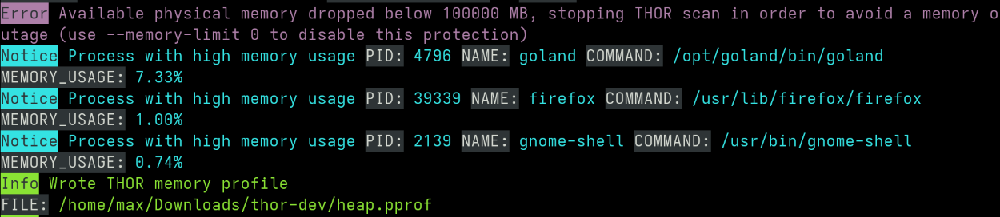

Other Topics 
============

Evidence Collection
-------------------

Process Memory Dumps (--dump-procs)
^^^^^^^^^^^^^^^^^^^^^^^^^^^^^^^^^^^

Since THOR version 10.5 it supports process dumping to backup volatile
malware information.

THOR on Windows creates a process dump of any process that is considered
malicious. Maliciousness is determined as anything that triggers a
warning or an alert.

Activate process memory dumping with ``--dump-procs``.

This process dump can then be analyzed with standard tools later on to
examine the found malware.

.. figure:: ../images/image23.png
   :alt: Process dumping

   Process dumping

.. figure:: ../images/image24.png
   :alt: Process dumps on disk

   Process dumps on disk

To prevent flooding the disk fully in case many dumps are created, old
dumps of a process are overwritten if a new dump is generated. Also,
THOR will not generate dumps by default if less than 5 GB disk space is
available. This can be overwritten to always or never dump malicious
processes.

Also note that THOR will never dump lsass.exe to prevent these dumps
from potentially being used to extract passwords by any attackers.

File Collection (Bifrost)
^^^^^^^^^^^^^^^^^^^^^^^^^

Bifrost v1 with Script-Based Server
"""""""""""""""""""""""""""""""""""

The ``./tools`` folder in the program directory contains a simple Python
based file collection server named Bifrost. The script is named
``bifrost-server.py``.

You can run that script on any internal system with a Python script
interpreter installed. By default, it uses port 1400/tcp for incoming
connections but you can use any port you like.

Usage is:

.. code-block:: console

   nextron@unix:~$ python ./bifrost-server.py -h
   usage: bifrost-server.py [-h] [-d out-dir] [-i ip] [-p port]
  
   Bifrost optional arguments:
  
   -h, --help  show this help message and exit
   -d out-dir  Quarantine directory
   -i ip       IP address to bind to
   -p port     Port to bind to (tcp, default 1400)

You can run the server script with:

.. code-block:: console
   
  nextron@unix:~$ python ./bifrost-server.py

In order to send suspicious file to that server, you have to set some
command line flags when running THOR, e.g.

.. code-block:: doscon
   
  C:\nextron\thor>thor64.exe --bifrostServer myserver

A more complex statement setting a minimum score and custom port would
look like this:

.. code-block:: doscon
   
  C:\nextron\thor>thor64.exe --bifrostServer myserver --bifrost-port 8080 --bifrostLevel 80

THOR will then try to submit all samples with score equal or higher than
80 to a Bifrost service running on ``myserver`` port 8080/tcp.

Bifrost v2 with ASGARD
""""""""""""""""""""""

Bifrost v2 cannot be used standalone yet. The required API Key is set by
ASGARD v2 during initialization and is unknown to a THOR user.

You can activate the quarantine function via Bifrost v2 when creating a
single or group scan via the ASGARD management interface.

.. figure:: ../images/image21.png
   :alt: Configure Quarantine via Bifrost in New Scan Dialogue

   Configure Quarantine via Bifrost in New Scan Dialogue

.. figure:: ../images/image22.png
   :alt: Collected File Evidence in ASGARD v2

   Collected File Evidence in ASGARD v2

Resource Control
----------------

THOR's internal resource control feature puts the system's stability and
the responsiveness of running services first.

Resource control is active by default. You can deactivate it using
**--norescontrol**.

Be advised that due to Resource Control, the THOR scan may terminate its
completion. The scan gets terminated under the following conditions:

1. If the available physical memory drops below 60MB

2. | If more than 60 MB of log data have been written (disk / syslog)
   | In this case, THOR switches in the "reduced-logging" mode in which it only transmits "Notices, Warnings and Alerts" and after another 4 MB of log data THOR terminates itself in order to prevent log flooding due to a high number of false positives

If the scan constantly terminates you should check what causes the
performance issues or choose times with less workload (e.g. weekends,
night). To debug such states, you can check the last warning that THOR
generates before exiting the scan. It includes the top memory consumers
that could have caused the memory exhaustion.

   Resource Control Scan Termination

.. warning:: 
  Deactivating Resource Control on systems with exhausted
  resources can put the system's stability at risk.

Automatic Soft Mode
^^^^^^^^^^^^^^^^^^^

Soft mode is automatically activated on systems with low hardware
resources.

One of the following conditions activates soft mode:

* Less than 2 CPU cores
* Less than 1024 MB of RAM

In Soft mode several checks and features that could risk system's
stability or could provoke an Antivirus or HIDS to intervene with the
scanner are disabled. See :ref:`usage/scan-modes:scan modes` for a complete
overview.

Scoring System
--------------

The scoring system is one of THOR's most prominent features. Both YARA
signatures and filename IOCs contain a score field. The score is an
integer value that can be negative to reduce the score on elements that
are prone to false positives.

Only YARA rules and Filename IOCs support a user defined score. But
since you are able to write YARA rules for almost every module, the
scoring system is very flexible.

The total score of an element determines the level/severity of the
resulting log message.

.. list-table::
   :header-rows: 1
   :widths: 20, 20, 60

   * - Score
     - Level
     - Condition
   * - 40
     - Notice
     - 
   * - 60
     - Warning
     - 
   * - 100
     - Alert
     - At least 1 sub score more than 75

Scoring per Signature Type Match
^^^^^^^^^^^^^^^^^^^^^^^^^^^^^^^^

.. list-table::
   :header-rows: 1
   :widths: 25, 75

   * - Type
     - Score
   * - YARA match
     - Defined in the meta data of the YARA rule as integer value (e.g. "score = 50")
   * - Filename IOC match
     - Defined in the 2\ :sup:`nd` field of the CSV (e.g. ``\\evil.exe;80``)
   * - Keyword IOC match
     - "warning" level messages, see :ref:`usage/other-topics:Default Scores`
   * - C2 IOC match
     - "warning" and "alert" level massages, see :ref:`usage/other-topics:Default Scores`

Accumulated Score by Module
^^^^^^^^^^^^^^^^^^^^^^^^^^^

.. list-table::
   :header-rows: 1
   :widths: 20, 20, 60

   * - Module
     - Cumulated

       Scoring
     - Score
   * - Filescan

       Archive Scan

       DeepDive

       Prefetch

       WER
     - Yes
     - Score is a sum of the scores of all "REASON"s (YARA matches, filename IOCs, other anomalies)

       **Note 1**: Only positive scores are shown by default

       **Note 2**: Only the top 2 reasons are shown by default (use ``--allreasons`` to show all positive scores)
   * - All Other Modules
     - No
     - Individual score of each signature match (YARA, filename IOC, keywords, C2)

       **Note 1**: This means that multiple matches for a single element are possible

Default Scores
^^^^^^^^^^^^^^

If no score is set in an "alert" or "warning" message, THOR
automatically appends a score that corresponds to the message level:
Warning = 70, Alert = 100.

Exception: High total score with low sub scores
^^^^^^^^^^^^^^^^^^^^^^^^^^^^^^^^^^^^^^^^^^^^^^^

"Alerts" on file system elements are only generated if one of the sub
scores is more than 75.

Before that change, multiple low scoring reasons had led to a score
higher 100 and caused an "Alert" level message although not a single
hard match was included in the "Reasons". A wrong extension, e.g.
``.txt`` for an executable, which is often used by employees to hand
executables through tight mail filters, and a suspicious location, e.g.
``C:\Temp\funprog.txt`` caused an "Alert" level message.

Since version 8.27.2, one of the sub scores that pushes the total score
over 100 has to be more than 75. (internally calculated as "alert\_level
- 25" because the user can adjust the alert level via the ``--alert``
parameter)

Exception: Filename IOC Matches
^^^^^^^^^^^^^^^^^^^^^^^^^^^^^^^

The "Filename IOC Check" is a sub check of the "String Check", which is
applied to many elements, like Eventlog messages or Registry keys.

The function ``checkString()`` receives a string as input and returns
possible matches.

The string is checked in multiple sub-checks against different signature
lists. The most important sub-checks are ``checkKeyword()`` and
``checkFilename()``.

While the ``checkKeyword()`` sub-check returns each individual match, the
``checkFilename()`` sub check accumulates the score of all matches and
returns a single total score. It is possible that many different
filename signatures have matched on that string but only one match with
a total score is reported. This is an exception to the usual behavior 
where only the "FileScan" module accumulates scores.

Filename IOC Matching in String Check Example
"""""""""""""""""""""""""""""""""""""""""""""

Imagine the following filename IOC signatures:

.. code-block:: none

   \\nmap.exe;70
   \\bin\\nmap.exe;-30

and the following Keyword signature:

.. code-block:: none

   nmap.exe

The ``checkString()`` function receives the following string from the
Eventlog scan module (here: a Sysmon Eventlog entry):

.. code-block:: none

   Process Create:
   UtcTime: 20180110 10:22:25.277
   ProcessGuid: {c1b49677e9615a5500000010bbc80702}
   ProcessId: 3912
   Image: C:\\Program Files\\Nmap\\bin\\nmap.exe
   CommandLine: nmap.exe
   CurrentDirectory: C:\\Windows\\system32\\
   User: PROMETHEUS\\user1
   LogonGuid: {c1b496771d725a5300000020d4232500}
   LogonId: 0x2523d4
   TerminalSessionId: 1
   IntegrityLevel: High
   Hashes: SHA1=F5DC12D658402900A2B01AF2F018D113619B96B8, MD5=9FEA051A9585F2A303D55745B4BF63AA
   ParentProcessGuid: {c1b496771d745a530000001057452500}
   ParentProcessId: 1036
   ParentImage: C:\\Windows\\explorer.exe
   ParentCommandLine: C:\\Windows\\Explorer.EXE

The ``checkString()`` function would create two messages: 1 "warning" for
the keyword signature and 1 "notice" of the filename IOC signatures.

The keyword IOC matches in the ``checkKeyword()`` sub-check and
``checkString()`` returns a match, that generates a "Warning" level
message that automatically receives a score of 75 (see :ref:`usage/other-topics:Default Scores`).

The filename IOCs would both match on the string in the
``checkFilename()`` sub-check and both scores would be summed up to a total
score of 40 (70 + (-30) = 40), which would generate a "Notice".

Action on Match
---------------

The action command allows you define a command that runs whenever THOR
encounters a file during "Filescan" that has a certain total score or
higher. The default score that triggers the action command (if set) is
40.

The most popular use case for the action command is sample collection.

Action Flags
^^^^^^^^^^^^

.. list-table::
   :header-rows: 1
   :widths: 30, 70

   * - Parameter
     - Description
   * - **--action\_command string**
     - Run this command for each file that has a score greater than the score from ``--action_level``
   * - **--action\_args strings**
     - Arguments to pass to the command specified via ``--action_command``. The placeholders %filename%, %filepath%, %file%, %ext%, %md5%, %score% and %date% are replaced at execution time
   * - **--action\_level int**
     - Only run the command from ``--action_command`` for files with at least this score (default ``40``)

Command Line Use
^^^^^^^^^^^^^^^^

A typical use would be e.g. to copy a sample to a network share:

.. code-block:: doscon
   
  C:\Users\nextron>copy %filepath% \\\\server\\share1

To instruct THOR to run this command, you need

.. code-block:: doscon
   
  C:\nextron\thor>thor64.exe --action_command copy --action_args %filepath% --action_args \\server\share1

Use in a Config File
^^^^^^^^^^^^^^^^^^^^

The **./config** folder contains a template for a config file that uses
the action commands.

Content of 'tmpl-action.yml':

.. literalinclude:: ../examples/tmpl-action.yml
   :language: yaml
   :linenos:

THOR DB
-------

This simple SQLite database is created by default in the
"**%ProgramData%\\thor**" (Linux, macOS: **/var/lib/thor/**) directory as "**thor10.db**". 
You can deactivate THOR DB and all its features by using the ``--nothordb`` flag.

It stores persistent information over several scan runs:

* | Scan State Information
  | This information is used to resume scan runs where they were stopped
* | Delta Comparison
  | This detection feature allows to compare the result of a former module check with the current results and indicate suspicious changes between scan runs

The THOR DB related command line options are:

.. list-table::
   :header-rows: 1
   :widths: 25, 75

   * - Parameter
     - Description
   * - **--nothordb**
     - Disables THOR DB completely. All related features will be disabled as well.
   * - **--dbfile [string]**
     - Allows to define a location of the THOR database file. File names or path names are allowed. If a path is given, the database file ``thor10.db`` will be created in the directory. Environment variables are expanded.
   * - **--resume**
     - Resumes a previous scan (if scan state information is still available and the exact same command line arguments are used)
   * - **--resumeonly**
     - Only resume a scan if a scan state is available. Do not run a full scan if no scan state can be found.

Scan Resume
^^^^^^^^^^^

THOR tries to resume a scan when you set the ``--resume`` parameter.
Since THOR version 10.5 the resume state doesn't get tracked by default
due to its significant performance implications. If you want to be able
to resume a scan, you have to start scans with the ``--resume`` flag. If
you start a scan and a previous resume state is present, then THOR is
going to resume the interrupted scan.

It will only resume the previous scan if

1. You have started the scan with ``--resume``

2. The argument list is exactly the same as in the first scan attempt

3. You haven't used the flag ``--nothordb``

4. | scan state information is still available
   | (could have been cleared by running THOR a second time without the
     ``--resume`` parameter)

You can always clear the resume state and discard an old state by
running thor.exe once without using the ``--resume`` parameter.

Delta Comparison
^^^^^^^^^^^^^^^^

The delta comparison feature allows comparing former scan results on a
system with the current results, indicating changes in system
configurations and system components.

Currently, the following scan modules feature the delta comparison
check:

* | Autoruns
  | THOR compares the output of the Autoruns module with the output of the last scan run. The Autoruns does not only check "Autorun" locations but also elements like browser plugins, drivers, LSA providers, WMI objects and scheduled tasks.
* | Services
  | The comparison detects new service entries and reports them.
* | Hosts
  | New or changed entries in the "hosts" file could indicate system manipulations by attackers to block certain security functions or intercept connections.

Archive Scan 
^^^^^^^^^^^^

The ``ArchiveScan`` feature supports the following archive types: 

- ZIP
- RAR
- TAR
- TAR + GZIP (.tar.gz)
- TAR + BZIP2 (.tar.bz2)

When scanning a file within any of these files, THOR will append the path within the archive to the archive's own path 
for scan purposes (like filename IOCs or YARA rules). E.g., an archive ``C:\temp\test.zip`` containing a file ``path/in/zip.txt``
will cause the simulated path to be ``C:\temp\test.zip\path\in\zip.txt``.
