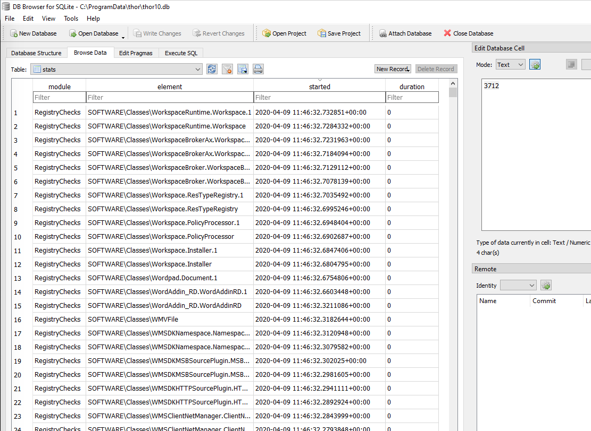

Scan
====

First of all, THOR runs fine with the default settings. The recommended scan options are already active in the default scan. 

Quick Start
-----------

Follow these steps to complete your first THOR scan

1. Make sure you've read the :doc:`Before You Begin<./beforeyoubegin>` guide
2. Open a command line (cmd.exe) as Administrator
3. Navigate to the folder in which you've extracted the THOR package and placed the license file(s)
4. Start THOR with **thor64.exe** (macOS: **thor-macos**, Linux: **thor-linux-64**)
5. Wait until the scan has completed (this can take between 20 and 180 minutes)
6. When the scan is complete, check the text log and HTML report in the THOR program directory

Often Used Parameters
---------------------

+----------------------------+--------------------------------------------------------------------------+
| Parameter                  | Description                                                              |
+============================+==========================================================================+
| --soft                     | | Reduce CPU usage, skip all checks that can consume a lot of memory     |
|                            | | (even if only for a few seconds)                                       |
+----------------------------+--------------------------------------------------------------------------+
| --quick                    | | Perform a :doc:`quick scan<./scan-modes>` (skips Eventlog and checks   |
|                            | | only the most relevant folders)                                        |
+----------------------------+--------------------------------------------------------------------------+
| -e target-folder           | | Write all output files to the given folder                             |
+----------------------------+--------------------------------------------------------------------------+

Parameters Possibly Relevant for Your User Case
-----------------------------------------------

+----------------------------+--------------------------------------------------------------------------+
| Parameter                  | Description                                                              |
+============================+==========================================================================+
| -c percentage              | | Reduce the average CPU load to the given percentage value              |
|                            | | note THOR already sets the process priority to the lowest possible     |
|                            | | value). This can be helpful to reduce the load e.g. on server systems  |
|                            | | with real-time services or reduce the noise produced by fans on user   |
|                            | | laptops.                                                               |
+----------------------------+--------------------------------------------------------------------------+
| --allhds                   | | By default THOR scans only the C: partition on Windows machines and    |
|                            | | other files/folders only in cases in which some reference points to a  |
|                            | | different partition (e.g. configured web root of IIS is on D:\inetpub, |
|                            | | registered service runs from D:\vendor\service)                        |
+----------------------------+--------------------------------------------------------------------------+
| --lookback days            | | Only check the elements changed or created during the last X days in   |
| --globallookback           | | all availabe modules (reduces the scan duration significantly)         |
+----------------------------+--------------------------------------------------------------------------+

Parameters Better Avoided 
-------------------------

This list contains flags often selected and used that should better be avoid unless you k now exactly what you're doing.

.. list-table:: 
   :header-rows: 1

   * - Parameter
     - Description
   * - --intense
     - long runtime, stability issues due to disabled resource control
   * - --c2-in-memory
     - many false positives on user workstations (especially browser memory)
   * - --alldrives
     - long runtime, stability issues due to scan on network drives or other remote filesystems
   * - --mft
     - stability issues due to high memory usage
   * - --dump-procs
     - stability issues, possibly high disk space usage (free disk space checks are implemented but may fail)

Help and Debugging
------------------

You can use the following parameters to 

.. list-table:: 
   :header-rows: 1

   * - Parameter
     - Description
   * - --debug
     - Get debug information if errors occur
   * - --help
     - Get a help with the most important scan options
   * - --fullhelp
     - Get a help with all scan options

Examples
--------

Logging to a Network Share
^^^^^^^^^^^^^^^^^^^^^^^^^^

The following command creates a plaintext log file on a share called
"rep" on system "sys" if the user running the command has the respective
access rights on the share.

.. code:: batch

   thor64.exe --nohtml --nocsv -l \\\\sys\\rep\\%COMPUTERNAME%\_thor.txt

Logging to Syslog Server
^^^^^^^^^^^^^^^^^^^^^^^^

The following command instructs THOR to log to a remote syslog server
only.

.. code:: batch

   thor64.exe --nohtml --nocsv --nolog -s syslog.server.net

Scan Run on a Single Directory
^^^^^^^^^^^^^^^^^^^^^^^^^^^^^^

.. code:: batch

   thor64.exe --lab -p C:\\ProgramData
   thor64.exe --lab -p I:\\mounted\_image\\disk1

IMPORTANT: This feature requires a `forensic lab license <https://www.nextron-systems.com/thor/license-packs/>`__ type which is meant to be used in forensic labs. 

Deactivate all file output - Syslog only
^^^^^^^^^^^^^^^^^^^^^^^^^^^^^^^^^^^^^^^^

.. code:: batch

   thor64.exe -s 10.1.5.14 --nohtml --nolog --nocsv

Save the result files to a different directory 
^^^^^^^^^^^^^^^^^^^^^^^^^^^^^^^^^^^^^^^^^^^^^^

.. code:: batch

   thor64.exe -s 10.1.5.14 -e Z:\\

Only scan the last 7 days of the Windows Eventlog and log files on disk 
^^^^^^^^^^^^^^^^^^^^^^^^^^^^^^^^^^^^^^^^^^^^^^^^^^^^^^^^^^^^^^^^^^^^^^^

.. code:: batch

   thor64.exe --lookback 7

Scan System with Defaults and Make a Surface Scan
^^^^^^^^^^^^^^^^^^^^^^^^^^^^^^^^^^^^^^^^^^^^^^^^^

By default, the surface scan (DeepDive) applies all YARA rules in
"./custom-signatures" folder. In this example all output files are
written to a network share.

.. code:: batch

   thor64.exe --deepdivecustom -e \\server\share\thor_output\

Intense Scan and DeepDive on a Mounted Image as Drive Z
^^^^^^^^^^^^^^^^^^^^^^^^^^^^^^^^^^^^^^^^^^^^^^^^^^^^^^^

.. code:: batch

   thor64.exe --lab --deepdive -p Z:\\

IMPORTANT: Lab scanning mode requires a `forensic lab license <https://www.nextron-systems.com/thor/license-packs/>`__ type which is meant to be used in forensic labs. 

You can achieve a similar (but not equal) scan using:

.. code:: batch 

   thor64.exe -a Filescan --intense -p C:\path-to-scan

Throttled THOR Run (static throttling value)
^^^^^^^^^^^^^^^^^^^^^^^^^^^^^^^^^^^^^^^^^^^^

Will restrict THOR’s CPU usage in the long running modules “FileScan”,
“Eventlog”, “LogScan” and “Registry” to 60%. Note that THOR
automatically applies certain restrictions in automatic soft mode.

.. code:: batch

   thor64.exe -c 60

Scan Multiple Paths
^^^^^^^^^^^^^^^^^^^

.. code:: batch

   thor64.exe --lab -p C:\\ D:\\webapps E:\\inetpub

(non-existent directories will be automatically skipped)

Scan All Hard Drives (Windows Only)
^^^^^^^^^^^^^^^^^^^^^^^^^^^^^^^^^^^

.. code:: batch

   thor64.exe --allhds

Don't Scan Recursively 
^^^^^^^^^^^^^^^^^^^^^^

To instruct THOR to scan a folder non-recursively use the **:NOWALK** suffix. 

.. code:: batch

  thor64.exe -a FileScan -p C:\Windows\System32:NOWALK

Run a Scan with Specific Modules
--------------------------------

With the parameter **-a** you can run a single module or select a set of
modules that you’d like to run. 

Valid modules are:

Autoruns, DeepDive, Dropzone, EnvCheck, Filescan, Firewall, Hosts,
LoggedIn, OpenFiles, ProcessCheck, UserDir, ServiceCheck, Users, AtJobs,
DNSCache, Eventlog, HotfixCheck, LSASessions, MFT, Mutex,
NetworkSessions, NetworkShares, RegistryChecks, Rootkit, SHIMCache,
ScheduledTasks, WMIStartup

Run a Rootkit check only:

.. code:: batch
   
   thor64.exe -a Rootkit

Run the Eventlog and file system scan:

.. code:: batch
	
   thor64.exe –a Eventlog -a Filescan

PE-Sieve Integration
--------------------

THOR integrates PE-Sieve, an open-source tool by @hasherezade to check
for malware masquerading as benevolent processes.

PE-Sieve can be activated to run on Windows as part of the ProcessCheck
module and is capable of detecting advanced techniques such as Process
Doppelganging. When investigating likely infections, you can also raise
the sensitivity of the integrated PE-Sieve's sensitivity beyond the
default (at the cost of likely false positives).

Activate a higher sensitivity with “\ **--full-proc-integrity**\ ”.

Multi-Threading
---------------

THOR supports scanning a system with multiple threads in parallel,
allowing for a significant increase in speed in exchange for a higher
CPU usage.

To use this feature, use the **--threads** flag which allows you to
specify THORs number of parallel threads.

When using the **--lab** (Lab Scanning), **--dropzone** (sample drop
zone) or **--thunderstorm** (Thunderstorm) command line flags, THOR will
default to using as many threads as the system has CPU cores; otherwise,
THOR will still default to running with a single thread.

Enabled Modules
^^^^^^^^^^^^^^^

Not all modules support multi-threading. It is currently enabled in:
File, Registry, Eventlog scanning and Thunderstorm and Dropzone service
mode.

Debugging
---------

Most unexpected behavior can be debugged by using the parameter **--debug**.

If you ever encounter a situation in which:

* THOR doesn’t produce an alert on a known malicious element
* THOR exits with an error
* THOR takes a long time or unexpected short time on elements

Debugging Examples 
^^^^^^^^^^^^^^^^^^

Then try scanning that specific element with the **--debug** parameter set.

To run only a certain module use: 

.. code:: batch 
   
   thor64.exe -a Mutex
   thor64.exe -a FileScan 
   thor64.exe -a Eventlog

You can try to reduce the scope of a module even further by using lookbacks

.. code:: batch

   thor64.exe -a Eventlog --lookback 3
   thor64.exe -a FileScan -p C:\Windows\System32 --globallookback --lookback 1

To find out why a certain file couldn't be detected, use 
**--debug** with **--printall** and try to switch into **intense mode**.  

.. code:: batch

   thor64.exe -a Filescan -p C:\testfolder --debug --printall 
   thor64.exe -a Filescan -p C:\testfolder --debug --printall --intense

If it has been detected in **intense mode** but not in default mode, 
the file extension or the magic header is most likely the problem. 
You can adjust **max_file_size** in **./config/thor.yml** or add a 
magic header in **./signatures/misc/file-type-signatures.cfg**.

Finding Bottlenecks 
^^^^^^^^^^^^^^^^^^^

You may get the error message "**MODULE: RuntimeWatcher MESSAGE: Maximum runtime has exceeded, killing THOR**" or encounter very slow
or never-ending scans.

You can check the statistics table in "**thor.db**" on that end
system after a scan to determine the last element or elements that took
a long time to process.

We recommend using: https://sqlitebrowser.org/

The THOR DB is located at: **C:\\ProgramData\\thor\\thor.db**

Most Frequent Causes of Missing Alerts
^^^^^^^^^^^^^^^^^^^^^^^^^^^^^^^^^^^^^^

THOR didn’t scan file due to file size restrictions
~~~~~~~~~~~~~~~~~~~~~~~~~~~~~~~~~~~~~~~~~~~~~~~~~~~

Solution: Use **--max\_file\_size** parameter or set permanently in
config file  "**./config/thor.yml**". Also note that in lab scanning
mode the default value is much bigger (**--max\_file\_size\_intense**)

THOR didn’t scan the file due to a skipped deeper inspection
~~~~~~~~~~~~~~~~~~~~~~~~~~~~~~~~~~~~~~~~~~~~~~~~~~~~~~~~~~~~

This can be caused by two reasons:

the magic header of that file is not in the list of interesting magic
headers (see **./signatures/misc/file-type-signatures.cfg**) AND file
doesn’t have a relevant file extension (.asp, .vbs, .ps, .ps1, .rar,
.tmp, .bas, .bat, .chm, .cmd, .com, .cpl, .crt, .dll, .exe, .hta, .js,
.lnk, .msc, .ocx, .pcd, .pif, .pot, .pdf, .reg, .scr, .sct, .sys, .url,
.vb, .vbe, .vbs, .wsc, .wsf, .wsh, .ct, .t, .input, .war, .jsp, .php,
.asp, .aspx, .doc, .docx, .pdf, .xls, .xlsx, .ppt, .pptx, .tmp, .log,
.dump, .pwd, .w, .txt, .conf, .cfg, .conf, .config, .psd1, .psm1,
.ps1xml, .clixml, .psc1, .pssc, .pl, .www, .rdp, .jar, .docm, .ace,
.job, .temp, .plg, .asm)

Solution: Use lab scanning mode (**--lab**) or add the magic header to
**file-type-signatures.cfg** (Warning: this file gets overwritten with
an update)
