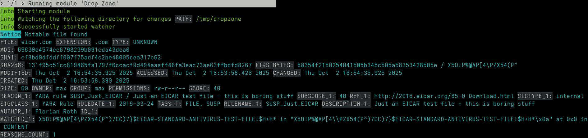

Special Scan Modes
==================

This section describes special purpose scan modes that
change THOR's mode of operation or activate particular
features. Some of these modes need a special license
which is highlighted in the ``note`` box. If you have
any questions regarding pricing of those licenses,
please contact our sales department at sales@nextron-systems.com.

Lab Scanning
------------

Lab scanning mode that is activated with ``--lab``.
It is used to scan mounted forensic images or a single
directory on a forensic workstation. All resource control functions are
disabled and deep mode is activated by default.

The ``--lab`` parameter automatically activates the following other
options:

* deep (scan every file intensively regardless of its extension or magic header, larger file size limit)
* no-resource-check (do not limit system resources or interrupt scan on low memory)
* no-soft (do not automatically activate soft mode on systems with single core CPUs or low memory)
* no-scan-lock (do not check for other THOR instances on the same system and do not interrupt scan if another instance has been found)
* cross-platform-paths (apply filename IOCs to both Unix and Windows style paths)
* multi-threading (it automatically sets the number of threads to use to the number of CPU cores found on the workstation)

The chapter :ref:`usage/use-cases:use cases` contains some use cases in which this scan mode is used. You may find the guides useful. 

.. note::

   If you run multiple THOR scans with multi-threading on a single system,
   resource usage will rise quickly since it scales per thread.

   Consider using ``--threads`` to reduce the number of threads that each THOR
   scan uses, e.g. ``--threads 4`` if running 4 scans on a 16 core system.

Forensic Lab License
^^^^^^^^^^^^^^^^^^^^

The scan of mounted disk or memory images is a use case that we call "lab scanning".
It requires a `forensic lab license <https://www.nextron-systems.com/2020/11/11/thor-forensic-lab-license-features/>`__ 
which is meant to be used in corporate digital forensic labs.

All other license types are meant for other use cases. (usually live system scanning)
You can get a similar but not an equally thorough scan using the following command line flags 

.. code-block:: doscon 

   C:\nextron\thor>thor64.exe -a Filescan --deep --no-resource-check --cross-platform-paths -p path-to-scan --threads 0
   
Without a valid lab license, you cannot use multiple instances of THOR on a single system.
The features mentioned in the following sub chapters
are also limited to a lab license.

`This article <https://www.nextron-systems.com/2020/11/11/thor-forensic-lab-license-features/>`__ explains that advantages of a lab licenses.

Path Remapping
^^^^^^^^^^^^^^^^^^^^^

Since THOR enriches messages with more details, it could be problematic
to scan a mounted drive “s:”, which has originally been a partition “c:”
on the source system of the image.

E.g. The analyst has mounted a partition "C:" from a source system to
drive "F:" on the forensic lab workstation. A SHIMCache entry points to
``C:\temp\mk.exe``. THOR would look at location ``C:\temp\mk.exe`` for
that file and couldn't find anything, since that file doesn't exist on
the forensic lab workstation.

Path remapping allows you to virtually map that drive to its
original name. The syntax is as follows:

.. code-block:: none

   --path-remap current-location:original-location

Some examples:

A original partition "C:" from the source system has been mounted to
drive "F:" on the forensic lab workstation:

.. code-block:: none

   --path-remap F:C

A original mount point "/" has been mounted to "/mnt/image1" on a Linux
forensic lab workstation:

.. code-block:: none

   --path-remap /mnt/image1:/

A Windows image of drive "C:" mounted to "/mnt/image1" on a Linux
forensic lab workstation:

.. code-block:: none

   --path-remap /mnt/image1:C

.. note::

    This feature requires a `forensic lab license <https://www.nextron-systems.com/2020/11/11/thor-forensic-lab-license-features/>`__
    type, which is meant to be used in forensic labs. 

Hostname Replacement in Logs
^^^^^^^^^^^^^^^^^^^^^^^^^^^^

The parameter ``-j`` can be used to set the hostname used in the log
files to a given identifier instead of using the current workstation's
name in all output files. If you don't use this flag, all log files
generated on that forensic lab workstation would contain the name of the
forensic lab workstation as the source.

You should use the name of the host from which the image has been
retrieved as the value for that parameter.

.. code-block:: none

   -j orig-hostname

Artefact Collector
^^^^^^^^^^^^^^^^^^

The purpose of this module is to be able to quickly collect and archive system
artifacts into a single ZIP via THOR.
It can be activated via ``--collector`` (running the collector module at
the end of a THOR run) or ``--collector-only`` (only running the
collector module) and uses ``<hostname>_collector.zip`` as output path
for the ZIP archive per default. The default ZIP archive path can be
changed with ``--collector-output <path>``.
The ZIP archive includes all found artifacts and a special file called
``collector.log`` containing logging information for the module execution
(e.g. timestamps, hashes, filesize, ...)

The artifacts which are collected per default (GLOB patterns) can be seen
with ``--collector-config-preview``. To change the default settings use
``--collector-config <file>``.

.. tip::
   Pipe the output of ``--collector-config-preview`` to a file and use a
   modified version of it.

For testing the collector config you can use ``--collector-preview`` -
this only prints the artifacts which would be collected to stdout - no
output ZIP archive will be created. It is also possible to limit the
artifact size via the ``--collector-file-size-limit`` flag.

If run on Windows, the collector module will parse the MFT and collect
files based on the extracted information. This allows the collection of
all files including special files like ``$UsnJrnl``. The downside of MFT
parsing is that it takes a bit longer. If you do not care about special
files and want to speed up the collection process, use ``--collector-no-mft``.

All flags can be found in the THOR full help (``--fullhelp``).

.. note::
   A special license called ``THOR Deep Forensics`` is needed to use the
   ``Artefact Collector`` feature.

Examples
^^^^^^^^

THOR Lab Scanning Example
~~~~~~~~~~~~~~~~~~~~~~~~~

A full command line of a THOR scan started in a lab environment would
look like this:

.. code-block:: doscon

   C:\nextron\thor>thor64.exe --lab -p S:\ --path-remap S:C -j WKS001 -e C:\reports

It instructs THOR to scan the mounted partition S: in lab scanning mode,
maps the current partition “S:” to a virtual drive “C:”, replaces the
hostname with "WKS001" in the outputs and saves every output file (text
log, HTML, CSV) to a reports folder named ``C:\reports``.

.. note::
   This feature requires a `forensic lab license <https://www.nextron-systems.com/2020/11/11/thor-forensic-lab-license-features/>`__
   type which is meant to be used in forensic labs.

Artefact Collector Example
~~~~~~~~~~~~~~~~~~~~~~~~~~

The command line of a THOR scan in collector-only mode would like this:

.. code-block:: doscon

   C:\nextron\thor>thor.exe --collector-only

If you want THOR to run in its "classic" way and afterwards collect
artifacts, use: 

.. code-block:: doscon

   C:\nextron\thor>thor.exe <normal-THOR-flags> --collector

.. note::
   This feature requires a `forensic lab license <https://www.nextron-systems.com/2020/11/11/thor-forensic-lab-license-features/>`__
   type which is meant to be used in forensic labs.

Lookback Mode
-------------

The ``--lookback`` option allows you to restrict the Eventlog and log
file scan to a given amount of days. E.g. by using ``--lookback 3`` you
instruct THOR to check only the log entries that have been created in
the last 3 days.

In THOR v10.5 we've extended this feature to include all applicable
modules:

* ``FileScan:`` Skipping files that are unchanged since the specified lookback period.
* ``Registry:`` Avoiding redundant analysis of registry keys or entries that have not been modified.
* ``Services:`` Focusing on service configurations or states that have changed.
* ``EVTX Scan:`` Excluding log entries that predate the lookback threshold.

By setting the flags ``--global-lookback --lookback 2`` you instruct
THOR to scan only elements that have been created or modified during the
last 2 days. This reduces the scan duration significantly.

This scan mode is perfect for quick scans to verify SIEM related events
and is used by default in THOR Cloud's settings for executions via
Microsoft Defender ATP.

Drop Zone Mode
--------------

The drop zone mode allows you to define a folder on your local hard
drive that is monitored for changes. If a new file is created in that
folder, THOR scans this file and writes a log message if suspicious
indicators have been found. The optional parameter ``--dropzone-purge`` can
be used to remove the dropped file once it has been scanned. Example:

.. code-block:: doscon

   C:\thor>thor64.exe --dropzone C:\dropzone

.. warning::

    If another process writes a file to the drop zone, this is prone to
    a race condition: THOR might read the file when no or not all data
    has been written yet. THOR tries to detect these cases, but especially
    slow writes (e.g. via network) have been known to cause issues.

    For consistent scan results, move files from another folder to the
    dropzone.

.. note::

    This feature requires a `forensic lab license <https://www.nextron-systems.com/2020/11/11/thor-forensic-lab-license-features/>`__
    or `Thunderstorm license <https://www.nextron-systems.com/thor/license-packs/>`__ which are meant to be used in forensic labs.

Drop Zone Mode Output
^^^^^^^^^^^^^^^^^^^^^

We designed the drop zone mode to show only relevant output (Notice, Warning or Alert)
after the initialization to reduce clutter on the screen. This might look like no files
are being scanned, which is actually not the case. To see if files are being scanned,
you can do one of the following two options.

You can drop the `EICAR test file <https://www.eicar.org/download-anti-malware-testfile/>`_ into the
defined dropzone to test if findings are shown properly:

Or you can print all files with ``--log-object-type file`` - this might clutter the output:

.. figure:: ../images/thor_dropzone_mode_example2.png
   :alt: Example of a THOR Drop Zone Mode finding

Dump Scan Mode
--------------

The dump scan mode is meant for the scan of un-mountable images
or memory dumps only. If you have a forensic image of a remote system,
it is always recommended to mount the image and scan
it using the Lab Scanning (--lab) mode.

The Dump Scan mode performs a deep dive on a given data file.
Therefore, the file type, structure or size of that file is not
relevant. The DeepDive module processes the file in overlapping chunks
and checks these chunks using the given YARA rule base
only (including custom YARA signatures).

The only suitable use case is the scan of a memory dump using your own
YARA signatures placed in the "./custom-signatures/yara" sub folder.

File Restoration
^^^^^^^^^^^^^^^^

The dump scan parses out every executable file and applies all
YARA signatures.

As a side effect of this dissection, all the embedded executables in
other file formats like RTF or PDF are also detected, provided that
they aren't further obfuscated.

There are some disadvantages linked with the DeepDive detection engine:

* The file name cannot be extracted from the raw executable code
* The file path of the reported sample is unknown

These files can also be written to disk. When you provide a directory to
``--memory-dump-extraction-directory``, THOR will write extracted
PE files that some YARA rules matched on to this directory, including the 
offset they were extracted from and the score they were matched with.

By default, all files with score 50 or higher will be written to disk;
this can be customized with ``--memory-dump-extraction-score``.

Examples
^^^^^^^^

.. code-block:: doscon

   C:\nextron\thor>thor64.exe --memory-dump-file systemX123.mem -j systemX123 -e C:\reports

.. note::

    This feature requires a `forensic lab license <https://www.nextron-systems.com/2020/11/11/thor-forensic-lab-license-features/>`__
    type which is meant to be used in forensic labs. 

Eventlog Analysis
-----------------

The Eventlog scan mode allows scanning certain Windows Eventlogs.

In deep mode, all Eventlogs are scanned. In normal or soft mode, the following Eventlogs are scanned:

- System
- Application
- Security
- Windows PowerShell
- Microsoft-Windows-AppLocker/EXE and DLL
- Microsoft-Windows-AppLocker/MSI and Script
- Microsoft-Windows-CodeIntegrity/Operational
- Microsoft-Windows-DeviceGuard/Operational
- Microsoft-Windows-Folder Redirection/Operational
- Microsoft-Windows-PowerShell/Operational
- Microsoft-Windows-Sysmon/Operational
- Microsoft-Windows-Security-Mitigations/KernelMode
- Microsoft-Windows-Shell-Core/Operational
- Microsoft-Windows-SmbClient/Security
- Microsoft-Windows-SMBServer/Security
- Microsoft-Windows-TaskScheduler/Operational
- Microsoft-Windows-WMI-Activity/Operational
- Microsoft-Windows-Windows Defender/Operational
- Microsoft-Windows-Windows Firewall With Advanced Security/Firewall
- Microsoft-Windows-WinINet-Config/ProxyConfigChanged
- Microsoft-Windows-VHDMP-Operational
- Microsoft-Windows-WLAN-AutoConfig/Operational
- Microsoft-Windows-Winlogon/Operational
- Microsoft-Windows-UniversalTelemetryClient/Operational

The parameter ``-n`` works like the ``-p`` parameter in the Filesystem
module. It takes the target Eventlog as parameter, which is the Windows
Eventlog's full name.

.. code-block:: doscon

   C:\nextron\thor>thor64.exe -a Eventlog -n "Microsoft-Windows-Sysmon/Operational"

``-n`` can also be used to scan all event logs by using ``-n all``.

You can get the full name of a Windows Eventlog by right clicking the
Eventlog in Windows Event Viewer and selecting "Properties".

.. figure:: ../images/image19.png
   :alt: Windows Eventlog Properties

   Windows Eventlog Properties

The ``-n`` parameter can also be used to restrict the Eventlog scanning to
certain Eventlogs. The following command will start a default THOR scan
and instructs the Eventlog module to scan only the “Security” and
“System” Eventlog.

.. code-block:: doscon

   C:\nextron\thor>thor64.exe -n Security -n System

MFT Analysis
------------

The MFT analysis module reads the "Master File Table" (MFT) of a
partition and parses its contents. The MFT analysis takes a significant
amount of time and is only active in deep scan mode by default.

You can activate MFT analysis in any mode by using ``--mft``.

Pure YARA mode
--------------

In the pure YARA mode (``--pure-yara``) THOR only applies
the internal and all custom YARA rules to the submitted samples.
It's lightweight and fast.

However, THOR does not parse and analyse most file formats in this mode,
including Windows Eventlogs (EVTX), registry hives, memory
dumps, Windows error reports (WER) and more, which are parsed otherwise.

Under normal circumstances, we recommend using the full-featured mode.
Since most files do not trigger an intense parsing
function, the processing speed should be similar to the “pure-yara”
mode.