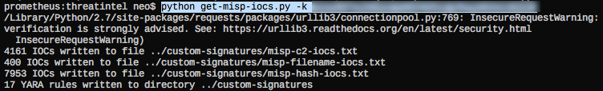
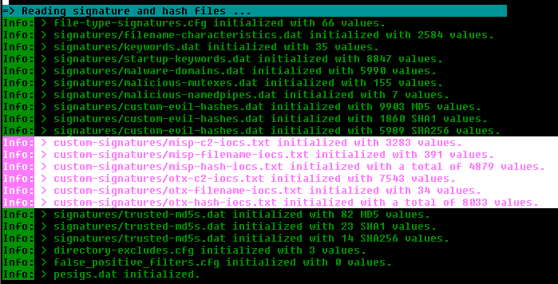

Threat Intel Receivers
======================

THOR provides several threat intel receiver scripts.

Those receivers can be used to query private and public feeds and store
the retrieved IOCs in a simple CSV format that THOR understands. Those
files are stored in the "**./custom-signatures/iocs**" folder and get
initialized during startup. The receiver scripts are stored in a
subfolder called "**./threatintel**".

The Threat Intel Receivers write different IOC types in dedicated files.
C2 server addresses and host names are stored in files named
"**source-c2-iocs.txt**". C2 server definitions received from a MISP
instance would be stored into "**misp-c2-iocs.txt**". THOR uses the
"**c2**" string in the file name to identify which type of indicators
the file contains. The keyword "**hash**" is used for hash indicators,
the keyword "**filename**" for file name indicators.

   Receive Threat Intel IOCs from MISP

This means that you can also store your own threat intel IOCs into files
in that folder with the correct tag in the file name and they will get
initialized by THOR during startup.

THOR currently contains with two threat intel receivers:

* | get-misp-iocs.py
  | MISP Receiver - retrieves Hash, C2, File Name IOCs and Yara signatures from an arbitrary MISP instance (local or CIRCL.lu community)
* | get-otx-iocs.py
  | OTX Receiver - retrieves Hash, C2 and File Name IOCs from AlienVault’s Open Threat Exchange platform

   THOR initializing the threat intel IOC files from MISP and OTX

Current requirements to use the Threat Intel Receivers:

* Python interpreter
   *  | PyMISP module
      | https://github.com/CIRCL/PyMISP
   *  | OTX Python SDK module
      | https://github.com/AlienVault-Labs/OTX-Python-SDK
* Direct Internet access (no proxy support)

The repository of the free IOC scanner LOKI contains compiled Windows
executables of these threat intel scripts but those scripts store the
files in the folder "**../signature-base/iocs/**" instead of
"**../custom-signatures**". We do not include two compiled threat intel
downloaders due to their big file size of more than 5MB.

Each script is provided as is in an Open Source form. Feel free to
extend or adjust them to your needs. The support for these scripts is
limited.
