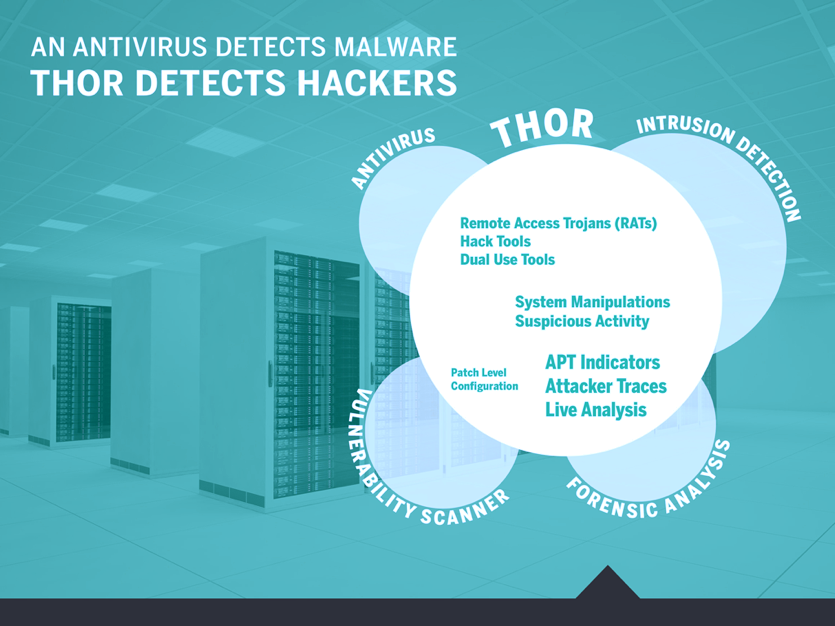

What is THOR?
=============

THOR is a portable scanner for attacker tools and activity on suspicious
or compromised server systems.

It covers a big set of basic checks and in deep analysis of the local
event log, registry and file system. THOR aims to be a sensitive auditor
noticing files and behavior traces a common Antivirus may have missed.
An integrated "Scoring System" enables THOR to rate elements based on
numerous characteristics to give hints on unknown malware.

THOR can be easily expanded to handle individual, client-specific attack
patterns (e.g. the detection of specific malware files or certain log
entries on the basis of a forensic analysis).

It is a portable and agent-less "APT Scanner".

   THOR Coverage and Comparison to Antivirus and Intrusion Detection

The key features are:

* Scans for hack tools and attacker activity (with multiple detection mechanisms)
* Portable – no installation required
* Runs on Windows, Linux and macOS platforms without any prerequisites
* Adaptable to the specific tools and activity of new APT cases
* Scoring System – providing a way to detect previously unknown software
* Several Export Formats – Syslog (JSON/Key-Value/CEF), HTML, TXT, JSON, CSV
* Throttling of the scan process to reduce the system load to a minimum

Package
-------

The THOR Package includes the following files and directories:

.. list-table:: 
   :widths: 30, 70
   :header-rows: 1

   * - 
     - Files/Directories
   * - THOR Binaries
     - **thor.exe** and **thor64.exe**, for 32-bit and 64-bit systems respectively
   * - THOR Utility
     - **thor-util.exe**, Helper tool for updates, encryption, report generation,
       signature verification and other tasks – see `THOR Util Manual <https://thor-util-manual.nextron-systems.com>`_
   * - Configuration Files
     - In subfolder ``./config`` - (**directory-excludes.cfg**, **sigma.yml**, **false\_positive\_filters.cfg**)
   * - Main Signature Database
     - In subfolder ``./signatures``
   * - Custom Signatures and Threat Intel IOCs
     - In subfolder ``./custom-signatures``
   * - THOR Changelog
     - **changes.log**
   * - Additional Tools
     - In subfolder ``./tools`` - EXE packers and the Bifrost server script
   * - THOR Manuals
     - In subfolder ``./docs``