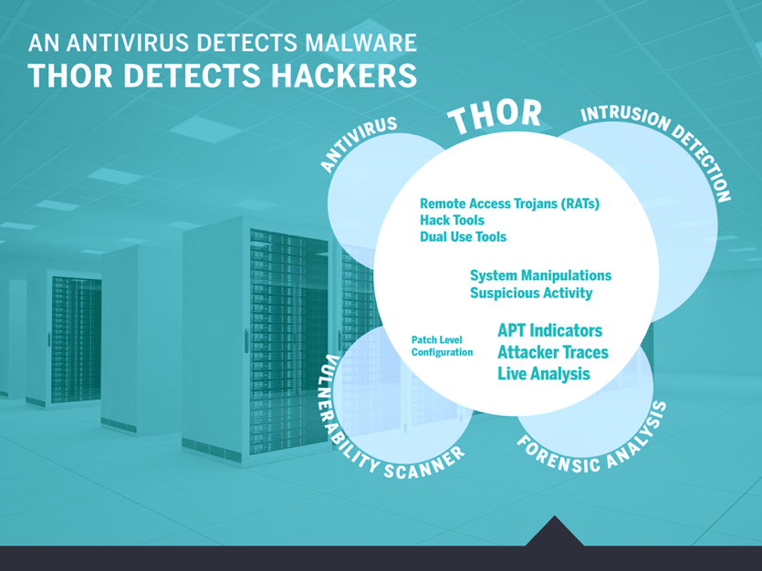

What is THOR?
=============

THOR is a portable scanner for attacker tools and activity on suspicious
or compromised server systems.

It combines a broad set of basic checks with in-depth analysis of the
local event log, registry, and file system. THOR is designed to
identify files and behavioral traces that a traditional antivirus
solution may miss. Its integrated scoring system helps assess
suspicious elements based on multiple characteristics and can provide
indicators for previously unknown malware.

THOR can be easily expanded to handle individual, client-specific attack
patterns (e.g. the detection of specific malware files or certain log
entries on the basis of a forensic analysis).

THOR is a portable, agentless "APT scanner".

   THOR Coverage and Comparison to Antivirus and Intrusion Detection

The key features are:

* Detects hack tools and traces of attacker activity using multiple detection mechanisms
* Portable - no installation required
* Runs on supported Windows, Linux, and macOS systems without additional runtime prerequisites
* Can be adapted to detect tools and activity specific to new APT cases
* Integrated scoring system to help identify suspicious or previously unknown malware
* Supports multiple export formats, including Syslog (JSON/Key-Value/CEF), HTML, TXT, JSON, and CSV
* Can throttle scan activity to reduce system load

Package
-------

The THOR package includes the following files and directories:

.. list-table:: 
   :widths: 30, 70
   :header-rows: 1

   * - Component
     - Files/Directories
   * - THOR Binaries
     - **thor.exe** and **thor64.exe**, for 32-bit and 64-bit systems respectively
   * - THOR Utility
     - **thor-util.exe**, helper utility for updates, encryption, report generation,
       signature verification, and other tasks - see the `THOR Util Manual <https://thor-util-manual.nextron-systems.com>`_
   * - Configuration Files
     - Located in ``./config`` (**directory-excludes.cfg**, **sigma.yml**, **false\_positive\_filters.cfg**)
   * - Main Signature Database
     - Located in ``./signatures``
   * - Custom Signatures and Threat Intel IOCs
     - Located in ``./custom-signatures``
   * - THOR Changelog
     - **changes.log**
   * - Additional Tools
     - Located in ``./tools`` - EXE packers and the Bifrost server script
   * - THOR Manuals
     - Located in ``./docs``
